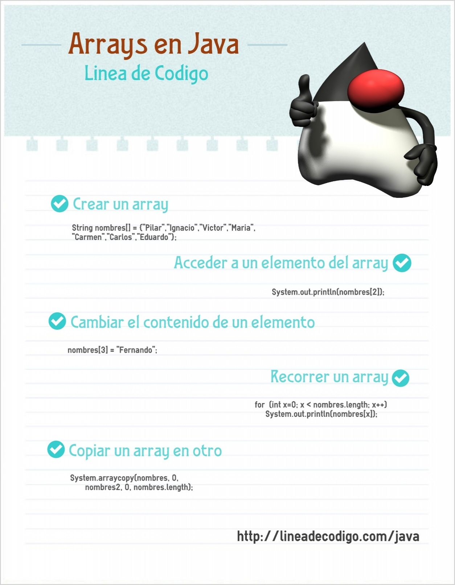

Una buena de empezar a programar con arrays en Java es aprenderte los 5 ejemplos de arrays en [Java](https://www.manualweb.net/java/): 





Si quieres incluir la imagen en tu web puedes utilizar el siguiente código:


```html
<a href="[https://lineadecodigo.com/java/arrays/](https://lineadecodigo.com/java/5-ejemplos-de-arrays-en-java/)" title="Arrays en Java">
  
</a>
```

