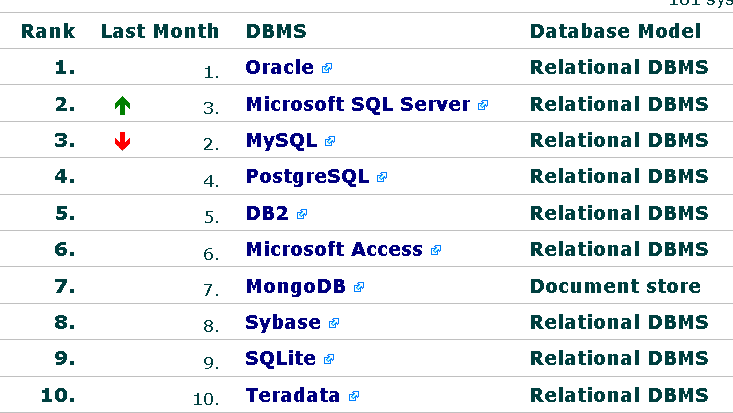

Hace un par de semanas publiqué en mi Blog una entrada sobre las diez bases de datos más populares. Este ranking que a continuación muestro me ha parecido sumamente interesante pues nos da una idea sobre que bases son más mencionadas en internet: 

¿Por qué en Internet?, bueno, [DbEngines](http://db-engines.com/) genera la estadística a partir de resultados de búsquedas en sitios como Google o Bing, además de extraer menciones de sitios especializados como LinkedIn y foros de consultas.

Si deseas conocer a más detalle la manera en que se calcula la posición de las bases de datos más populares puedes consultar el siguiente [enlace](http://db-engines.com/en/ranking_definition).

En el ranking de las bases de datos más populares de este mes, podemos notar una disminución de MYSQL frente a Microsoft SQL Server lo cual puede deberse a dos razones:

- Microsoft anunció durante Julio la liberación de SQL Server CPT 2014
- Maria Db Anunció la liberación de su versión 5.5.3

Lo anterior claro, es una opinión personal.

