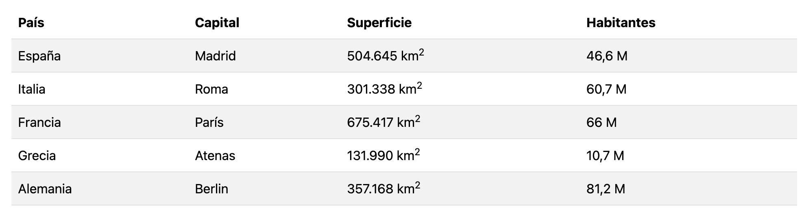

Las tablas estilo cebra son aquellas que tiene una alternancia en los colores de las líneas, suelen presentan las líneas impares de un color y las líneas pares de otro. En este artículo vamos a ver cómo podemos crear tablas estilo cebra con [CSS](http://www.manualweb.net/css/).


## Crear la tabla HTML


Lo primero será crear una tabla con datos:


```html
<table>
  <tr>
    <th>País</th>
    <th>Capital</th>
    <th>Superficie</th>
    <th>Habitantes</th>
  </tr>
  <tr>
    <td>España</td>
    <td>Madrid</td>
    <td>504.645 km<sup>2</sup></td>
    <td>46,6 M</td>
  </tr>
</table>
```


## Aplicar estilos CSS


Ahora vamos a trabajar con [los estilos CSS](http://www.manualweb.net/css/). Pero vayamos por parte. Lo primero que aprenderemos será a poner el color de fondo de una fila:


```css
tr {
  background-color: yellow;
}
```


Hemos utilizado el [atributo background-color](https://www.w3api.com/CSS/background-color/) para dar el color a una fila. Lo que sucede es que este código pone el color de fondo a todas las filas de la tabla.


## Usar el selector nth-child


Si queremos poner el color a una fila en concreto tenemos que utilizar el selector nth-child. El selector nth-child recibe como parámetro el número de la lista de elementos a la cual aplicar el estilo.


```css
tr:nth-child(2) {
  background-color: yellow;
}
```


En este caso hemos aplicado el estilo a la segunda fila. Pero claro no vamos a escribir tantas veces esta línea por cada línea que tenga la tabla.


## Filas pares e impares


Es por ello que nos vamos a apoyar en los modificadores `even` y `odd` (lo que viene a ser par e impar):


```css
tr:nth-child(even) {
  background-color: yellow;
}

tr:nth-child(odd) {
  background-color: white;
}
```


Así el primer estilo se aplicará a todas las filas que sean pares y el segundo se aplicará a todas las filas que sean impares. De esta forma conseguimos tener tablas estilo cebra con [CSS](http://www.manualweb.net/css/) o también conocidas como "striped tables".


## Resultado final


El efecto sería similar al siguiente:




