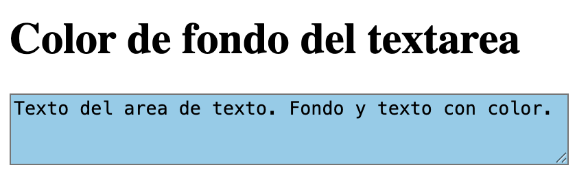
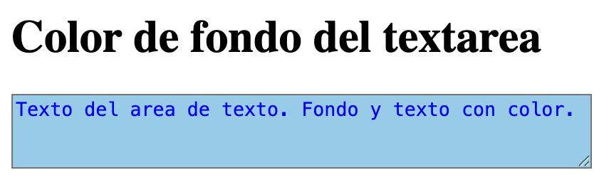

Una área de texto en [HTML](https://www.manualweb.net/html/), por defecto, no trae asociado ningún color. Mediante [CSS](http://www.manualweb.net/css/) tenemos la posibilidad de modificar el color de fondo del [`textarea`](http://w3api.com/HTML/textarea/), así como el color del texto que va a ir dentro de la misma. Así que, en este ejemplo, vamos a ver paso a paso cómo definir el color de fondo del textarea.


## Aplicar el color de fondo al textarea


Para poder modificar el color de fondo del [`textarea`](http://w3api.com/HTML/textarea/) debemos de apoyarnos en el atributo [`background-color`](http://w3api.com/CSS/background-color/) de [CSS](http://www.manualweb.net/css/) y asociárselo a la etiqueta [`textarea`](https://www.w3api.com/HTML/textarea/) de [HTML](https://www.manualweb.net/html/). Los atributos [CSS](http://www.manualweb.net/css/) se aplican mediante el [atributo `style`](http://w3api.com/HTML/style/) de [HTML](https://www.manualweb.net/html/).


```html
<textarea style="background-color: #valor_color;">Texto del área</textarea>
```


Ahora solo tendremos que darle un valor de color, en formato RGB al [atributo `background-color`](https://www.w3api.com/CSS/background-color/). Por ejemplo, si queremos que el fondo sea rojo le asignaremos el valor **#f00**, o azul con **#00f**. La [linea de código](http://lineadecodigo.com/) que nos permitirá hacer esta asignación quedará de la siguiente forma:


```html
<textarea cols="48" rows="3" style="background-color: #87ceeb;">
  Texto del área de texto. Fondo con color.
</textarea>
```


Veamos como queda el efecto viendo un área de texto con el color de fondo cambiado:





## Modificar el color del texto


Para modificar el color del texto hay que manipular el atributo [`color`](http://w3api.com/CSS/color/) y asignarle de igual forma valores RGB. Veamos la [linea de código](https://lineadecodigo.com/) como quedaría aplicado en el [atributo `style`](http://w3api.com/HTML/style/):


```html
<textarea cols="48" rows="3" style="background-color: #87ceeb; color: #0000ff;">
  Texto del área de texto. Fondo y texto con color.
</textarea>
```


Y como queda el haber cambiado el color de fondo y del texto que hay dentro del [`textarea`](http://w3api.com/HTML/textarea/): 





Como has podido comprobar es muy sencillo definir el color de fondo del textarea y poner tanto el fondo como el texto que hay dentro de los colores que más nos gusten.

