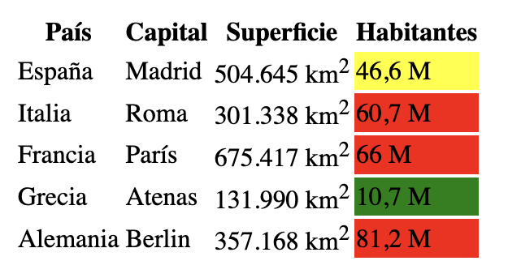

En este ejemplo vamos a ver cómo podemos especificar el color de una celda en [HTML](https://www.manualweb.net/html/). Para ello nos vamos a apoyar en el [lenguaje de estilos CSS](http://www.manualweb.net/css/).


## Estructura básica de una tabla HTML


Lo primero que tenemos que saber para especificar el color de una celda en [HTML](https://www.manualweb.net/html/) es cómo se construye una tabla. Una tabla se construye a partir de tres elementos básicos: [table](https://www.w3api.com/HTML/table/), [tr](https://www.w3api.com/HTML/tr/) y [td](https://www.w3api.com/HTML/td/colspan/).

- El [elemento table](https://www.w3api.com/HTML/table/) representa a la tabla
- El [elemento tr](https://www.w3api.com/HTML/tr/) representa a una fila o conjunto de celdas
- Las celdas son representadas mediante el [elemento td](https://www.w3api.com/HTML/td/colspan/)

Por ejemplo, una tabla en [HTML](https://www.manualweb.net/html/) sería de la siguiente forma:


```html
<table>
  <tr>
    <td>País</td>
    <td>Capital</td>
    <td>Superficie</td>
    <td>Habitantes</td>
  </tr>
  <tr>
    <td>España</td>
    <td>Madrid</td>
    <td>504.645 km<sup>2</sup></td>
    <td>46,6 M</td>
  </tr>
</table>
```


## Aplicar color de fondo con CSS


Para poder especificar el color de una celda en [HTML](https://www.manualweb.net/html/) deberemos trabajar con el [elemento td](https://www.w3api.com/HTML/td/colspan/) y sus estilos asociados. En este caso vamos a trabajar con la [propiedad background-color](https://www.w3api.com/CSS/background-color/) que es la que nos permite especificar el color de fondo de un elemento.


De esta forma, al especificar el estilo [background-color](https://www.w3api.com/CSS/background-color/), podríamos escribir lo siguiente:


```css
td {
  background-color: blue;
}
```


Si bien lo que vamos a **conseguir es que todas las celdas tengan un color de fondo azul**.


## Usar clases CSS para celdas específicas


En el caso de que queramos especificar el color de una celda en [HTML](https://www.manualweb.net/html/), pero que esta celda sea concreta, es recomendable que utilicemos las clases. Es decir, vamos a definir unas clases en [CSS](http://www.manualweb.net/css/) las cuales se las vamos a asociar a las celdas.


Por ejemplo, podemos crear tres clases de importancia:


```css
table .importante {
  background-color: red;
}

table .normal {
  background-color: yellow;
}

table .menos-importante {
  background-color: green;
}
```


Al escribir los selectores vemos que les hemos anticipado el [elemento table](https://www.w3api.com/HTML/table/) para que estas clases solo puedan establecerse dentro de una tabla.


> Los nombres de las clases en [CSS](http://www.manualweb.net/css/) siempre van a empezar por un punto (.)


## Aplicar las clases a las celdas


Ahora lo que hacemos es utilizar el [atributo class](https://www.w3api.com/HTML/class/) del [elemento td](https://www.w3api.com/HTML/td/colspan/) que representa a las celdas para asignarles un valor u otro.


```html
<td class="importante">Celda importante</td>
<td class="normal">Celda normal</td>
<td class="menos-importante">Celda menos importante</td>
```


Así nuestra tabla podría quedar de la siguiente forma:





Vemos cómo hemos utilizado diferentes clases en diferentes [elementos td](https://www.w3api.com/HTML/td/colspan/) para poder definir el color de una celda en [HTML](https://www.manualweb.net/html/).

