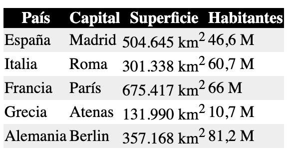
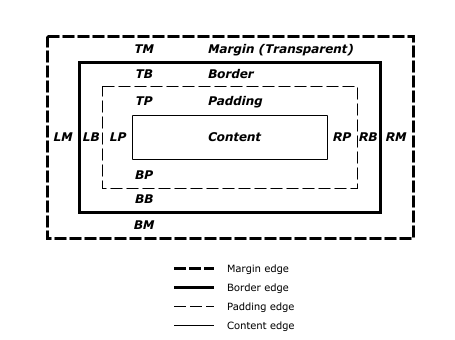
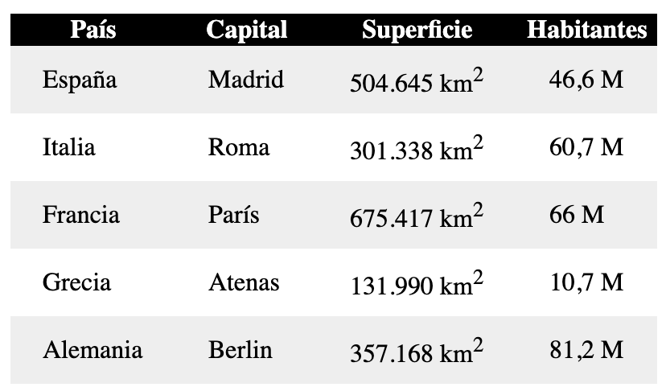

Espaciar contenido en una tabla con CSS permite separar los datos del borde de cada celda y mejorar su legibilidad. Para conseguirlo se utiliza principalmente la propiedad `padding`, aplicada a las celdas `th` y `td`.


Partiremos de una [tabla HTML](https://lineadecodigo.com/html/) sencilla con países, capitales, superficie y habitantes. La estructura utiliza los elementos `table`, `tr`, `th` y `td`:


```html
<table>
  <tr>
    <th>País</th>
    <th>Capital</th>
    <th>Superficie</th>
    <th>Habitantes</th>
  </tr>
  <tr>
    <td>España</td>
    <td>Madrid</td>
    <td>504.645 km<sup>2</sup></td>
    <td>46,6 M</td>
  </tr>
  <tr>
    <td>Italia</td>
    <td>Roma</td>
    <td>301.338 km<sup>2</sup></td>
    <td>60,7 M</td>
  </tr>
  <tr>
    <td>Francia</td>
    <td>París</td>
    <td>675.417 km<sup>2</sup></td>
    <td>66 M</td>
  </tr>
</table>
```


Sin estilos, el contenido puede quedar demasiado cerca de los bordes y resultar incómodo de leer.





## Cómo funciona el padding en una tabla


La propiedad `padding` crea un espacio interior entre el contenido y el borde de un elemento. En una tabla, este espacio se aplica dentro de cada celda y no entre unas celdas y otras.


Este comportamiento forma parte del [modelo de cajas de CSS](https://www.w3.org/TR/css-box-3/), también conocido como `box model`. De dentro hacia fuera, una caja está compuesta por:

1. El contenido.
2. El `padding` o espacio interior.
3. El borde.
4. El `margin` o espacio exterior.




Es importante distinguir `padding` de `margin`: para separar el texto del borde de una celda se utiliza `padding`. El `margin` no es la herramienta adecuada para crear este espacio interior.


## Propiedades de padding disponibles


El espacio puede configurarse de forma independiente para cada lado mediante cuatro propiedades:

- `padding-top`: espacio superior.
- `padding-right`: espacio derecho.
- `padding-bottom`: espacio inferior.
- `padding-left`: espacio izquierdo.

Por ejemplo, podemos añadir `10px` en vertical y `20px` en horizontal:


```css
padding-top: 10px;
padding-bottom: 10px;
padding-left: 20px;
padding-right: 20px;
```


Los valores pueden expresarse con distintas unidades de [CSS](https://lineadecodigo.com/css/), como `px`, `rem`, `em` o porcentajes. Para el espaciado de celdas, `px` y `rem` suelen ofrecer un resultado predecible. Los porcentajes requieren más atención porque el `padding` porcentual se calcula respecto al ancho del bloque contenedor, incluso en el eje vertical.


## Forma abreviada de padding


La propiedad abreviada `padding` permite sustituir las cuatro declaraciones anteriores por una sola:


```css
padding: 10px 20px 10px 20px;
```


Cuando se indican cuatro valores, el orden es **arriba, derecha, abajo e izquierda**, siguiendo el sentido de las agujas del reloj.


Como los valores verticales y horizontales son iguales entre sí, también podemos escribir:


```css
padding: 10px 20px;
```


Con dos valores, el primero se aplica a la parte superior e inferior y el segundo a la derecha e izquierda. También existen estas variantes:


```css
/* Un valor: los cuatro lados */
padding: 12px;

/* Tres valores: arriba, horizontal y abajo */
padding: 8px 16px 12px;

/* Cuatro valores: arriba, derecha, abajo e izquierda */
padding: 8px 16px 12px 20px;
```


## Aplicar el espaciado a las celdas


Si queremos espaciar todas las celdas de datos, podemos utilizar el selector `table td`:


```css
table td {
  padding-top: 10px;
  padding-bottom: 10px;
  padding-left: 20px;
  padding-right: 20px;
}
```


La forma abreviada produce el mismo resultado:


```css
table td {
  padding: 10px 20px;
}
```


Como la tabla del ejemplo también contiene encabezados, lo habitual es aplicar el espaciado tanto a `th` como a `td`:


```css
table th,
table td {
  padding: 10px 20px;
}
```


De esta forma, todas las celdas mantienen una separación consistente. El resultado es una tabla más clara y cómoda de leer.





## Ejemplo completo de tabla con padding


El siguiente ejemplo reúne la estructura y los estilos. Además del `padding`, incorpora bordes y `border-collapse` para que la separación interior se aprecie con claridad:


```html
<!DOCTYPE html>
<html lang="es">
<head>
  <meta charset="UTF-8">
  <meta name="viewport" content="width=device-width, initial-scale=1.0">
  <title>Tabla con padding</title>
  <style>
    table {
      border-collapse: collapse;
      width: 100%;
    }

    th,
    td {
      border: 1px solid #b7b7b7;
      padding: 10px 20px;
      text-align: left;
    }

    th {
      background-color: #f2f2f2;
    }
  </style>
</head>
<body>
  <table>
    <thead>
      <tr>
        <th>País</th>
        <th>Capital</th>
        <th>Superficie</th>
        <th>Habitantes</th>
      </tr>
    </thead>
    <tbody>
      <tr>
        <td>España</td>
        <td>Madrid</td>
        <td>504.645 km<sup>2</sup></td>
        <td>46,6 M</td>
      </tr>
      <tr>
        <td>Italia</td>
        <td>Roma</td>
        <td>301.338 km<sup>2</sup></td>
        <td>60,7 M</td>
      </tr>
      <tr>
        <td>Francia</td>
        <td>París</td>
        <td>675.417 km<sup>2</sup></td>
        <td>66 M</td>
      </tr>
    </tbody>
  </table>
</body>
</html>
```


La declaración `border-collapse: collapse` combina los bordes contiguos de las celdas. No controla el espacio interior, pero ayuda a obtener una cuadrícula visual limpia. El espacio entre el contenido y el borde sigue dependiendo de `padding`.


## Recomendaciones de legibilidad


Para conseguir una tabla equilibrada:

- Aplica el mismo `padding` a `th` y `td`, salvo que el diseño requiera una diferencia explícita.
- Utiliza algo más de espacio horizontal que vertical cuando las celdas contienen texto breve.
- Evita valores excesivos, ya que pueden obligar a la tabla a desbordarse en pantallas estrechas.
- En diseños adaptables, combina un `padding` moderado con un contenedor que permita desplazamiento horizontal mediante `overflow-x: auto`.
- Mantén una alineación coherente: el texto suele alinearse a la izquierda y los datos numéricos pueden alinearse a la derecha.

Con estas reglas, espaciar contenido en una tabla con CSS consiste en aplicar correctamente `padding` a sus celdas y elegir valores que mejoren la lectura sin perjudicar el diseño adaptable.

