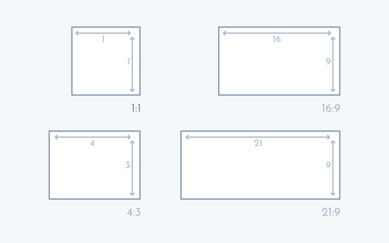

Mediante la propiedad [`aspect-ratio`](https://www.w3api.com/CSS/aspect-ratio/) podremos definir relaciones de aspecto en [CSS](https://www.manualweb.net/css/) de los elementos caja de una página. Esto nos permite, por ejemplo, ajustar imágenes para que se puedan ver mejor atendiendo al dispositivo en el que se esté renderizando nuestro contenido.


### ¿Qué son las relaciones de aspecto en CSS o la propiedad aspect-ratio?


Las relaciones de aspecto en [CSS](https://www.manualweb.net/css/) nos permiten definir la proporción que tiene una imagen entre su ancho y su alto. De esta manera, si la imagen tiene un mismo valor para el ancho y el alto, por lo que se ve como un cuadrado, tendrá una relación de aspecto de 1:1. Si utilizamos Instagram, veremos que la relación de aspecto que utiliza para sus fotos es de 1:1.


Pero, si por ejemplo estamos mirando un televisor, veremos que no es un cuadrado (los televisores muy antiguos sí que lo eran), sino que tiene forma de rectángulo. En este caso, los televisores tienen una relación de aspecto de 16:9 o, en algunos casos, de 4:3.


### ¿Cuáles son las relaciones de aspecto más comunes?


Antes de empezar a codificar nuestras primeras relaciones de aspecto en [CSS](https://www.manualweb.net/css/) vamos a conocer un poco más cuáles son las relaciones de aspecto más comunes. Las que nos podemos encontrar son:

- **1:1** - Utilizada en redes sociales como Instagram o para fotos de perfil.
- **16:9** - El estándar más común para vídeos en alta definición y pantallas modernas.
- **4:3** - Formato tradicional usado en televisores antiguos y algunos dispositivos.
- **21:9** - Formato panorámico utilizado en películas y monitores ultrawide.

Imagen explicativa de la relación de aspecto de [Silo Creativo](https://www.silocreativo.com/) en su artículo [Creando relaciones de aspecto en CSS con la propiedad aspect-ratio](https://www.silocreativo.com/creando-relaciones-aspecto-css-aspect-ratio/).





### Propiedad CSS aspect-ratio


Cuando trabajamos las relaciones de aspecto en [CSS](https://www.manualweb.net/css/) nos focalizamos en la propiedad CSS aspect-ratio. La propiedad aspect-ratio se puede aplicar directamente sobre un elemento caja. Así tendrá la siguiente sintaxis:


```css
elemento {
  aspect-ratio: valor;
}
```


Los valores que podremos dar a esta propiedad son `auto` para ajustarse a la relación de aspecto del elemento que lo contiene o un valor que represente en valores `ancho/alto` la relación de aspecto. Es decir, podremos poner como valor 1/1, 16/9, 4/3,… o cualquier otro valor.


De esta manera, si por ejemplo queremos definir que todas las imágenes de una página tengan una relación de aspecto de 1:1 podremos añadir el siguiente [código CSS](https://www.manualweb.net/css/):


```css
img {
  aspect-ratio: 1/1;
}
```


Hay que tener en cuenta que esto solo regula la relación de aspecto de la imagen, pero no su tamaño. Es decir, las propiedades de [`width`](https://www.w3api.com/CSS/width/) y [`height`](https://www.w3api.com/CSS/height/) siguen siendo necesarias.


### No deformar una imagen con aspect-ratio


Siguiendo con el ejemoplo de relaciones de aspecto en [CSS](https://www.manualweb.net/css/) tenemos que saber que una de las cosas que pasa al utilizar la propiedad [`aspect-ratio`](https://www.w3api.com/CSS/aspect-ratio/) es que la imagen se tiene que adaptar a la nueva relación de aspecto y, por lo tanto, la imagen se puede ver deformada.


Para evitar que se deforme la imagen al utilizar la propiedad aspect-ratio en [CSS](https://www.manualweb.net/css/) se debe de combinar con la propiedad [`object-fit`](https://www.w3api.com/CSS/object-fit/). La propiedad [`object-fit`](https://www.w3api.com/CSS/object-fit/) nos permite ajustar las imágenes o vídeos a contenedores.


La sintaxis de la propiedad [`object-fit`](https://www.w3api.com/CSS/object-fit/) es la siguiente:


```css
object-fit : fill | contain | cover | none | scale-down

```


Los valores que podemos utilizar en la propiedad [`object-fit`](https://www.w3api.com/CSS/object-fit/) son los siguientes, cada uno con un comportamiento específico para el ajuste de las imágenes:

- **scale-down** - Selecciona automáticamente entre 'none' o 'contain', eligiendo el que resulte en un tamaño más pequeño.
- **none** - Mantiene la imagen en su tamaño original sin realizar ningún tipo de ajuste.
- **cover** - Ajusta la imagen para cubrir completamente el contenedor, manteniendo la proporción pero pudiendo recortar los bordes.
- **fill** - Estira la imagen para llenar el contenedor completamente, sin mantener la proporción original.
- **contain** - Ajusta la imagen dentro del contenedor manteniendo su proporción original, sin recortar ni estirar.

En este caso, para que no se deforme la imagen, [`aspect-ratio`](https://www.w3api.com/CSS/aspect-ratio/) vamos a asignar el valor de “cover” para que así rellene el espacio designado por la relación de aspecto.


### Ejemplos de uso de las relaciones de aspecto en CSS.


Cuando estemos trabajando con relaciones de aspecto en [CSS](https://www.manualweb.net/css/) t publicando vídeos o imágenes, es bueno recurrir al atributo [`aspect-ratio`](https://www.w3api.com/CSS/aspect-ratio/), pero otros ejemplos típicos en los que nos lo podemos encontrar serían:

- **Tarjetas de presentación**: Para mantener una relación de aspecto consistente en el diseño de tarjetas de visita digitales.
- **Galerías de imágenes:** Para crear una cuadrícula uniforme donde todas las imágenes mantengan la misma proporción.
- **Banners publicitarios:** Para asegurar que los anuncios se muestren correctamente en diferentes dispositivos y plataformas.

Centrándonos en cómo modelar una galería de imagen, lo primero será definir unos estilos con nombre que representen las principales relaciones de aspecto para poder ser utilizadas en el [código HTML](https://lineadecodigo.com/categoria/html/):


```css
.cuadrado {
    aspect-ratio: 1/1;
    width: 100%;
    object-fit: cover;
}
.television {
    aspect-ratio: 4/3;
    width: 100%;
    object-fit: cover;
}
.apaisado {
    aspect-ratio: 16/9;
    width: 100%;
    object-fit: cover;
}
.widescreen {
    aspect-ratio: 21/9;
    width: 100%;
    object-fit: cover;
}

```


Así como algunos estilos para el contenedor en el que los insertamos:


```css
.contenedor {
    display: flex;
    flex-direction: row;
    flex-wrap: wrap;
    justify-content: space-around;
}
.item {
    width: 300px;
}

```


Y lo siguiente sería ver cómo lo podemos utilizar en algún ejemplo. Para ello hemos seleccionado la galería de imágenes. En la que podemos ver que cada imagen es un cuadrado de relación de aspecto 1:1


```html
<h2>Galería de Imágenes</h2>
<div class="contenedor">
  <div class="item">
    
    <div class="contenido">Imagen 1</div>
  </div>
  <div class="item">
    
    <div class="contenido">Imagen 2</div>
  </div>
  <div class="item">
    
    <div class="contenido">Imagen 3</div>
  </div>
  <div class="item">
    
    <div class="contenido">Imagen 4</div>
  </div>
</div>
```


Espero que, una vez leído este artículo, te quede un poco más claro qué es y para qué podemos utilizar la propiedad [`aspect-ratio`](https://www.w3api.com/CSS/aspect-ratio/) para definir relaciones de aspecto en [CSS](https://www.manualweb.net/css/).

