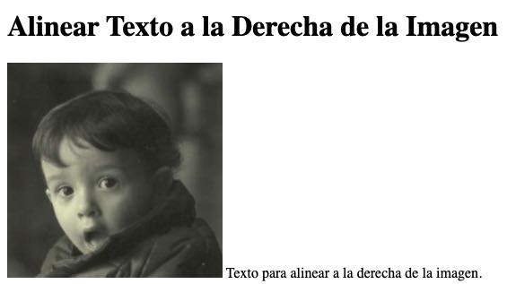
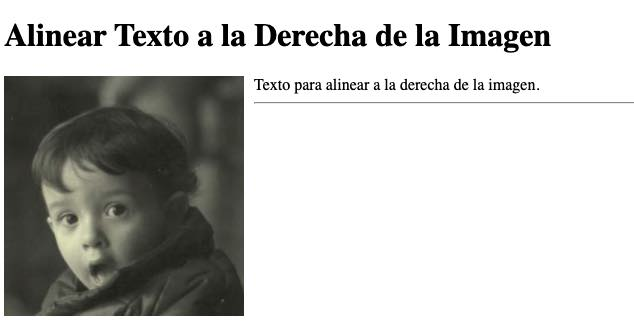

Colocar **texto a la derecha de una imagen con CSS** es un patrón habitual en artículos, fichas, biografías y bloques informativos. La solución clásica utiliza la propiedad `float`, que permite que el texto fluya alrededor de la imagen. Para componentes más estructurados también puede utilizarse `Flexbox`.


Partiremos de una imagen sencilla en [HTML](https://lineadecodigo.com/html/):


```html

```


Los atributos `width` y `height` reservan el espacio necesario antes de que se cargue la imagen y ayudan a evitar saltos inesperados en el contenido. El atributo `alt` proporciona una alternativa textual cuando la imagen no puede verse.


## Qué ocurre al añadir texto después de la imagen


Si colocamos texto inmediatamente después del elemento `img`, el navegador lo sitúa a continuación de la imagen dentro de la misma línea disponible:


```html

Texto para alinear a la derecha de la imagen.
```


El texto puede aparecer junto a la parte inferior de la imagen, pero no ocupará automáticamente todo el espacio lateral disponible.





Para conseguir que varias líneas de texto recorran el lateral derecho desde la parte superior, debemos modificar el comportamiento de la imagen.


## Alinear el texto con la propiedad float


La propiedad `float` desplaza un elemento hacia un lado y permite que el contenido en línea posterior fluya a su alrededor. Si aplicamos `float: left` a la imagen, esta queda a la izquierda y el texto ocupa el espacio disponible a su derecha:


```html

<p>
  Texto para alinear a la derecha de la imagen. Si el párrafo es largo,
  continuará fluyendo por el lateral y después ocupará todo el ancho
  disponible debajo de la imagen.
</p>
```


```css
.imagen-izquierda {
  float: left;
}
```


Este comportamiento resulta adecuado cuando queremos que el texto rodee la imagen, como sucede en una noticia o en una entrada de blog.


## Añadir separación entre la imagen y el texto


Si solo aplicamos `float: left`, el texto quedará demasiado pegado a la imagen. El ejemplo original utilizaba `padding-right`, pero la propiedad más apropiada para separar dos elementos es `margin-right`, ya que crea espacio exterior alrededor de la imagen:


```css
.imagen-izquierda {
  float: left;
  margin-right: 16px;
  margin-bottom: 8px;
}
```


`margin-right` separa el texto del lateral de la imagen, mientras que `margin-bottom` evita que el contenido situado debajo quede pegado a su borde inferior.


El ejemplo completo con estilos separados del marcado queda así:


```html

<p>
  Texto para alinear a la derecha de la imagen.
</p>
```


```css
.imagen-izquierda {
  float: left;
  margin: 0 16px 8px 0;
}
```


La declaración abreviada de `margin` aplica, en orden, margen superior, derecho, inferior e izquierdo.





## Evitar que el contenido siguiente rodee la imagen


El efecto de `float` puede alcanzar otros elementos posteriores. Si queremos que una sección siguiente comience debajo de la imagen, podemos utilizar la propiedad `clear`:


```html

<p>Texto que fluye alrededor de la imagen.</p>
<p class="contenido-siguiente">Este contenido empieza debajo.</p>
```


```css
.imagen-izquierda {
  float: left;
  margin: 0 16px 8px 0;
}

.contenido-siguiente {
  clear: both;
}
```


Otra opción es hacer que el contenedor genere su propio contexto de formato mediante `display: flow-root`. Esta solución contiene el elemento flotante sin necesidad de añadir un elemento auxiliar:


```html
<div class="bloque-imagen">
  
  <p>Texto situado a la derecha de la imagen.</p>
</div>
```


```css
.bloque-imagen {
  display: flow-root;
}

.imagen-izquierda {
  float: left;
  margin: 0 16px 8px 0;
}
```


## Alternativa moderna con Flexbox


Cuando no queremos que el texto rodee la imagen, sino crear dos columnas bien definidas, `Flexbox` ofrece una estructura más predecible. La imagen ocupa una columna y el texto, otra:


```html
<div class="ficha">
  
  <div class="ficha__texto">
    <h2>Título de la ficha</h2>
    <p>Texto situado a la derecha de la imagen.</p>
  </div>
</div>
```


```css
.ficha {
  display: flex;
  align-items: flex-start;
  gap: 16px;
}

.ficha__imagen {
  max-width: 100%;
  height: auto;
}
```


La propiedad `gap` define la separación entre las columnas sin añadir márgenes a la imagen. `align-items: flex-start` alinea ambos contenidos por su parte superior.


## Adaptar el diseño a pantallas pequeñas


Una imagen de `240px` y una columna de texto pueden no caber cómodamente en pantallas estrechas. Con una consulta de medios podemos colocar la imagen encima del texto cuando el espacio sea limitado:


```css
@media (max-width: 600px) {
  .ficha {
    flex-direction: column;
  }

  .ficha__imagen {
    width: 100%;
    max-width: 240px;
  }
}
```


Si utilizamos la solución con `float`, también podemos desactivar el flotado en móviles:


```css
@media (max-width: 600px) {
  .imagen-izquierda {
    float: none;
    display: block;
    max-width: 100%;
    height: auto;
    margin: 0 0 16px;
  }
}
```


## Elegir entre float y Flexbox

- Utiliza `float` cuando el objetivo sea que el texto fluya alrededor de una imagen.
- Utiliza `Flexbox` cuando necesites dos columnas independientes y una alineación controlada.
- Añade `margin-right` al elemento flotante o `gap` al contenedor flexible para separar la imagen del texto.
- Aplica estilos adaptables para evitar desbordamientos en pantallas pequeñas.
- Conserva siempre un atributo `alt` descriptivo y evita incluir información esencial únicamente en la imagen.

Con estas técnicas podemos colocar texto a la derecha de una imagen con CSS, mantener una separación visual adecuada y adaptar el resultado a distintos tamaños de pantalla.

