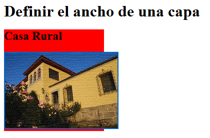
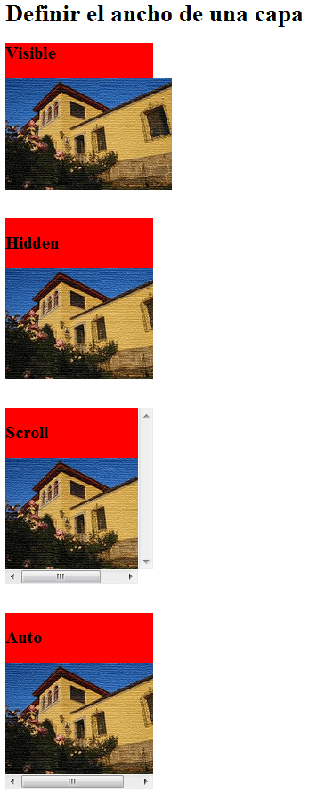

Cuando definimos el ancho o la altura de una capa con `CSS`, su contenido puede ocupar más espacio del disponible. En ese caso se produce un desbordamiento y necesitamos controlar el `overflow` de la capa para decidir si el contenido debe mostrarse, recortarse o quedar accesible mediante barras de desplazamiento.


Como vimos en el artículo [definir el ancho de una capa con CSS](http://lineadecodigo.com/css/definir-el-ancho-de-una-capa-con-css/), este problema puede aparecer con texto, aunque es especialmente habitual al insertar imágenes, tablas, bloques de código u otros elementos cuyo tamaño supera al del contenedor.


## Qué es el overflow de una capa


El `overflow` es el contenido que rebasa los límites de un elemento. Cuando una capa tiene dimensiones limitadas mediante propiedades como `width`, `height` o `max-height`, el navegador necesita saber qué hacer con aquello que no cabe dentro de su caja.


Por defecto, el contenido permanece visible aunque sobresalga. Este comportamiento evita que la información desaparezca, pero puede provocar solapamientos, romper el diseño o dificultar la lectura.





La propiedad `overflow` permite controlar este comportamiento tanto en el eje horizontal como en el vertical.


## Valores de la propiedad overflow


Los valores más utilizados de `overflow` son los siguientes:

- **`visible`**: el contenido puede superar el tamaño definido para la capa. Es el valor inicial y no añade barras de desplazamiento.
- **`hidden`**: recorta el contenido que desborda los límites del elemento. Aunque no se muestra, el contenido continúa formando parte del documento.
- **`scroll`**: recorta el contenido y reserva barras de desplazamiento horizontales y verticales, incluso cuando alguna de ellas no sea necesaria.
- **`auto`**: añade barras de desplazamiento únicamente cuando el contenido desborda el contenedor. Suele ser la opción más práctica para componentes con tamaño limitado.
- **`clip`**: recorta el contenido en el borde de la caja y, a diferencia de `hidden`, no crea un contenedor desplazable.
- **`inherit`**: hace que el elemento utilice el valor calculado de `overflow` de su elemento padre.

También pueden emplearse otros valores globales de `CSS`, como `initial`, `unset` o `revert`, cuando sea necesario restablecer o heredar el comportamiento según la cascada.


## Ejemplo básico para controlar el overflow


El ejemplo original utiliza una capa de `200px` de ancho, fondo rojo y barras de desplazamiento:


```css
.casa {
  width: 200px;
  background: red;
  overflow: scroll;
}
```


Si el contenido de `.casa` supera el ancho disponible, `overflow: scroll` permite consultarlo mediante desplazamiento. Para comprobar el resto de comportamientos, basta con sustituir `scroll` por `visible`, `hidden` o `auto`.





En una interfaz real suele ser conveniente limitar también la altura. Así se evita que el contenedor crezca indefinidamente:


```html
<div class="casa">
  <p>
    Este contenido es más extenso que el espacio disponible dentro de la capa.
    El navegador mostrará una barra de desplazamiento cuando sea necesaria.
  </p>
</div>
```


```css
.casa {
  width: 200px;
  max-height: 120px;
  padding: 1rem;
  overflow: auto;
  background: #f2f2f2;
  border: 1px solid #ccc;
}
```


En este segundo ejemplo, `max-height` establece el límite vertical y `overflow: auto` mantiene accesible todo el contenido sin mostrar barras innecesarias.


## Controlar cada eje por separado


Cuando el desbordamiento horizontal y vertical necesita comportamientos diferentes, se pueden utilizar estas propiedades:

- `overflow-x`: controla el desbordamiento en el eje horizontal.
- `overflow-y`: controla el desbordamiento en el eje vertical.

Por ejemplo, una tabla puede desplazarse horizontalmente sin crear una barra vertical:


```css
.contenedor-tabla {
  max-width: 100%;
  overflow-x: auto;
  overflow-y: hidden;
}
```


Este patrón resulta útil en diseños adaptables cuando una tabla o un bloque de código es más ancho que la pantalla.


## Diferencia entre overflow y overflow-wrap


Aunque sus nombres son parecidos, `overflow` y `overflow-wrap` resuelven problemas distintos:

- `overflow` determina qué sucede cuando el contenido supera las dimensiones de la caja.
- `overflow-wrap` permite dividir palabras o cadenas largas para evitar que desborden horizontalmente.

Por ejemplo, una dirección web muy larga puede ajustarse dentro de la capa con:


```css
.contenido {
  overflow-wrap: anywhere;
}
```


Esta propiedad puede evitar el desbordamiento del texto, mientras que `overflow` gestiona el contenido que ya ha rebasado los límites del contenedor.


## Cuándo utilizar cada valor

- Utiliza `visible` cuando el contenido debe mostrarse completo y no existe riesgo de romper el diseño.
- Utiliza `hidden` para recortes visuales controlados, teniendo en cuenta que puede ocultar información importante.
- Utiliza `scroll` cuando necesitas reservar siempre el espacio de las barras de desplazamiento.
- Utiliza `auto` en paneles, tablas, fragmentos de código y otros componentes cuyo contenido puede variar.
- Utiliza `overflow-x` y `overflow-y` cuando solo uno de los ejes necesita desplazamiento.

Conviene comprobar el resultado con diferentes tamaños de pantalla y volúmenes de contenido. Si una capa desplazable puede recibir interacción, asegúrate también de que el contenido siga siendo accesible mediante teclado y no dependa únicamente del desplazamiento con ratón.


Controlar el `overflow` de una capa permite mantener estable el diseño cuando el contenido supera el espacio disponible. La elección entre `visible`, `hidden`, `scroll` y `auto` depende de si el contenido debe sobresalir, recortarse o permanecer accesible mediante desplazamiento. A partir de esta base, otras propiedades de posicionamiento y dimensiones permiten ajustar con mayor precisión la ubicación de las capas.

