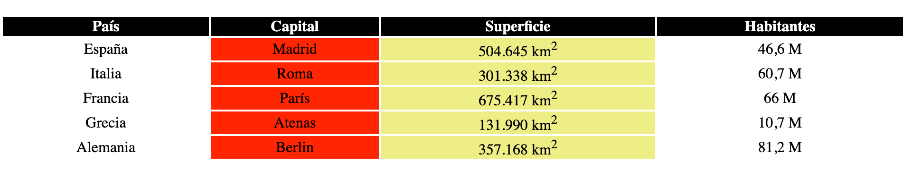

Dar color a las columnas de una tabla con CSS permite destacar categorías, métricas o datos importantes sin modificar el contenido de cada celda. En este ejemplo veremos las dos formas principales de hacerlo: aplicar el color a las celdas con `:nth-child()` o definirlo en las columnas mediante `<colgroup>` y `<col>`.


Partiremos de una [tabla creada con HTML](http://lineadecodigo.com/html/crear-una-tabla-en-html/) mediante el elemento [`<table>`](http://w3api.com/wiki/HTML:TABLE). La estructura se escribe con [HTML](https://lineadecodigo.com/html/) e incluye una agrupación de columnas al principio de la tabla. El elemento [`<colgroup>`](http://www.w3api.com/HTML/colgroup) agrupa las columnas y cada elemento [`<col>`](http://w3api.com/wiki/HTML:COL) representa una de ellas.


## Estructura de la tabla de ejemplo


```html
<table>
  <colgroup>
    <col>
    <col>
    <col>
    <col>
  </colgroup>
  <thead>
    <tr>
      <th scope="col">País</th>
      <th scope="col">Capital</th>
      <th scope="col">Superficie</th>
      <th scope="col">Habitantes</th>
    </tr>
  </thead>
  <tbody>
    <tr>
      <td>España</td>
      <td>Madrid</td>
      <td>504.645 km<sup>2</sup></td>
      <td>46,6 M</td>
    </tr>
    <tr>
      <td>Italia</td>
      <td>Roma</td>
      <td>301.338 km<sup>2</sup></td>
      <td>60,7 M</td>
    </tr>
    <tr>
      <td>Francia</td>
      <td>París</td>
      <td>675.417 km<sup>2</sup></td>
      <td>66 M</td>
    </tr>
    <tr>
      <td>Grecia</td>
      <td>Atenas</td>
      <td>131.990 km<sup>2</sup></td>
      <td>10,7 M</td>
    </tr>
    <tr>
      <td>Alemania</td>
      <td>Berlín</td>
      <td>357.168 km<sup>2</sup></td>
      <td>81,2 M</td>
    </tr>
  </tbody>
</table>
```


La agrupación que utilizaremos para aplicar estilos a las columnas es esta:


```html
<colgroup>
  <col>
  <col>
  <col>
  <col>
</colgroup>
```


El orden de los elementos `<col>` debe coincidir con el orden de las columnas de la tabla. En este caso hay cuatro columnas: país, capital, superficie y habitantes.


## Dar color a una columna mediante las celdas td


La primera solución consiste en aplicar la propiedad `background-color` directamente a los elementos [`<td>`](http://w3api.com/wiki/HTML:TD). Este selector colorea todas las celdas de datos:


```css
table td {
  background-color: #ffee88;
}
```


Como el objetivo es dar color a una única columna, podemos utilizar la pseudoclase [`:nth-child()`](http://w3api.com/wiki/CSS:Nth-child). Para colorear la tercera columna, seleccionamos cada celda `<td>` que ocupa esa posición dentro de su fila:


```css
table td:nth-child(3) {
  background-color: #ffee88;
}
```


El valor `3` indica la posición de la celda entre los hijos de cada fila `<tr>`. Si también queremos aplicar el color a la cabecera de esa columna, debemos incluir los elementos `<th>`:


```css
table th:nth-child(3),
table td:nth-child(3) {
  background-color: #ffee88;
}
```


Esta técnica es directa y flexible. También permite aplicar estilos distintos a la cabecera y al cuerpo de la tabla:


```css
table th:nth-child(3) {
  background-color: #d8b400;
  color: #111111;
}

table td:nth-child(3) {
  background-color: #fff4b8;
}
```


La pseudoclase `:nth-child()` también se utiliza para [crear tablas de estilo cebra con CSS](http://lineadecodigo.com/css/tablas-estilo-cebra-con-css/), aunque en ese caso se aplica normalmente a las filas y se combinan los valores `odd` y `even`.


## Dar color a una columna mediante colgroup y col


La segunda forma consiste en asignar el fondo a las columnas definidas con `<colgroup>` y `<col>`. El siguiente selector colorearía todas las columnas:


```css
table colgroup col {
  background-color: red;
}
```


Para aplicar el color únicamente a la segunda columna, volvemos a utilizar `:nth-child()`:


```css
table colgroup col:nth-child(2) {
  background-color: red;
}
```


También podemos añadir una clase a cada `<col>` para que el código sea más fácil de mantener si cambia el orden de las columnas:


```html
<colgroup>
  <col>
  <col class="columna-capital">
  <col>
  <col>
</colgroup>
```


```css
col.columna-capital {
  background-color: #ffd6d6;
}
```


El fondo aplicado a `<col>` se muestra a través de las celdas que tengan un fondo transparente. Si una regla asigna otro `background-color` directamente a un `<td>` o `<th>`, el fondo de la celda se dibuja por encima y oculta el de la columna.


Además, `<col>` no admite todas las propiedades visuales que se pueden aplicar a una celda. Para controlar aspectos como el texto, el espaciado o la alineación, es preferible seleccionar los elementos `<td>` y `<th>`.


## Diferencias entre ambos métodos

- **Celdas con** **`:nth-child()`****:** ofrecen mayor control y permiten modificar el fondo, el texto, la alineación, el borde o cualquier otra propiedad aplicable a `<td>` y `<th>`.
- **Columnas con** **`<col>`****:** expresan de forma clara que el estilo pertenece a una columna completa y evitan repetir el selector para cada tipo de celda.
- **Mantenimiento:** una clase en `<col>` resulta legible, mientras que `:nth-child()` es práctico cuando la posición de la columna es estable.
- **Compatibilidad con** **`colspan`****:** si una fila contiene celdas que abarcan varias columnas mediante `colspan`, la posición estructural de los hijos puede no coincidir con la columna visual. En ese caso, `<col>` o clases específicas en las celdas ofrecen un resultado más predecible.

## Recomendaciones de accesibilidad


El color debe complementar la información, no ser la única forma de comunicarla. Conviene mantener encabezados claros con `<th>`, utilizar el atributo `scope="col"` y comprobar que existe contraste suficiente entre el fondo y el texto.


Con cualquiera de las dos técnicas podemos dar color a las columnas de una tabla con `CSS`. La elección depende del nivel de control necesario: `:nth-child()` es más flexible para estilizar celdas, mientras que `<colgroup>` y `<col>` resultan útiles para definir el fondo de una columna completa.




