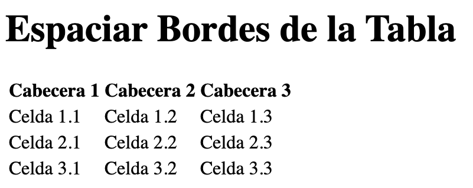
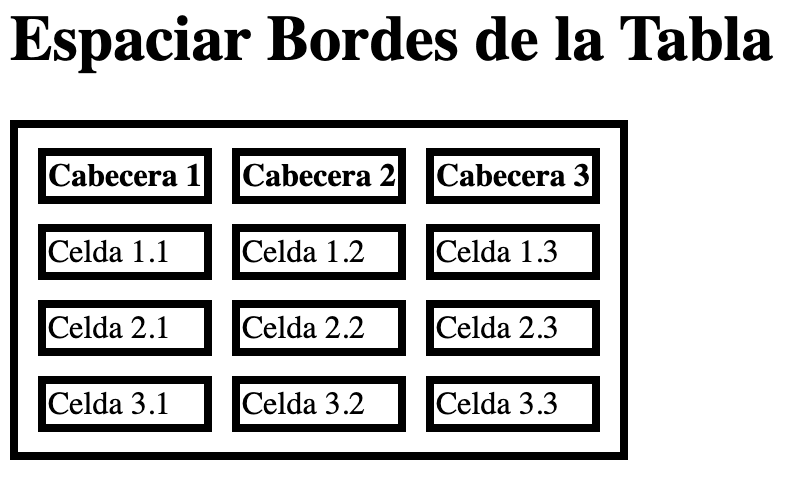

Al dar formato a una tabla podemos necesitar espacio entre los bordes de sus celdas. Para espaciar bordes de una tabla con CSS se utilizan principalmente las propiedades `border-spacing` y `border-collapse`.


Dentro de una tabla existen dos tipos de bordes: el borde exterior del elemento `table` y los bordes de las celdas `th` y `td`. El espacio entre estos últimos no debe confundirse con el espacio interior de las celdas, que se controla mediante `padding`.


## Crear la tabla HTML


Partimos de una [tabla HTML](https://lineadecodigo.com/html/tablas/) sencilla que combina los elementos `table`, `thead`, `tbody`, `tr`, `th` y `td`:


```html
<table>
  <thead>
    <tr>
      <th>Cabecera 1</th>
      <th>Cabecera 2</th>
      <th>Cabecera 3</th>
    </tr>
  </thead>
  <tbody>
    <tr>
      <td>Celda 1.1</td>
      <td>Celda 1.2</td>
      <td>Celda 1.3</td>
    </tr>
    <tr>
      <td>Celda 2.1</td>
      <td>Celda 2.2</td>
      <td>Celda 2.3</td>
    </tr>
    <tr>
      <td>Celda 3.1</td>
      <td>Celda 3.2</td>
      <td>Celda 3.3</td>
    </tr>
  </tbody>
</table>
```


Por defecto, una tabla no muestra bordes visibles, aunque el navegador mantiene el modelo de bordes separados como comportamiento inicial.





## Añadir bordes a la tabla y sus celdas


La propiedad `border` permite definir el grosor, el estilo y el color del borde. Aplicamos la misma regla al elemento `table` y a las celdas `th` y `td`:


```css
table,
th,
td {
  border: 4px solid #000;
}
```


La declaración contiene tres valores:

- `4px`: grosor del borde. Es un valor grande para que el efecto se aprecie con claridad.
- `solid`: estilo de línea continua.
- `#000`: color negro expresado en formato hexadecimal.

El orden de estos componentes es flexible, aunque mantener la secuencia grosor, estilo y color facilita la lectura. También se ha añadido el punto y coma que faltaba en el ejemplo original.


## Espaciar bordes de una tabla con border-spacing


La propiedad `border-spacing` establece la distancia entre los bordes de las celdas adyacentes. Para que funcione, `border-collapse` debe tener el valor `separate`:


```css
table {
  border-collapse: separate;
  border-spacing: 10px;
}
```


Con `border-spacing: 10px`, el navegador deja una separación de `10px` tanto en horizontal como en vertical. El valor no se aplica dentro de las celdas, sino entre sus bordes.





## Diferencia entre separate y collapse


La propiedad `border-collapse` controla el modelo de bordes de la tabla y admite dos valores principales:

- `separate`: cada celda conserva su propio borde y puede existir espacio entre celdas mediante `border-spacing`.
- `collapse`: los bordes contiguos se combinan en un único borde compartido y `border-spacing` deja de tener efecto.

Por ejemplo, esta tabla no mostrará separación entre las celdas aunque se declare `border-spacing`:


```css
table {
  border-collapse: collapse;
  border-spacing: 10px;
}
```


En este caso prevalece el modelo de bordes colapsados. Si el objetivo es espaciar bordes de una tabla con CSS, debemos utilizar `border-collapse: separate`.


## Definir espacios horizontales y verticales distintos


`border-spacing` acepta uno o dos valores de longitud. Con un valor se aplica la misma distancia en ambos ejes:


```css
table {
  border-collapse: separate;
  border-spacing: 12px;
}
```


Con dos valores, el primero controla el espacio horizontal y el segundo el vertical:


```css
table {
  border-collapse: separate;
  border-spacing: 16px 8px;
}
```


En este ejemplo hay `16px` entre columnas y `8px` entre filas. Los valores deben ser longitudes no negativas, como `px`, `em` o `rem`.


## Ejemplo completo


El siguiente código reúne la estructura de la tabla, sus bordes y el espacio entre las celdas:


```html
<!DOCTYPE html>
<html lang="es">
<head>
  <meta charset="UTF-8">
  <meta name="viewport" content="width=device-width, initial-scale=1.0">
  <title>Tabla con bordes separados</title>
  <style>
    table {
      border: 4px solid #000;
      border-collapse: separate;
      border-spacing: 10px;
    }

    th,
    td {
      border: 4px solid #000;
      padding: 8px 12px;
    }
  </style>
</head>
<body>
  <table>
    <thead>
      <tr>
        <th>Cabecera 1</th>
        <th>Cabecera 2</th>
        <th>Cabecera 3</th>
      </tr>
    </thead>
    <tbody>
      <tr>
        <td>Celda 1.1</td>
        <td>Celda 1.2</td>
        <td>Celda 1.3</td>
      </tr>
      <tr>
        <td>Celda 2.1</td>
        <td>Celda 2.2</td>
        <td>Celda 2.3</td>
      </tr>
      <tr>
        <td>Celda 3.1</td>
        <td>Celda 3.2</td>
        <td>Celda 3.3</td>
      </tr>
    </tbody>
  </table>
</body>
</html>
```


En este ejemplo, `border-spacing` separa unas celdas de otras, mientras que `padding` separa el contenido del borde interior de cada celda. Ambas propiedades pueden combinarse porque resuelven necesidades diferentes.


## Border-spacing, padding y margin


Estas propiedades producen efectos distintos:

- `border-spacing` crea espacio entre las celdas cuando el modelo de bordes es `separate`.
- `padding` crea espacio dentro de cada celda, entre su contenido y su borde.
- `margin` crea espacio exterior alrededor de la tabla, pero no es la opción adecuada para separar celdas entre sí.

Para crear una tabla legible suele ser útil combinar un `border-spacing` moderado con `padding` en `th` y `td`. Si se busca una cuadrícula continua, es preferible usar `border-collapse: collapse` y prescindir de `border-spacing`.


## Errores habituales


Si la separación no aparece, conviene revisar lo siguiente:

- `border-collapse` no debe tener el valor `collapse`.
- `border-spacing` debe aplicarse al elemento `table`, no a `th` ni a `td`.
- Los valores de `border-spacing` no pueden ser negativos.
- Debe existir un borde visible si se quiere apreciar con claridad la distancia entre los bordes de las celdas.
- No hay que sustituir `border-spacing` por `cellspacing`, un atributo antiguo de [HTML](https://lineadecodigo.com/html/) que debe evitarse en favor de CSS moderno.

Con estas propiedades podemos controlar de forma precisa el espacio entre los bordes de una tabla y adaptar su apariencia sin alterar la estructura de los datos.

