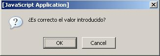

**Confirmar datos en Javascript** es el mecanismo por el cual queremos pedirle al usuario una confirmación de una acción dentro de la página. Esta confirmación busca la aceptación o denegación por parte del usuario de dicha acción.


Para realizar estas validaciones com alguno de los datos podemos apoyarnos en la función [`confim`](https://www.w3api.com/DOM/Window/confirm/). Cuya signatura es la siguiente:


```javascript
confirm(mensaje)
```


Dónde mensaje será el texto de confirmación que le queremos mostrar al usuario.


Una vez que hemos diseñado un formulario [HTML](https://manualweb.net/html/) nos encontraremos a los usuarios introduciendo datos mediante estos formularios.Será en estos casos cuando se nos puede presentar la situación ante la cual necesitemos confirmar ciertos datos de la página. Es decir, preguntarle al usuario si está seguro de alguna de las cosas que ha introducido.


```javascript
confirm("mensaje de texto") return boolean;
```


Es decir, deberemos de pasar un mensaje de texto con la pregunta que queremos hacerle al usuario y nos devolverá un valor booleano indicando si el usuario acepta o no.


Al usuario le saldrá una ventana con botones de _**“Aceptar”**_ o **“C**_**ancelar”**_ como podemos ver a continuación.





Si el usuario pulsa en **"Aceptar"** se devolverá un valor de `true` y si pulsa en el botón de _**"Cancelar"**_ se devolverá un valor de `false`.


Para mostrar la ventana anterior tendremos la siguiente [línea de código](http://lineadecodigo.com/):


```javascript
confirm('¿Es correcto el valor introducido?');
```


Al devolver valores booleanos es una función apta para evaluar en condiciones, así el caso en el que más nos la encontraremos será el siguiente:


```javascript
if (confirm('¿Es correcto el valor introducido?'))
  \\Acciones de OK
else
  \\ Acciones de KO
```


Quizás, **solo una pega a esta función**. Y es que no podremos modificar el titulo del mensaje. Es por ello que estaremos expuestos a lo que el navegador decida.

