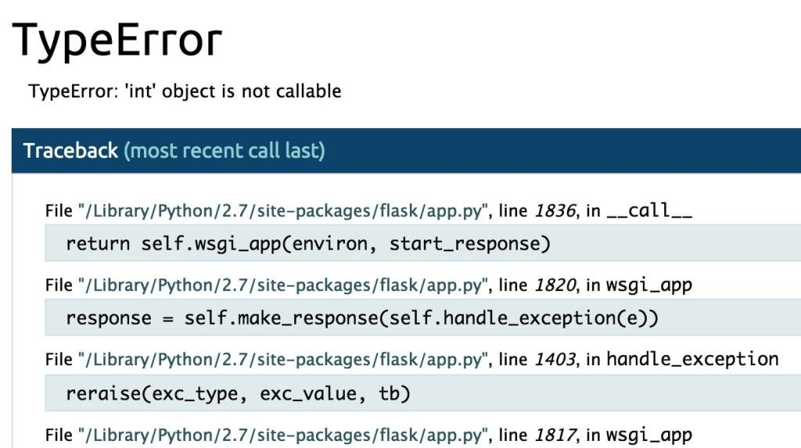

Cuando estemos trabajando con aplicaciones Flask puede darnos múltiples errores que tengamos que depurar. En este ejemplo vamos a ver cómo podemos depurar una aplicación Flask de una forma sencilla.


## Código inicial


Vamos a partir de la siguiente aplicación Flask:


```python
from flask import Flask
app = Flask(__name__)

@app.route("/suma/<int:num1>/<int:num2>")
def suma(num1, num2):
    return num1 + num2

if __name__ == "__main__":
    [app.run](http://app.run/)()
```


## El problema


A priori parece que es correcta y que hemos creado un servicio en Flask que nos suma dos números. Así que al ejecutar `/suma/2/3` debería de sumarnos los dos números y mostrar el resultado.


Pero la realidad es que nos devuelve lo siguiente:


```javascript
Internal Server Error
The server encountered an internal error and was unable to complete your request.
Either the server is overloaded or there is an error in the application.
```


## Activar el modo debug


Si queremos ayuda para poder depurar una aplicación Flask lo que podemos hacer es indicar en el método `run` que tenga activa la depuración:


```python
if __name__ == "__main__":
    [app.run](http://app.run/)(debug=True)
```


> Recuerda que el modelo de depuración solo debes de habilitarlo para entornos de desarrollo o pruebas, nunca en producción.


## Información de depuración


Ahora, al ejecutar la aplicación veremos una pantalla con toda la información de depuración. Y nos permitirá ver que no podemos retornar un número, si no que el servicio debe de retornar una cadena.





## Solución


La solución es convertir el resultado a cadena:


```python
from flask import Flask
app = Flask(__name__)

@app.route("/suma/<int:num1>/<int:num2>")
def suma(num1, num2):
    return str(num1 + num2)

if __name__ == "__main__":
    [app.run](http://app.run/)(debug=True)
```


Mediante este ejemplo hemos podido comprobar cual es el proceso para depurar una aplicación Flask.

