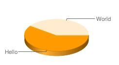

## Generar gráficas con Google Chart


[Google](http://www.ayudaenlaweb.com/buscadores/que-es-google/) nos ofrece un servicio para poder generar gráficas en tiempo real llamado [Google Chart](http://www.manualweb.net/tutorial-google-chart/), el cual podemos utilizar en nuestras páginas web. Su funcionamiento es muy sencillo, ya que simplemente tendremos que hacer invocaciones al servidor de [Google Chart](http://www.manualweb.net/tutorial-google-chart/), para que este, mediante una petición GET nos componga las gráficas en tiempo real.


De esta forma bastará con insertar una URL en la barra de navegación para ver el resultado:


```text
http://chart.apis.google.com/chart?cht=p3&chd=s:hW&chs=250x100&chl=Hello|World
```


## Insertar la gráfica en HTML


En el caso que queramos añadirlo a nuestra página web, podemos utilizar el elemento HTML [`img`](https://www.w3api.com/HTML/img/), y en el atributo [`src`](https://www.w3api.com/HTML/img/src/) indicar la URL.


```html

```


Esto funciona ya que el resultado de la petición GET es una imagen PNG.





Hay que tener en cuenta que hay un límite de 50.000 peticiones diarias. Es por ello que si queremos usarlo de forma masiva, sería bueno el realizar algún tipo de cache de las imágenes.


Vía: _TuFunción_

