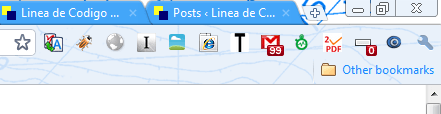
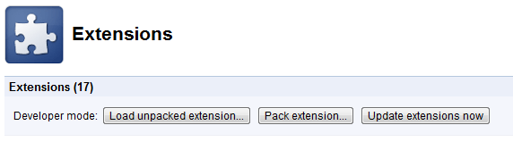
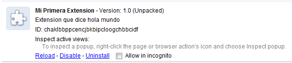
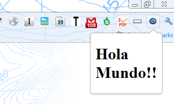

## Introducción a las Extensiones de Google Chrome


Mediante este artículo vamos a ver **como podemos crear nuestra primera extensión en** [**Google Chrome**](http://www.ayudaenlaweb.com/navegadores/que-es-google-chrome/). Pero antes de empezar, ¿qué son las extensiones de [Google Chrome](http://www.ayudaenlaweb.com/navegadores/que-es-google-chrome/)?


Las extensiones de [Google Chrome](http://www.ayudaenlaweb.com/navegadores/que-es-google-chrome/) son componentes que se le pueden añadir al navegador web [Google Chrome](http://www.ayudaenlaweb.com/navegadores/que-es-google-chrome/) para ampliar la funcionalidad del mismo.





Si queréis, [podéis informaros más sobre las extensiones de Google Chrome](https://chrome.google.com/extensions?page=1&hl=en&itemlang=es).


## El Fichero manifest.json


Lo primero que tenemos que saber para crear una extensión en [Google Chrome](http://www.ayudaenlaweb.com/navegadores/que-es-google-chrome/) es que hay que **declarar un fichero manifest en formato json**. Este fichero se llamará **manifest.json**.


La [estructura de manifest.json](http://code.google.com/chrome/extensions/manifest.html) es la que define los elementos que contienen la extensión. A ver:

- **name**, nombre de la extensión.
- **version**, versión de la extensión.
- **description**, descripción de la extensión.
- **icons**, iconos que representan la extensión. Hay que proporcionar, al menos, dos. Uno que sea 48x48 y otro 128x128
- **browser_action**, nos permite añadir un elemento a la barra de [Google Chrome](http://www.ayudaenlaweb.com/navegadores/que-es-google-chrome/). Este será el elemento más importante de nuestra primera extensión en Google Chrome.

Así, podemos ir creando el fichero manifest.json:


```json
{
  "name": "Mi Primera Extension",
  "version": "1.0",
  "description": "Extension que dice hola mundo",
}
```


## Configurando browser_action


Pero vamos a entrar en profundidad en **browser_action**. Y es que **browser_action** es una estructura en si mismo, la cual puede contener los siguientes campos:

- **default_icon**, icono que saldrá en la barra del [Google Chrome](http://www.ayudaenlaweb.com/navegadores/que-es-google-chrome/).
- **default_title**, tooltip que se mostrará al pasar sobre el icono.
- **default_popup**, fichero [HTML](https://www.manualweb.net/html/) que se abrirá al pulsar sobre la extensión.

Vamos añadiendo cosas a nuestro fichero manifest.json:


```json
{
  "name": "Mi Primera Extension",
  "version": "1.0",
  "description": "Extension que dice hola mundo",
  "browser_action": {
    "default_icon": "logo.ico",
    "popup": "miprimeraextension.html"
  }
}
```


## Creando el Fichero HTML


Vemos que el fichero que se abrirá al pulsar sobre la extensión en [Google Chrome](http://www.ayudaenlaweb.com/navegadores/que-es-google-chrome/) será "miprimeraextension.html". Así que será dentro de él dónde codificaremos lo que queramos mostrar en la extensión. En este caso será algo muy sencillo.


```html
<h1>Hola Mundo!!</h1>
```


## Estructura de Archivos


Así, tenemos 3 ficheros dentro de nuestro directorio.


```javascript
/MiPrimeraExtension
|-- manifest.json
|-- miprimeraextension.html
|-- logo.ico
```


## Instalando la Extensión


Ahora solo tendremos que instalarlo en [Google Chrome](http://www.ayudaenlaweb.com/navegadores/que-es-google-chrome/). Para ello vamos al menú:


```javascript
Tools » Developer Extensions

```


En la parte superior veremos que hay una opción que se llama _**Load unpacked extension**_. Al pulsar sobre esta opción se nos mostrará un explorador mediante el cual hay que elegir el directorio MiPrimeraExtension.





Y ya tendremos la extensión instalada en [Google Chrome](http://www.ayudaenlaweb.com/navegadores/que-es-google-chrome/).





## Resultado Final


Y el resultado de nuestra primera extensión en Google Chrome es el siguiente...




