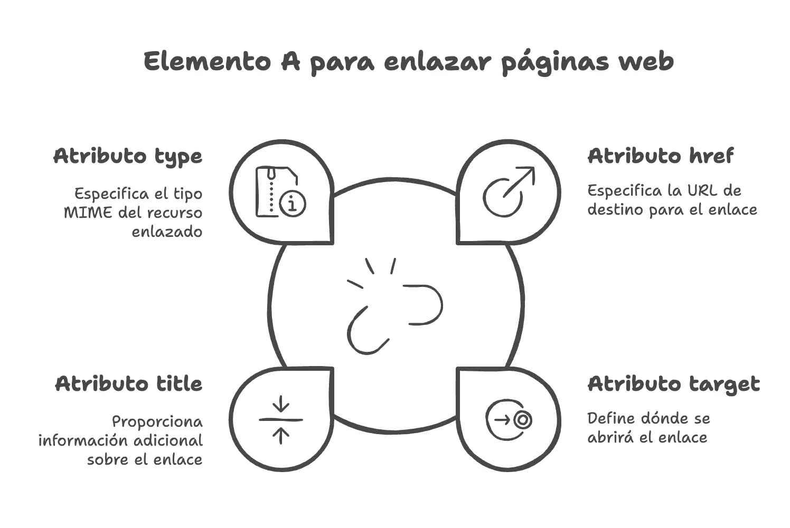

Uno de los principios sobre los que se sustenta la WWW es el enlazado de documentos. Así que vamos a aprender a enlazar dos páginas web. Esto se basa en el concepto de Hipertexto, que viene a decir algo así como presentar documentos que puedan bifurcarse o ejecutarse cuando sea solicitado. Esta definición se data en 1963 por **el sociólogo Theodore Holm Nelson**, mucho antes de que naciese la WWW.


Una de las formas del hipertexto son los _hipervínculos_ o _hiperenlaces_ o enlaces (forma vulgar más conocida de las tres).


Así que si queremos hacer páginas web utilizando [HTML](https://www.manualweb.net/html), lo primero que tenemos que aprender, o una de las primeras cosas, es [cómo hacer enlaces](https://lineadecodigo.com/tag/html-enlaces/).


Para ello nos tenemos que apoyar en [el elemento ](https://w3api.com/HTML/a/)[`a`](https://w3api.com/HTML/a/)[ ](https://w3api.com/HTML/a/)que viene del ingles _"anchor"_ (ancla) y que es uno de los elementos base del lenguaje [HTML](http://www.manualweb.net/html).


### Atributos del elemento a para enlazar dos páginas web


Los atributos [del elemento ](https://w3api.com/HTML/a/)[`a`](https://w3api.com/HTML/a/)[ ](https://w3api.com/HTML/a/)que tenemos que conocer para generar los enlaces son los siguientes:

- [`href`](https://w3api.com/HTML/a/href/), donde habrá que especificar la página (o recurso) de destino. Este podrá ser con la dirección absoluta o relativa al enlace que queremos poner.
- [`target`](https://w3api.com/HTML/a/target/), donde indicaremos el frame destino de la página. Si queremos que el enlace se abra sobre la misma página, lo dejamos vacío.
- [`title`](https://w3api.com/HTML/title/), título del enlace. Será útil para que se interprete por los clientes qué significa el enlace que se muestra. Suele ser útil en temas de SEO.
- [`type`](https://w3api.com/HTML/a/type/), que especifica el tipo MIME del recurso enlazado, es decir, si es una página, si es una image, un archivo de vídeo,…, ayudando al [navegador web](https://www.ayudaenlaweb.com/navegadores/que-es-un-navegador/) a determinar cómo manejar el contenido al que se está enlazando. Este atributo es especialmente útil cuando se enlaza a recursos que no son páginas web estándar.




### Código para enlazar las páginas


Ahora ya nos ponemos manos a la obra para poder escribir nuestro [código HTML](https://lineadecodiogo.com/categoria/html/) para ello asumimos que estamos en la _paginaA.htm_ y queremos enlazar y por lo tanto abrir la _paginaB.htm._ En [código HTML](https://lineadecodiogo.com/categoria/html/) será algo así:


```html
<a href="paginaB.htm" title="Mi enlace">Mi enlace</a>
```


De esta forma tan sencilla hemos conseguido enlazar dos páginas web mediante [HTML](http://www.manualweb.net/html) y así seguir tejiendo esta inmensa red que es la WWW.

