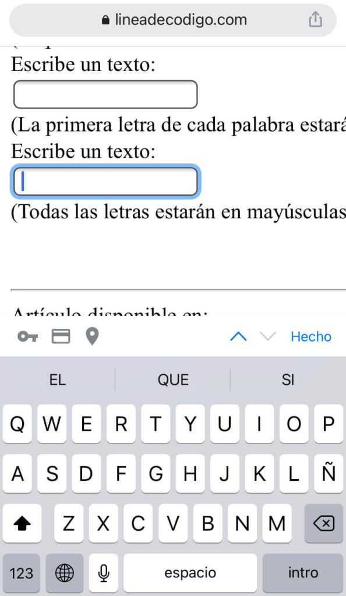

Una de las cosas que nos permite [HTML5](https://www.manualweb.net/html5) es poder configurar teclados para la entrada de datos en [HTML5](https://www.manualweb.net/html5) de tal manera que podemos forzar a que el teclado esté configurado en mayúsculas, a que la primera letra de una frase sea en mayúsculas o bien que todas las palabras que insertemos empiecen en mayúsculas.


De esta manera estaremos ayudando al usuario cuando este tenga que introducir contenido dentro de los formularios. Es muy importante que esta configuración de teclados afectará cuándo estemos utilizando dispositivos móviles, los cuales nos muestren los teclados virtuales para poder insertar el contenido en el formulario. O bien, para aplicaciones de accesibilidad que estén ayudando en la captura de información.


Pero, vamos por partes. Lo primero de todo será [crear nuestro formulario HTML](https://lineadecodigo.com/tag/html-form/) mediante el elemento [`form`](http://w3api.com/HTML/form/) y los elementos [`input`](http://w3api.com/HTML/input/) para cada una de las entradas de texto.


```html
<form>
  <input type="text" name="nombre" placeholder="Nombre">
  <input type="text" name="apellidos" placeholder="Apellidos">
</form>
```


## El atributo autocapitalize


Lo siguiente que tenemos que conocer es el comportamiento del atributo [`autocapitalize`](http://w3api.com/HTML/autocapitalize/). El atributo [`autocapitalize`](http://w3api.com/HTML/autocapitalize/) nos sirve para dar los diferentes comportamientos sobre el teclado virtual, así podemos asignarle los siguientes valores:

- **off**, no hay conversión a mayúsculas automática.
- **sentences**, la primera letra de cada frase se le ofrecerá al usuario en mayúsculas.
- **words**, la primera letra de cada palabra se le mostrará en el teclado en mayúsculas.
- **characters**, todas las letras del teclado están en mayúsculas.

De esta manera, si queremos que todas las letras del teclado esté en mayúsculas marcaremos el atributo [`autocapitalize`](http://w3api.com/HTML/autocapitalize/) como **"characteres"**.


```html
<input type="text" name="nombre" placeholder="Nombre" autocapitalize="characters">
```


## Probando autocapitalize


Si probamos en nuestro terminal móvil veremos en funcionamiento el atributo [`autocapitalize`](http://w3api.com/HTML/autocapitalize/):





Podemos ir variando el contenido del atributo [`autocapitalize`](http://w3api.com/HTML/autocapitalize/) con los diferentes valores:


```html
<input type="text" name="nombre" placeholder="Nombre" autocapitalize="sentences">
<input type="text" name="apellidos" placeholder="Apellidos" autocapitalize="words">
<input type="text" name="codigo" placeholder="Código" autocapitalize="characters">
```


De esta forma ya sabemos configurar teclados para la entrada de datos en [HTML5](https://www.manualweb.net/html5) y dar al usuario la experiencia que mejor nos convenga para nuestra entrada de datos.

