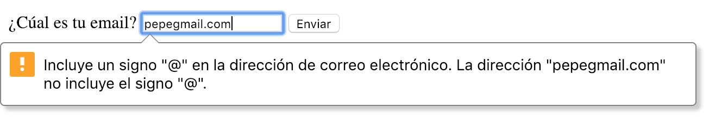

Una de las cosas que nos trajo [HTML5](http://www.manualweb.net/html5/) fue una gran **cantidad de controles de formulario**. Controles que además venían enriquecidos con controles de validación de los datos que manejaban. Entre ellos el input email en [HTML5](http://www.manualweb.net/html5/).


Atrás quedaban los años en los que cada vez que creabas un formulario te tenías que codificar los controles en [Javascript](http://www.manualweb.net/javascript/) o [jQuery](http://www.manualweb.net/jquery/) o bien apoyarte en [librerías como wForms](http://lineadecodigo.com/categoria/wforms/).


## Definir un input email en HTML5


Ahora podemos incluir dentro de nuestro formulario un input email en [HTML5](http://www.manualweb.net/html5/) para que el usuario pueda meter direcciones de correo electrónico. Para ello, simplemente tenemos que utilizar un elemento `input`, al cual daremos en su atributo `type` el valor de `email`.


El código [HTML5](http://www.manualweb.net/html5/) que generaremos será el siguiente:


```html
<input type="email" id="correoelectronico" name="correoelectronico"/>
```


> Qué conste que el `id` y `name` que se utilizan suele ser también un nombre como `email`, pero para destacar el campo `type` lo hemos cambiado a `correoelectronico`.


## Validación automática del email


Lo que nos va a presentar el formulario es un simple campo de texto, tal y como los presentaba con los elementos `input` de tipo `text` que existían, pero con una pequeña-gran diferencia.


Es que **será el propio HTML5 quien realice la validación de que el contenido corresponda con un texto en formato email**. Así, si el usuario no inserta un contenido que sea un email, el propio formulario se "quejará" al respecto, mostrando un mensaje de error al usuario.





## Ejemplo completo de formulario


El formulario completo con nuestro input email en [HTML5](http://www.manualweb.net/html5/) quedaría de la siguiente manera:


```html
<form action="#" method="post">
  <label for="correoelectronico">¿Cuál es tu email?</label>
  <input type="email" id="correoelectronico" name="correoelectronico"/>
  <input type="submit" value="Enviar"/>
</form>
```


Con esto vemos lo que nos ha simplificado la vida cuando tenemos que gestionar input email en [HTML5](http://www.manualweb.net/html5/) dentro de un formulario.

