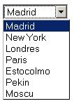
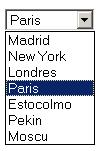

Cuando estamos poniendo un combo en nuestra página web nos ayudaremos de las etiquetas [SELECT](http://w3api.com/wiki/HTML:SELECT) y [OPTION](http://w3api.com/wiki/HTML:OPTION). La primera se encarga de definir el propio combo, mientras que la segunda se repetirá por cada una de las opciones que queramos añadir. Así, podríamos tener el siguiente combo:


```html
<select name="ciudades">
  <option>Madrid</option>
  <option>New York</option>
  <option>Londres</option>
  <option>Paris</option>
  <option>Estocolmo</option>
  <option>Pekin</option>
  <option>Moscu</option>
</select>
```


En la página web veríamos el siguiente efecto: Si queremos que salga marcada una opción por defecto, deberemos de utilizar el [atributo SELECTED](http://w3api.com/wiki/HTML:Selected) sobre la etiqueta [OPTION](http://w3api.com/wiki/HTML:OPTION) que contenga el valor por defecto. Así, si queremos que salga Paris como opción por defecto, deberemos de tener el siguiente código:





```html
<select name="ciudades">
  <option>Madrid</option>
  <option>New York</option>
  <option>Londres</option>
  <option selected="selected">Paris</option>
  <option>Estocolmo</option>
  <option>Pekin</option>
  <option>Moscu</option>
</select>
```


Y se nos producirá el siguiente efecto:




