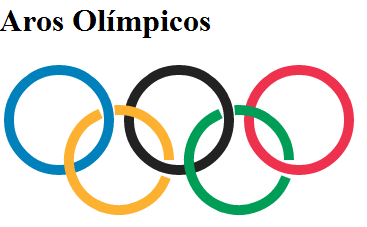

Durante los Juegos Olímpicos de Londres 2012, y después de explicar cómo dibujar círculos en HTML5, surgió la idea de utilizar el elemento `<canvas>` para recrear los cinco aros olímpicos. El ejemplo sigue siendo una forma práctica de aprender a crear arcos, definir colores y controlar el grosor de los trazos mediante [JavaScript](https://lineadecodigo.com/javascript/).





## Preparar el elemento Canvas


El primer paso para crear los aros olímpicos con Canvas y HTML5 es añadir un elemento `<canvas>` al documento. Los atributos `width` y `height` establecen las dimensiones internas del lienzo y deben indicarse como números, sin la unidad `px`.


También es recomendable proporcionar una descripción accesible y un contenido alternativo para los navegadores que no puedan mostrar el lienzo:


```html
<canvas
  id="micanvas"
  width="420"
  height="240"
  aria-label="Ilustración de cinco aros olímpicos entrelazados"
>
  Tu navegador no admite el elemento canvas.
</canvas>
```


Desde [JavaScript](https://lineadecodigo.com/javascript/) obtenemos la referencia al elemento y solicitamos su contexto de representación `2d`:


```javascript
const canvas = document.getElementById("micanvas");
const ctx = canvas.getContext("2d");
```


El objeto `ctx` es una instancia de `CanvasRenderingContext2D`. A través de él podemos crear rutas, dibujar arcos y aplicar estilos al contorno.


## Dibujar los tres aros superiores


Para dibujar un círculo completo utilizamos el método `arc()`. Sus ángulos se expresan en radianes, por lo que una circunferencia completa va desde `0` hasta `Math.PI * 2`.


Cada aro sigue esta secuencia:

1. `beginPath()` inicia una ruta nueva.
2. `arc()` añade el círculo a la ruta actual.
3. `strokeStyle` define el color del contorno.
4. `lineWidth` establece el grosor de la línea.
5. `stroke()` dibuja el contorno.

Podemos encapsular estas operaciones en una función reutilizable:


```javascript
const radio = 50;

ctx.lineWidth = 10;
ctx.lineCap = "round";

function dibujarAro(x, y, color) {
  ctx.beginPath();
  ctx.arc(x, y, radio, 0, Math.PI * 2);
  ctx.strokeStyle = color;
  ctx.stroke();
}

// Aros superiores: azul, negro y rojo
dibujarAro(80, 80, "rgb(0 129 188)");
dibujarAro(210, 80, "rgb(35 34 35)");
dibujarAro(340, 80, "rgb(238 50 78)");
```


No es necesario rellenar los círculos con un color transparente. Como solo queremos representar los bordes, basta con utilizar `stroke()`. El interior del aro permanece transparente de forma natural.


## Crear el efecto entrelazado con arcos parciales


Los aros amarillo y verde se sitúan debajo de los superiores. Para simular el entrelazado del ejemplo original, cada uno se divide en dos arcos y se dejan pequeños espacios en las zonas de cruce.


La siguiente función permite expresar los ángulos en grados y convertirlos a radianes antes de llamar a `arc()`:


```javascript
function aRadianes(grados) {
  return (grados * Math.PI) / 180;
}

function dibujarArco(x, y, inicio, fin, color) {
  ctx.beginPath();
  ctx.arc(
    x,
    y,
    radio,
    aRadianes(inicio),
    aRadianes(fin),
    true
  );
  ctx.strokeStyle = color;
  ctx.stroke();
}
```


Ahora dibujamos los dos segmentos de cada aro inferior:


```javascript
// Aro amarillo
dibujarArco(145, 145, 0, 265, "rgb(252 177 49)");
dibujarArco(145, 145, 248, 20, "rgb(252 177 49)");

// Aro verde
dibujarArco(275, 145, 0, 265, "rgb(0 157 87)");
dibujarArco(275, 145, 248, 20, "rgb(0 157 87)");
```


El último argumento de `arc()` es `true`, por lo que los arcos se recorren en sentido antihorario. Los intervalos utilizados dejan las interrupciones necesarias para sugerir que unas partes pasan por delante y otras por detrás.


## Código completo de los aros olímpicos


Este es el ejemplo completo, listo para copiar en un documento HTML:


```html
<!doctype html>
<html lang="es">
<head>
  <meta charset="utf-8">
  <meta name="viewport" content="width=device-width, initial-scale=1">
  <title>Aros olímpicos con Canvas y HTML5</title>
</head>
<body>
  <canvas
    id="micanvas"
    width="420"
    height="240"
    aria-label="Ilustración de cinco aros olímpicos entrelazados"
  >
    Tu navegador no admite el elemento canvas.
  </canvas>

  <script>
    const canvas = document.getElementById("micanvas");
    const ctx = canvas.getContext("2d");
    const radio = 50;

    ctx.lineWidth = 10;
    ctx.lineCap = "round";

    function dibujarAro(x, y, color) {
      ctx.beginPath();
      ctx.arc(x, y, radio, 0, Math.PI * 2);
      ctx.strokeStyle = color;
      ctx.stroke();
    }

    function aRadianes(grados) {
      return (grados * Math.PI) / 180;
    }

    function dibujarArco(x, y, inicio, fin, color) {
      ctx.beginPath();
      ctx.arc(
        x,
        y,
        radio,
        aRadianes(inicio),
        aRadianes(fin),
        true
      );
      ctx.strokeStyle = color;
      ctx.stroke();
    }

    dibujarAro(80, 80, "rgb(0 129 188)");
    dibujarAro(210, 80, "rgb(35 34 35)");
    dibujarAro(340, 80, "rgb(238 50 78)");

    dibujarArco(145, 145, 0, 265, "rgb(252 177 49)");
    dibujarArco(145, 145, 248, 20, "rgb(252 177 49)");
    dibujarArco(275, 145, 0, 265, "rgb(0 157 87)");
    dibujarArco(275, 145, 248, 20, "rgb(0 157 87)");
  </script>
</body>
</html>
```


## Conceptos importantes del ejemplo

- Es necesario ejecutar `beginPath()` antes de cada aro para evitar que los nuevos estilos afecten a las rutas anteriores.
- `strokeStyle` controla el color del contorno y `lineWidth` su grosor.
- `lineCap` con el valor `round` suaviza los extremos visibles de los arcos parciales.
- `arc()` recibe la posición del centro, el radio y los ángulos inicial y final.
- El contenido dibujado en `<canvas>` no forma parte del `DOM`; por eso conviene añadir `aria-label` o contenido alternativo.

Con estas técnicas podemos crear los aros olímpicos con Canvas y HTML5 y, al mismo tiempo, aprender los fundamentos necesarios para construir otros gráficos basados en círculos y rutas.

