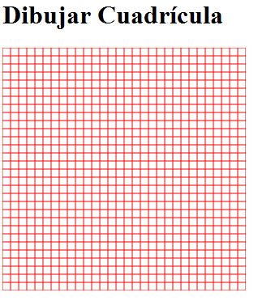

Crear una cuadrícula sobre un canvas de HTML5 consiste en dibujar una serie de líneas verticales y horizontales separadas a intervalos regulares. El resultado simula un papel cuadriculado y permite practicar el uso de rutas, coordenadas y estilos de línea en la `Canvas API`.


El resultado que buscamos será similar a este:





Para construirla utilizaremos `moveTo()` para situar el inicio de cada línea, `lineTo()` para definir su final y `stroke()` para dibujar todas las líneas de la ruta.


## Crear el elemento Canvas


Primero añadimos el elemento `<canvas>` a la página. Los atributos `width` y `height` se indican mediante valores numéricos, sin añadir la unidad `px`:


```html
<canvas id="micanvas" width="300" height="300">
  Tu navegador no admite el elemento canvas.
</canvas>
```


Después obtenemos la referencia al elemento y su contexto de dibujo `2d` mediante [JavaScript](https://lineadecodigo.com/javascript/):


```javascript
const canvas = document.getElementById("micanvas");
const ctx = canvas.getContext("2d");
```


El objeto `ctx` es un `CanvasRenderingContext2D` y contiene los métodos necesarios para definir y representar las líneas.


## Definir la separación de la cuadrícula


La separación determina la distancia entre dos líneas consecutivas. En lugar de repetir el valor directamente en cada bucle, lo almacenamos en una constante:


```javascript
const separacion = 10;
```


Con una separación de `10` píxeles, un lienzo de `300 × 300` tendrá líneas distribuidas regularmente en ambos ejes. Podemos aumentar el valor para obtener celdas más grandes o reducirlo para crear una cuadrícula más densa.


## Dibujar las líneas verticales


Iniciamos un `Path` nuevo con `beginPath()`. Después recorremos el ancho del lienzo y añadimos una línea vertical en cada posición del eje `x`:


```javascript
ctx.beginPath();

for (let x = 0; x <= canvas.width; x += separacion) {
  ctx.moveTo(x, 0);
  ctx.lineTo(x, canvas.height);
}
```


`moveTo(x, 0)` sitúa el punto inicial en la parte superior y `lineTo(x, canvas.height)` extiende la línea hasta el borde inferior. Estos métodos definen la geometría, pero todavía no la dibujan.


## Dibujar las líneas horizontales


El segundo bucle recorre la altura del lienzo mediante la coordenada `y`. Cada línea comienza en el borde izquierdo y termina en el derecho:


```javascript
for (let y = 0; y <= canvas.height; y += separacion) {
  ctx.moveTo(0, y);
  ctx.lineTo(canvas.width, y);
}
```


Utilizar `canvas.width` y `canvas.height` evita depender de valores fijos. Si cambiamos las dimensiones del lienzo, la cuadrícula seguirá ocupando toda su superficie.


## Aplicar el estilo y dibujar la cuadrícula


Una vez definidas las líneas, configuramos su color y grosor. Una sola llamada a `stroke()` dibuja todas las subrutas añadidas:


```javascript
ctx.strokeStyle = "#d0d7de";
ctx.lineWidth = 1;
ctx.stroke();
```


El atributo `strokeStyle` establece el color de las líneas y `lineWidth` define su grosor. Usar un color claro ayuda a que la cuadrícula funcione como guía sin competir visualmente con otros dibujos.


## Ejemplo completo


El siguiente documento crea una cuadrícula sobre un `canvas` de HTML5 con celdas de `10 × 10` píxeles:


```html
<!doctype html>
<html lang="es">
<head>
  <meta charset="utf-8">
  <title>Cuadrícula sobre Canvas</title>
</head>
<body>
  <canvas id="micanvas" width="300" height="300">
    Tu navegador no admite el elemento canvas.
  </canvas>

  <script>
    const canvas = document.getElementById("micanvas");
    const ctx = canvas.getContext("2d");
    const separacion = 10;

    ctx.beginPath();

    for (let x = 0; x <= canvas.width; x += separacion) {
      ctx.moveTo(x, 0);
      ctx.lineTo(x, canvas.height);
    }

    for (let y = 0; y <= canvas.height; y += separacion) {
      ctx.moveTo(0, y);
      ctx.lineTo(canvas.width, y);
    }

    ctx.strokeStyle = "#d0d7de";
    ctx.lineWidth = 1;
    ctx.stroke();
  </script>
</body>
</html>
```


## Crear una función reutilizable


Podemos encapsular el dibujo para generar cuadrículas con diferentes tamaños, colores y separaciones:


```javascript
function dibujarCuadricula(ctx, ancho, alto, separacion, color = "#d0d7de") {
  if (separacion <= 0) {
    return;
  }

  ctx.beginPath();

  for (let x = 0; x <= ancho; x += separacion) {
    ctx.moveTo(x, 0);
    ctx.lineTo(x, alto);
  }

  for (let y = 0; y <= alto; y += separacion) {
    ctx.moveTo(0, y);
    ctx.lineTo(ancho, y);
  }

  ctx.strokeStyle = color;
  ctx.lineWidth = 1;
  ctx.stroke();
}

dibujarCuadricula(ctx, canvas.width, canvas.height, 20, "#b0bec5");
```


La validación de `separacion` evita un bucle infinito cuando el valor es `0` o negativo.


## Mejorar la nitidez de líneas de un píxel


En un contexto sin escalado, un trazo de un píxel situado sobre una coordenada entera puede repartirse entre dos columnas o filas de píxeles y verse suavizado. Para obtener líneas más nítidas, podemos desplazar las coordenadas `0.5` píxeles:


```javascript
for (let x = 0; x <= canvas.width; x += separacion) {
  ctx.moveTo(x + 0.5, 0);
  ctx.lineTo(x + 0.5, canvas.height);
}
```


Este ajuste es opcional y está pensado para `lineWidth = 1`. Si se aplican transformaciones o escalado al contexto, conviene comprobar visualmente el resultado.


## Errores comunes

- **Añadir** **`px`** **a** **`width`** **o** **`height`****:** los atributos del `<canvas>` deben usar valores numéricos, como `width="300"`.
- **Olvidar** **`beginPath()`****:** una nueva llamada a `stroke()` podría volver a dibujar rutas anteriores.
- **No llamar a** **`stroke()`****:** `moveTo()` y `lineTo()` solo definen la ruta; no muestran las líneas.
- **Usar dimensiones fijas en los bucles:** es preferible consultar `canvas.width` y `canvas.height`.
- **Utilizar una separación igual o menor que cero:** el bucle no avanzaría correctamente.
- **Dibujar cada línea con un** **`stroke()`** **independiente:** agruparlas en una sola ruta simplifica el código y reduce operaciones innecesarias.

En resumen, para crear una cuadrícula sobre un `canvas` de HTML5 iniciamos una ruta, generamos líneas verticales y horizontales mediante dos bucles y las representamos con una única llamada a `stroke()`.

