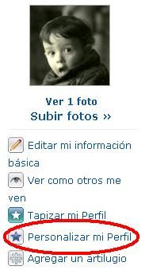
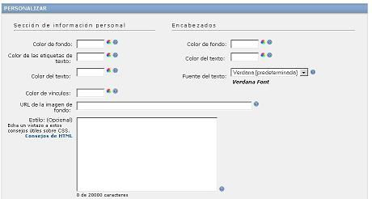
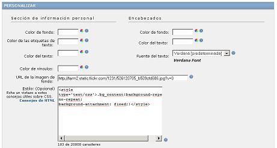

Muchas personas me han enviado correos preguntándome como podían dejar fijo el fondo de pantalla en [hi5.com](http://hi5.com/). Sobre todo porque habían seguido el ejemplo ["Fondo estático en una página web"](http://lineadecodigo.com/html/fondo-estatico-en-una-pagina-web/) y no les había funcionado. (también podéis ver los comentarios al artículo que hablan sobre el tema).


El código de ["Fondo estático en una página web"](http://lineadecodigo.com/html/fondo-estatico-en-una-pagina-web/) no funciona con [hi5.com](http://hi5.com/) debido a que está pensado para poder manipular una página sin restricciones o hecha enteramente por nosotros.


Si bien, [hi5.com](http://hi5.com/), nos deja modificar ciertas propiedades en la edición del perfil para poder conseguir que el fondo de la página se quede estático.


## Pasos para configurar el fondo estático


Lo primero que tienes que hacer es acceder con tu usuario y contraseña dentro de [hi5.com](http://hi5.com/). Una vez dentro deberéis de ir a la opción **"Personalizar mi Perfil"**.


Una vez dentro veras un formulario como el que sigue:








## Configuración del perfil


La la parte de personalización del perfil deberás de rellenar dos campos (aunque puedes personalizarte muchos más):


Por un lado **URL de la imagen de fondo:** donde tienes que indicar la URL de tu foto o imagen (en mi caso he puesto una foto de [flickr.com](http://flickr.com/)) y por otro tienes que poner el siguiente código en **Estilo**


```css
<style type="text/css">
.bg_content {
  background-repeat: no-repeat;
  background-attachment: fixed;
}
</style>
```


En este caso el elemento sobre el que se aplica el fondo fijo es `.bg_content` y no `.body`


Quedando algo como lo que sigue:





Podéis comprobar el estado final en mi página [http://lineadecodigo.hi5.com](http://lineadecodigo.hi5.com/)

