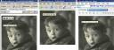

Muchas veces habréis pasado sobre una imagen y habréis visto que sale como un pequeño texto en amarillo con un texto, normalmente relacionado con la imagen. Pues bien, eso es lo que se conoce como tooltip.


Lo primero que vamos a hacer es poner una imagen en nuestra página web. Para ello utilizaremos la etiqueta [IMG](http://w3api.com/wiki/HTML:IMG). Dentro de esta etiqueta tenemos el [atributo src](http://w3api.com/wiki/HTML:Src) que nos indicará el nombre de la imagen que queremos mostrar.


Así nos quedará la siguiente [línea de código](/):


```html

```


Si queremos incluirle el tooltip, deberemos de utilizar el atributo title, al cual le daremos como valor el texto que queramos que salga en el tooltip. Veamos cómo queda la [línea de código](/):


```html

```


Lo bueno del [atributo title](http://w3api.com/wiki/HTML:Title) es que lo podemos utilizar en diferentes etiquetas [HTML](https://www.manualweb.net/html/). Es decir, que no solo está limitado a la etiqueta [IMG](http://w3api.com/wiki/HTML:IMG).


Y veamos el resultado, pasa sobre la imagen…


Veamos el comportamiento de algunos navegadores:




