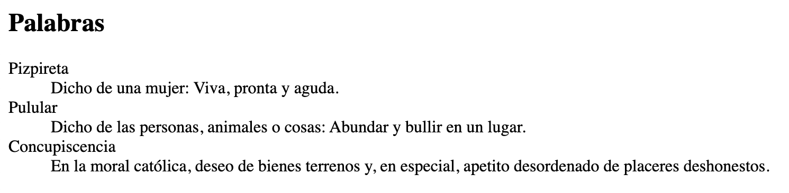

Quizás una de las listas más desconocidas son las listas de definiciones en [HTML](https://www.manualweb.net/html/), ya que lo normal es maquetar mediante [listas ordenadas](http://lineadecodigo.com/html/listas-ordenadas-en-html/) o [listas desordenadas](http://lineadecodigo.com/html/listas-desordenadas-en-html/). Las listas de definiciones en [HTML](https://www.manualweb.net/html/) nos permiten crear listas con pares de término/definición. Algo así como un glosario o diccionario.


## Estructura del elemento DL


La estructura básica de las listas de definiciones en [HTML](https://www.manualweb.net/html/) se construye mediante el [elemento DL](https://www.w3api.com/HTML/dl/).


```html
<dl>
  <dt>Termino 1</dt>
  <dd>Definición 1</dd>
  <dt>Término 2</dt>
  <dd>Definición 2</dd>
  ...
  <dt>Término N</dt>
  <dd>Definición N</dd>
</dl>
```


Dentro de la estructura del [elemento DL](https://www.w3api.com/HTML/dl/) encontramos dos elementos, el primero es [DT](https://www.w3api.com/HTML/dt/) el cual alberga el término que vamos a explicar y [DD](https://www.w3api.com/HTML/dd/) dónde indicamos la definición de dicho término. Así que encontramos siempre estos dos pares de elementos [DT](https://www.w3api.com/HTML/dt/) y [DD](https://www.w3api.com/HTML/dd/).


## Ejemplo de diccionario


Para ver el funcionamiento de las listas de definiciones en [HTML](https://www.manualweb.net/html/) vamos a ver como crear un pequeño diccionario de palabras con su definición asociada. De esta manera el código que generamos para nuestra lista de definiciones será el siguiente:


```html
<dl>
  <dt>Pizpireta</dt>
  <dd>Dicho de una mujer: Viva, pronta y aguda.</dd>
  <dt>Pulular</dt>
  <dd>Dicho de las personas, animales o cosas: Abundar y bullir en un lugar.</dd>
  <dt>Concupiscencia</dt>
  <dd>En la moral católica, deseo de bienes terrenos y, en especial, apetito desordenado de placeres deshonestos.</dd>
</dl>
```


Este código para el manejo de listas de definiciones en [HTML](https://www.manualweb.net/html/) generará lo siguiente en pantalla:





## Personalización con CSS


Mediante código [CSS](http://www.manualweb.net/css/) podemos modificar la visualización de las listas de definiciones en [HTML](https://www.manualweb.net/html/) si no nos convence la presentación por defecto del navegador.

