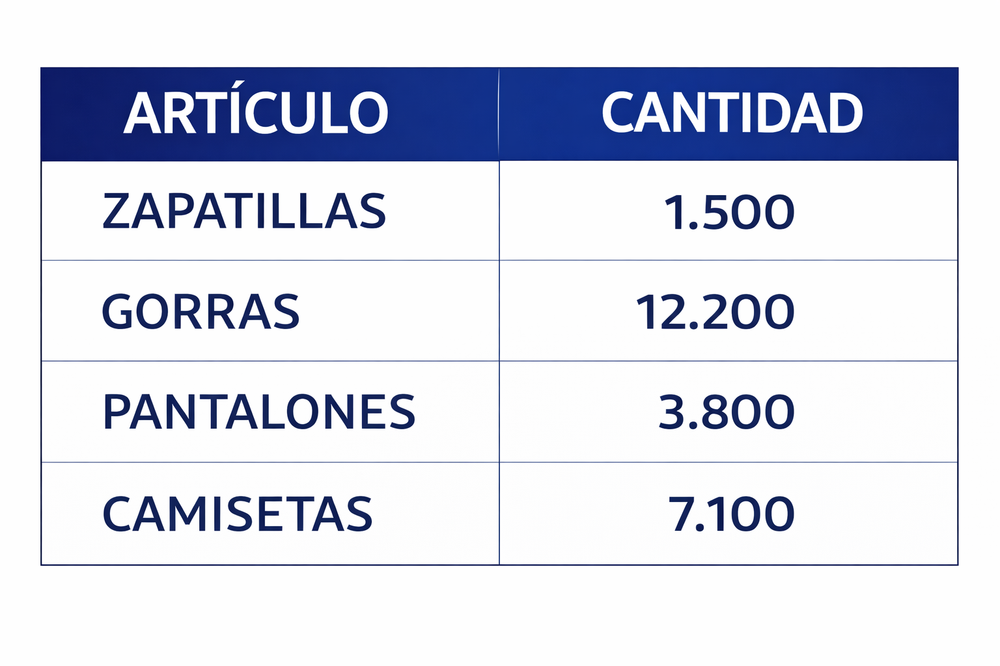
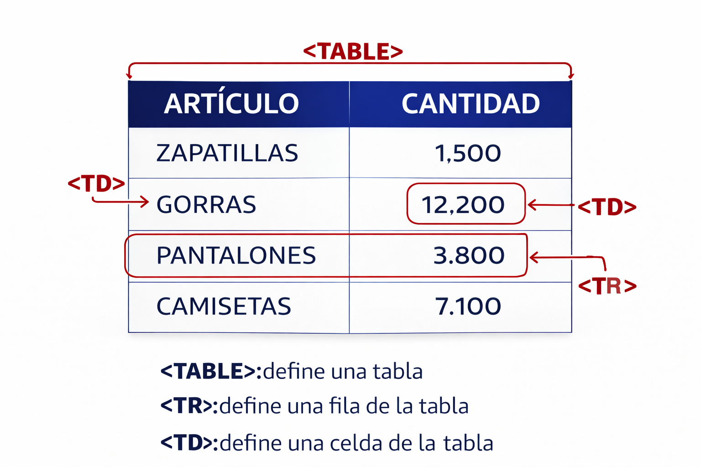

Las tablas son elementos que nos sirven en [HTML](https://www.manualweb.net/html/) para mostrar datos organizados. Si trabajas con programas de ofimática estarás familiarizado con su funcionamiento y las utilidades que puede tener una tabla.


Por ejemplo podemos tener una tabla que nos muestre los artículos que tenemos en un almacén.





## El elemento TABLE


El elemento [HTML](https://www.manualweb.net/html/) que representa a una tabla es [TABLE](https://www.w3api.com/HTML/table/). Con lo cual [TABLE](https://www.w3api.com/HTML/table/) será el elemento padre a la hora de crear una tabla en [HTML](https://www.manualweb.net/html/).


```html
<table>
  <!-- Contenido de la tabla -->
</table>
```


## El elemento TR para las filas


Ahora hay que conocer otro elemento que va dentro de la tabla. El elemento [TR](https://www.w3api.com/HTML/tr/) representa una fila.


Así que dentro del elemento [TABLE](https://www.w3api.com/HTML/table/) tendremos tantos elementos [TR](https://www.w3api.com/HTML/tr/) como filas tenga nuestra tabla. Si tenemos 5 filas, ponemos 5 veces el elemento [TR](https://www.w3api.com/HTML/tr/):


```html
<table>
  <tr></tr>
  <tr></tr>
  <tr></tr>
  <tr></tr>
  <tr></tr>
</table>
```


## El elemento TD para las celdas


Una vez que tenemos las filas definidas mediante el elemento [TR](https://www.w3api.com/HTML/tr/) vamos a poner las celdas. Las celdas se definen mediante el elemento [TD](https://www.w3api.com/HTML/td/).


Dentro del elemento [TD](https://www.w3api.com/HTML/td/) irá el contenido de la celda en cuestión.


## Ejemplo de la primera fila


De esta manera nuestra primera fila se representaría de la siguiente forma:


```html
<tr>
  <td>Artículo</td>
  <td>Cantidad</td>
</tr>
```


## Ejemplo de la segunda fila


Y la segunda fila de la siguiente forma:


```html
<tr>
  <td>Zapatillas</td>
  <td>1.500</td>
</tr>
```


## Código completo de la tabla


Como vemos la tabla en [HTML](https://www.manualweb.net/html/) es una secuencia de elementos [TR](https://www.w3api.com/HTML/tr/) representando las filas y [TD](https://www.w3api.com/HTML/td/) representando las celdas.





El código completo de nuestra tabla en [HTML](https://www.manualweb.net/html/) será el siguiente:


```html
<table>
  <tr>
    <td>Artículo</td>
    <td>Cantidad</td>
  </tr>
  <tr>
    <td>Zapatillas</td>
    <td>1.500</td>
  </tr>
  <tr>
    <td>Gorras</td>
    <td>12.200</td>
  </tr>
  <tr>
    <td>Pantalones</td>
    <td>3.800</td>
  </tr>
  <tr>
    <td>Camisetas</td>
    <td>7.100</td>
  </tr>
</table>
```


## Resultado visual


La tabla se vería así:


| Artículo   | Cantidad |
| ---------- | -------- |
| Zapatillas | 1.500    |
| Gorras     | 12.200   |
| Pantalones | 3.800    |
| Camisetas  | 7.100    |

undefined
Ya hemos visto que es sencillo crear una tabla en [HTML](https://www.manualweb.net/html/). Solo necesitas recordar tres elementos: `<table>` para la tabla, `<tr>` para las filas y `<td>` para las celdas.

