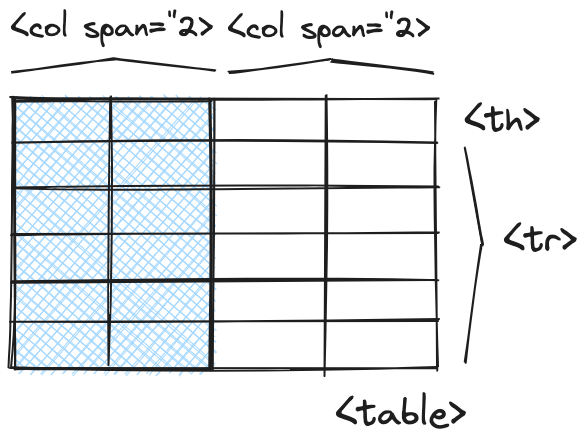

Cuando [trabajamos con tablas en HTML](https://lineadecodigo.com/tag/html-tabla/) lo normal es que vayamos dando forma a cada una de las filas de la tabla, bien sea mediante el elemento [`th`](https://www.w3api.com/HTML/th/) para las filas de la cabecera o [`tr`](https://www.w3api.com/HTML/tr/) para las filas del cuerpo de la tabla. Pero también tenemos que saber qué podemos definir columnas en [una tabla HTML](https://manualweb.net/html/tablas-html/). Para ello podemos apoyarnos en el elemento [`col`](https://www.w3api.com/HTML/col/) y en este artículo vamos a ver para qué nos sirve poder definir columnas.


## Definir columnas en una tabla HTML


Lo primero que vamos a aprender es cómo definir una columna dentro de [una tabla HTML](https://manualweb.net/html/tablas-html/). El elemento que representa a una columna es el elemento [`col`](https://www.w3api.com/HTML/col/). Dicho elemento tiene un atributo [`span`](https://www.w3api.com/HTML/col/span/) que nos permite identificar sobre cuántas columnas actúa el elemento [`col`](https://www.w3api.com/HTML/col/).


La sintaxis del elemento [`col`](https://www.w3api.com/HTML/col/) sería la siguiente:


```html
<col span="valor">
```


Por lo tanto, si queremos definir una columna que solo afecte a una única columna indicaríamos el siguiente código:


```html
<col span="1">
```


Mientras que si queremos que afecte a dos columnas tendríamos este otro código:


```html
<col span="2">
```


Además los elementos [`col`](https://www.w3api.com/HTML/col/) se agrupan en un elemento superior que es el [`colgroup`](https://www.w3api.com/HTML/colgroup/). De esta manera podemos tener varias definiciones de columnas seguidas.


```html
<colgroup>
  <col span="2">
  <col span="2">
</colgroup>
```


La pregunta es si estos elementos [`col`](https://www.w3api.com/HTML/col/) nos van a generar las columnas sobre la tabla. Y la respuesta es NO. Simplemente nos sirve para identificar columnas o grupos de columnas. Luego veremos su utilidad.


> Los elementos [`col`](https://www.w3api.com/HTML/col/) y [`colgroup`](https://www.w3api.com/HTML/colgroup/) no generan elementos visuales dentro de una tabla. Pero nos sirven para definir las columnas o grupos de columnas que componen la tabla.


Con lo que ya sabemos vamos definiendo la tabla:


```html
<table>
  <colgroup>            
    <col span="2">
    <col span="2">
  </colgroup>
  <tr>
    <th>País</th>
    <th>Capital</th>
    <th>Superficie</th>
    <th>Habitantes</th>
  </tr>
  <tr>
    <td>España</td>
    <td>Madrid</td>
    <td>504.645 km<sup>2</sup></td>
    <td>46,6 M</td>
  </tr>
</table>
```


Aquí ya utilizamos los elementos [`tr`](https://www.w3api.com/HTML/tr/) para definir las filas y [`th`](https://www.w3api.com/HTML/th/) para definir celdas de cabecera y [`td`](https://www.w3api.com/HTML/td/) para definir celdas de contenido.


Solo nos quedará dar más contexto para la definición de la tabla en base a columnas y es el indicar si las cabeceras que hemos insertado corresponden a una fila o a una columna, como es este caso. Para esto tenemos que indicar en el elemento [`th`](https://www.w3api.com/HTML/th/) mediante el atributo [`scope`](https://www.w3api.com/HTML/th/scope/) que el ámbito de actuación de dicha cabecera es una columna.


Quedando el código definitivamente de la siguiente manera:


```html
<table>
  <colgroup>            
    <col span="2" class="ubicacion">
    <col span="2" class="datos">
  </colgroup>
  <tr>
    <th scope="col">País</th>
    <th scope="col">Capital</th>
    <th scope="col">Superficie</th>
    <th scope="col">Habitantes</th>
  </tr>
  <tr>
    <td>España</td>
    <td>Madrid</td>
    <td>504.645 km<sup>2</sup></td>
    <td>46,6 M</td>
  </tr>
</table>
```


Si representamos visualmente lo que supone definir columnas en [una tabla HTML](https://manualweb.net/html/tablas-html/) tendríamos algo similar a esto. Dónde el elemento [`col`](https://www.w3api.com/HTML/col/) define las columnas y los elementos [`th`](https://www.w3api.com/HTML/th/),  [`td`](https://www.w3api.com/HTML/td/) y [`tr`](https://www.w3api.com/HTML/tr/) las filas. Si bien, como hemos visto en el código el atributo [`scope`](https://www.w3api.com/HTML/th/scope/) nos sirve para definir si las celdas de la cabecera aplican a la fila o a la columna.





Con esto ya sabemos lo que tenemos que hacer si lo que queremos es definir columnas en [una tabla HTML](https://manualweb.net/html/tablas-html/).

