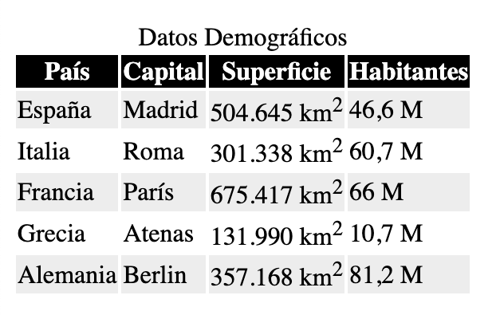

En este ejemplo vamos a ver cómo podemos poner un título en tabla [HTML](https://www.manualweb.net/html/). Para ello vamos a ver cómo podemos utilizar el [elemento caption](https://www.w3api.com/HTML/caption/) de [HTML](https://www.manualweb.net/html/).


## Crear la tabla básica


Lo primero será partir de una tabla. En este caso hemos escogido una tabla con datos demográficos.


```html
<table>
  <tr>
    <th>País</th>
    <th>Capital</th>
    <th>Superficie</th>
    <th>Habitantes</th>
  </tr>
  <tr>
    <td>España</td>
    <td>Madrid</td>
    <td>504.645 km<sup>2</sup></td>
    <td>46,6 M</td>
  </tr>
  <tr>
    <td>Italia</td>
    <td>Roma</td>
    <td>301.338 km<sup>2</sup></td>
    <td>60,7 M</td>
  </tr>
</table>
```


Vemos que la estructura de la tabla es la normal, con su [elemento table](https://www.w3api.com/HTML/table/), con sus filas definidas mediante el [elemento tr](https://www.w3api.com/HTML/tr/) y las celdas ya sean de [cabecera th](https://www.w3api.com/HTML/th/) o [normales td](https://www.w3api.com/HTML/td/).


## Añadir el elemento caption


Para poner el título en tabla [HTML](https://www.manualweb.net/html/) deberemos de añadir el [elemento caption](https://www.w3api.com/HTML/caption/) justamente después del [elemento table](https://www.w3api.com/HTML/table/).


El [elemento caption](https://www.w3api.com/HTML/caption/) es un elemento con etiquetas de inicio y cierre que contendrá el texto representativo del título.


Es decir, el código [HTML](https://www.manualweb.net/html/) nos quedará de la siguiente forma:


```html
<table>
  <caption>Datos Demográficos</caption>
  <tr>
    <th>País</th>
    <th>Capital</th>
    <th>Superficie</th>
    <th>Habitantes</th>
  </tr>
  <tr>
    <td>España</td>
    <td>Madrid</td>
    <td>504.645 km<sup>2</sup></td>
    <td>46,6 M</td>
  </tr>
  <tr>
    <td>Italia</td>
    <td>Roma</td>
    <td>301.338 km<sup>2</sup></td>
    <td>60,7 M</td>
  </tr>
  <tr>
    <td>Francia</td>
    <td>París</td>
    <td>675.417 km<sup>2</sup></td>
    <td>66 M</td>
  </tr>
  <tr>
    <td>Grecia</td>
    <td>Atenas</td>
    <td>131.990 km<sup>2</sup></td>
    <td>10,7 M</td>
  </tr>
  <tr>
    <td>Alemania</td>
    <td>Berlin</td>
    <td>357.168 km<sup>2</sup></td>
    <td>81,2 M</td>
  </tr>
</table>
```


## Resultado visual


Visualmente el título en tabla [HTML](https://www.manualweb.net/html/) se muestra centrado encima de la tabla. Si bien mediante [CSS](http://www.manualweb.net/css/) podremos ponerlo encima o debajo de la tabla (lo veremos en otro artículo) o modificar su representación visual.





De esta forma tan sencilla podemos añadir un título descriptivo a nuestras tablas HTML utilizando el elemento caption, mejorando así la accesibilidad y comprensión de nuestros datos tabulares.

