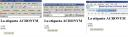

Si nos vamos al Diccionario de la Lengua Española de la Real Academia Española nos encontramos una definición curiosa de lo que es un acrónimo. Veámosla… 1. m. Tipo de sigla que se pronuncia como una palabra; p. ej., o(bjeto) v(olante) n(o) i(dentificado). Dentro del [HTML](http://www.manualweb.net/tutorial-html/) podemos denotar texto que sean siglas. Para ello utilizamos la etiqueta [ACRONYM](http://w3api.com/wiki/HTML:ACRONYM).


```html
<acronym lang="spa" title="tituloDelAcronimo">Acronimo</acronym>
```


Dicha etiqueta tiene dos atributos: - [**title**](http://w3api.com/wiki/HTML:Title), que define el texto del acrónimo
- [**lang**](http://w3api.com/wiki/HTML:Lang), que identifica el lenguaje del texto del acrónimo.


Así podríamos tener la siguiente composición siguiente:


```html
<acronym lang="spa" title="Objeto Volante No Identificado">OVNI</acronym>
```


U otra composición más común ;-)


```html
<acronym lang="eng" title="World Wide Web">WWW</acronym>
```


Y cual es el resultado en el navegador. Pues sencillo, nos muestra un tooltip con el texto del acrónimo dentro del mismo. Ahh… y se me olvidaba. [FireFox](http://www.getfirefox.com/) y [Opera](http://www.opera.com/) le pegan unos puntitos debajo muy monos.


Veamos como queda en Internet Explorer 6.01, Firefox 1.5 y Opera 8




