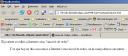
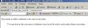

En [HTML](http://www.manualweb.net/tutorial-html/) tenemos dos formas de poner citas. Es decir, hacer referencia a textos que se han dicho por otros. Para ello el lenguaje [HTML](http://www.manualweb.net/tutorial-html/) nos ofrece los elementos [Q](http://www.w3api.com/wiki/HTML:Q) y [BLOCKQUOTE](http://www.w3api.com/wiki/HTML:BLOCKQUOTE). La principal diferencia entre estos elementos es que [Q](http://www.w3api.com/wiki/HTML:Q) nos sirve para citas pequeñas y que van en la propia línea de texto, mientras que [BLOCKQUOTE](http://www.w3api.com/wiki/HTML:BLOCKQUOTE) se utiliza para citas largas, las cuales requieren de un salto de parrafo. Su uso es muy sencillo, ya que nos bastará con poner la cita entre los elementos de inicio y fin. De esta forma una cita corta nos quedará de la siguiente forma:


```html
El ponente se refirio a Internet como <q>una red de redes</q>.
```


Su resultado será: El ponente se refirio a Internet como una red de redes. Mientras que para el caso de las citas largas se utilizará de la siguiente forma:


```html
<blockquote>Y es que hoy en día conocemos a Internet como la red de redes, en la cual podemos encontrar...<blockquote></blockquote></blockquote>
```


Su resultado será (los estilos de mi theme de [WorPress](http://www.wordpress.com/) lo van a cambiar): > Y es que hoy en día conocemos a Internet como la red de redes, en la cual podemos encontrar…


En cuanto a los atributos de estas etiquetas, a parte de los estandares ([id](http://www.w3api.com/wiki/HTML:Id), [class](http://www.w3api.com/wiki/HTML:Class), [lang](http://www.w3api.com/wiki/HTML:Lang),…), tenemos el atributo cite, el cual espera una URI con la dirección donde se encuentra la cita. De esta forma la línea e código quedará de la siguiente forma:


```html
El ponente se refirio a Internet como <q cite="http://www.lineadecodigo.com/ponentes/ldc/">una red de redes</q>;.
```


o


```html
<blockquote cite="http://www.lineadecodigo.com/ponentes/ldc/">Y es que hoy en día conocemos a Internet como la red de redes, en la cual podemos encontrar...</blockquote>.
```


## **Renderizando los elementos**


Los agentes renderizan estos elementos de diferente forma. Pero, a grandes rasgos, podemos decir que el elemento <Q> lo renderizan incluyendo comillas al principio y final de la cita. Es por ello que no necesitamos ponerlas en nuestro texto.


Por otro lado el elemento [BLOCKQUOTE](http://www.w3api.com/wiki/HTML:BLOCKQUOTE) suele ser presentado en un bloque identado. Veamos como queda esto en FireFox, Internet Explorer y Opera: Como podemos ver Internet Explorer (en nuestro caso el 6), no pone las comillas a la cita del elemento <Q>. :-(


## **El problema del blockquote**


Uno de los problemas que nos encontramos con el elemento [BLOCKQUOTE](http://www.w3api.com/wiki/HTML:BLOCKQUOTE) es que históricamente ha sido utilizado para identar texto. Sobre todo antes de que apareciesen las hojas de estilo. Es por ello que los agentes no insertan comillas. De una forma u otra hay que asegurar la compatibilidad. En estos casos podemos apoyarnos en las hojas de estilos [CSS](http://www.manualweb.net/css/) para corregir este “defecto”.








