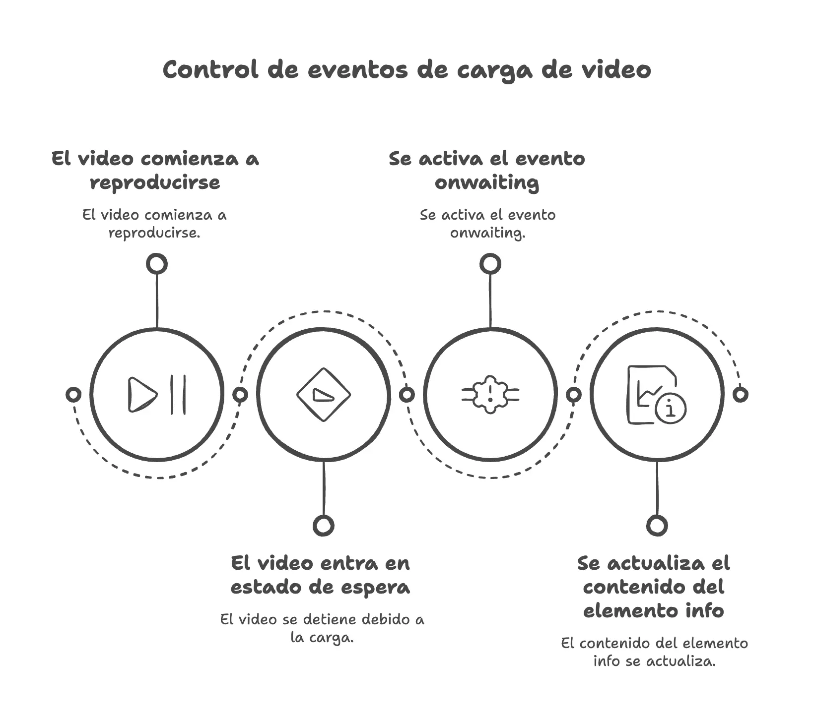

El tener problemas cuando reproducimos un vídeo es algo extraño, y puede dar a pensar que controlar cargas inestables de vídeos en [HTML5](https://www.manualweb.net/html5/) no es necesario y que el usuario siempre va a reproducir el vídeo sin ningún tipo de inconveniente.


Y es que el uso de vídeos dentro de las páginas y aplicaciones webs está a la orden del día, raro sería encontrar una página que no tenga un vídeo enlazado o incrustado. Además, con las velocidades que existen en muchas partes del mundo estamos acostumbrados a que los vídeos se carguen y reproduzcan de forma inmediata una vez que pulsamos sobre el botón play.


Pero tenemos que tener en cuenta que el usuario puede estar en un sitio dónde la cobertura no sea estable, y no hay que irse a una montaña o lugar recóndito para que tengamos una “carga con saltos”, basta con estar en un medio de transporte para poder comprobar este efecto dado a que nuestro móvil puede estar saltando de antena en antena y perdiendo cobertura de datos.
Así, que vamos a ver cómo de sencillo es el poder controlar cargas inestables de vídeos en [HTML5](https://www.manualweb.net/html5/) mediante [código Javascript](https://lineadecodigo.com/categoria/javascript/). 


## Cargar el vídeo en HTML5


Lo primero será [cargar un vídeo en HTML5](https://lineadecodigo.com/html5/cargar-un-video-en-html5/). Esto lo hacemos de forma sencilla mediante los elementos [`video`](https://w3api.com/HTML/video/) y [`source`](https://w3api.com/HTML/source/).


```html
<video id="mivideo" controls>  
  <source src="http://easyhtml5video.com/images/happyfit2.ogv" type="video/ogg"></source>
  Tu navegador no soporta el elemento <code>video</code>.  
</video> 
```


Es importante que en el elemento [`video`](https://w3api.com/HTML/video/) indiquemos mediante el atributo [`id`](https://w3api.com/HTML/id/) un identificador para el vídeo, ya que en el [código Javascript](https://lineadecodigo.com/categoria/javascript/) recuperaremos una referencia al vídeo.


Por otro lado en el elemento [`source`](https://w3api.com/HTML/source/) vamos a indicar dónde se encuentra ubicado el vídeo y el tipo de vídeo que es, mediante el atributo [`type`](https://www.w3api.com/HTML/source/type/). En este caso hemos puesto un vídeo OGV que es un formato de código abierto. El valor asignado es `“video/ogg”`.


## Atributo onwaiting para controlar cargas inestables de vídeos en HTML5


Ahora vamos para ver cómo podemos hacer para controlar cargas inestables de vídeos en [HTML5](https://www.manualweb.net/html5/). Para ello vamos a apoyarnos en el evento [`onwaiting`](https://w3api.com/HTML/onwaiting/).


El evento [`onwaiting`](https://w3api.com/HTML/onwaiting/) se puede lanzar sobre los elementos [`video`](https://w3api.com/HTML/video/) y [`audio`](https://w3api.com/HTML/audio/) en el caso de que el elemento a reproducir tenga problemas en la obtención de datos. Esto nos permitirá el poder avisar al usuario que la reproducción está teniendo problemas en la carga.


Para poder utilizar el evento [`onwaiting`](https://w3api.com/HTML/onwaiting/) para controlar cargas inestables de vídeos en [HTML5](https://www.manualweb.net/html5/) lo primero que tenemos que hacer es obtener una referencia al vídeo mediante su identificador y utilizando el método [`.getElementById()`](https://www.w3api.com/DOM/Document/getElementById/).


```javascript
let mivideo = document.getElementById("mivideo");
```


Lo siguiente será registrar el evento [`onwaiting`](https://w3api.com/HTML/onwaiting/) sobre el vídeo y asignarle una función para gestionarlo.


```javascript
mivideo.onwaiting = function() { ... };
```


En nuestro caso lo que vamos a hacer es mostrar la información en la página para poder avisar al usuario que hay problemas en la descarga del vídeo.


Así que lo que hemos hecho es crear una capa, mediante un elemento [`div`](https://www.w3api.com/HTML/div/), para poder volcar la información:


```html
<div id="info"></div>
```


Y modificaremos la función de nuestro evento [`onwaiting`](https://w3api.com/HTML/onwaiting/) para volcar el contenido sobre la capa mediante la propiedad [`.innerHTML`](https://www.w3api.com/DOM/Element/innerHTML/):


```javascript
let info = document.getElementById("info");

mivideo.onwaiting = function() {
  info.innerHTML = info.innerHTML + "Esperando a que se cargue el vídeo<br>";    
};
```


Para poder probar que el código funciona solo tienes que cargar la web con el código que hemos explicado y empezar a reproducir el vídeo. Cuando el vídeo se esté reproduciendo puedes cortar los datos y verás que salta el evento que nos avisa de la inestabilidad de la carga de los datos del vídeo y nos mostrará el mensaje en pantalla.





Ya tendremos nuestro código desarrollado para poder controlar cargas inestables de vídeos en [HTML5](https://www.manualweb.net/html5/) .

