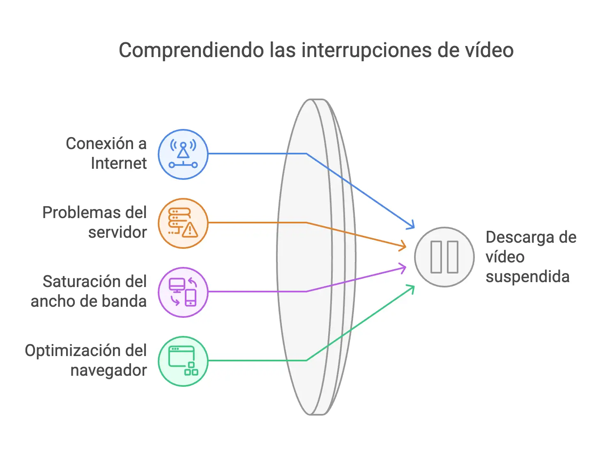

Otro ejemplo para tener un control mayor sobre la descarga y visualización de los videos. En este caso vamos a ver cómo podemos controlar cortes en la descarga de vídeos [HTML5](https://www.manualweb.net/html/).


La idea es poder realizar una gestión con los usuarios de nuestras páginas web en el caso de que se corte la descarga del vídeo hacía la página.


## ¿Por qué se puede suspender la descarga de un vídeo?


Antes de entrar a ver el detalle de cómo podemos codificar la implementación de establecer el control de cortes en la descarga de vídeos [HTML5](https://www.manualweb.net/html/) vamos a ver lo motivos por los cuales nos lleve a tener que realizar dicha implementación cuando estemos desarrollando nuestras páginas web mediante [código HTML5](https://lineadecodigo.com/categoria/html5/).


La descarga de un vídeo se puede suspender por diferentes motivos. Es importante entender estas causas para poder diagnosticar y resolver los problemas de reproducción. Los motivos más comunes que pueden interrumpir la descarga de contenido multimedia son:

- **Una conexión lenta o inestable a Internet**, que puede ser causada por problemas en la infraestructura de red o por la distancia al servidor
- **Problemas en el servidor que aloja el vídeo**, incluyendo sobrecarga del servidor, mantenimiento programado o fallos técnicos inesperados
- **Saturación del ancho de banda del usuario**, especialmente común cuando múltiples dispositivos comparten la misma conexión o durante horas pico de uso
- Puede ocurrir **cuando el navegador decide pausar la descarga para optimizar recursos** o cuando hay interferencias en la red. Esto incluye situaciones donde el navegador prioriza otras tareas o cuando detecta problemas de rendimiento en el sistema

	


## Insertando el vídeo en una página HTML5


Manos a la obra, a estas alturas ya sabes cómo [insertar un vídeo HTML5](https://lineadecodigo.com/html5/cargar-un-video-en-html5/) en tu página. Pero, por recordar como hacerlo, dejamos el código mediante el elemento [`video`](https://w3api.com/HTML/video/) para indicar que hay un vídeo y el elemento [`source`](https://w3api.com/HTML/source/) para cargar el origen del vídeo e indicar su formato.


```javascript
<video id="video" width="320" height="240" controls>
  <source src="tecla.mp4" type="video/mp4">
	Tu navegador no soporta elementos de vídeo
</video>
```


Además vamos a añadir un capa para poder volcar mensajes al usuario. Esto lo realizamos mediante el elemento [`div`](https://w3api.com/HTML/div/).


```javascript
<p id="error-message" style="color: red;"></p>
```


## Gestionando el evento suspend para controlar cortes en la descarga de vídeos HTML5


Ahora pasamos al meollo de la cuestión que es la parte de controlar cortes en la descarga de vídeos [HTML5](https://www.manualweb.net/html/). Para ello nos vamos a apoyar en el evento [`onsuspend`](https://www.w3api.com/HTML/onsuspend/). El evento [`onsuspend`](https://www.w3api.com/HTML/onsuspend/) se lanza cuando la carga de un vídeo o de un audio se ha suspendido por alguno de los motivos que veíamos al principio del artículo: conexión, saturación, el navegador,… incluso el propio usuario, al parar el vídeo puede forzar a que el navegador suspenda la descarga del vídeo.


Así que lo que haremos será coger una referencia al vídeo y suscribirnos a su evento [`onsuspend`](https://www.w3api.com/HTML/onsuspend/):


```javascript
const video = document.getElementById('video');

video.addEventListener('suspend', (event) => { });
```


Para suscribirnos al evento [`onsuspend`](https://www.w3api.com/HTML/onsuspend/) hemos utilizado la función [`addEventListener()`](https://www.w3api.com/DOM/EventTarget/addEventListener/) del DOM y le hemos asignado una [función anónima de Javascript](https://manualweb.net/javascript/funciones-javascript/#funciones-an%C3%B3nimas) para poder gestionar este evento.


Lo que vamos a hacer en la gestión del evento, en este caso, será mostrar un mensaje de texto al usuario en la capa que habíamos creado a tal respecto.


```javascript
const video = document.getElementById('video');
const errorMessage = document.getElementById('error-message');

video.addEventListener('suspend', (event) => {
    errorMessage.innerHTML = 'La carga del vídeo se ha suspendido. Por favor, inténtelo de nuevo más tarde.';
});
```


De esta manera ya tendremos el código que nos permite controlar cortes en la descarga de vídeos [HTML5](https://www.manualweb.net/html/). ¿Se te ocurre en qué situaciones te puedes ver avocado a realizar un control de los cortes en la descarga de vídeos utilizando el evento [`onsuspend`](https://www.w3api.com/HTML/onsuspend/)? Nos encantaría conocer tus opiniones, así que no dudes en dejarnolas en los comentarios.

