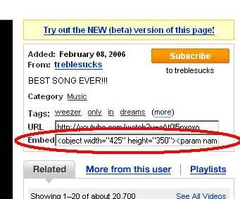

Raro es encontrar a una persona que no haya oído hablar o haya visto un vídeo de [YouTube](http://www.ayudaenlaweb.com/gestores-de-videos/que-es-youtube/). Y es que no hace falta ni estar conectado a Internet para tenerlo que ver, ya que todos los zapping de televisión utilizan a [YouTube](http://www.ayudaenlaweb.com/gestores-de-videos/que-es-youtube/) como base de sus programas. Si estás haciendo una web, poner un vídeo de [YouTube](http://www.ayudaenlaweb.com/gestores-de-videos/que-es-youtube/) es muy sencillo. Lo que tienes que hacer es buscar el vídeo que más te guste por la web de [YouTube](http://www.ayudaenlaweb.com/gestores-de-videos/que-es-youtube/). En la página del vídeo encontrareis un formulario donde viene un código llamado embeded. Como el que viene a continuación:


```html
<object height="350" width="425">
<param name="movie" value="http://www.youtube.com/v/aAt0l5nxoxo"></param>
<param name="wmode" value="transparent"></param>
<embed height="350" src="http://www.youtube.com/v/aAt0l5nxoxo" type="application/x-shockwave-flash" width="425" wmode="transparent"></embed>
</object>
```


Simplemente tendremos que copiar dicho código en nuestra página web para que se pueda visualizar el vídeo. Si profundizamos un poco en el código. Está claro que el “copia y pega” no ha sido muy complicado. Lo que vemos es que tenemos dos etiquetas OBJECT y EMBED. Estas sirven para cargar el vídeo. Se utilizan las dos ya que, como en muchos casos, los navegadores hacen diferentes interpretaciones de las etiquetas. Por un lado, tenemos el Internet Explorer que utiliza la etiqueta OBJECT y por otro tenemos a la familia Mozilla que utiliza la etiqueta EMBED.




