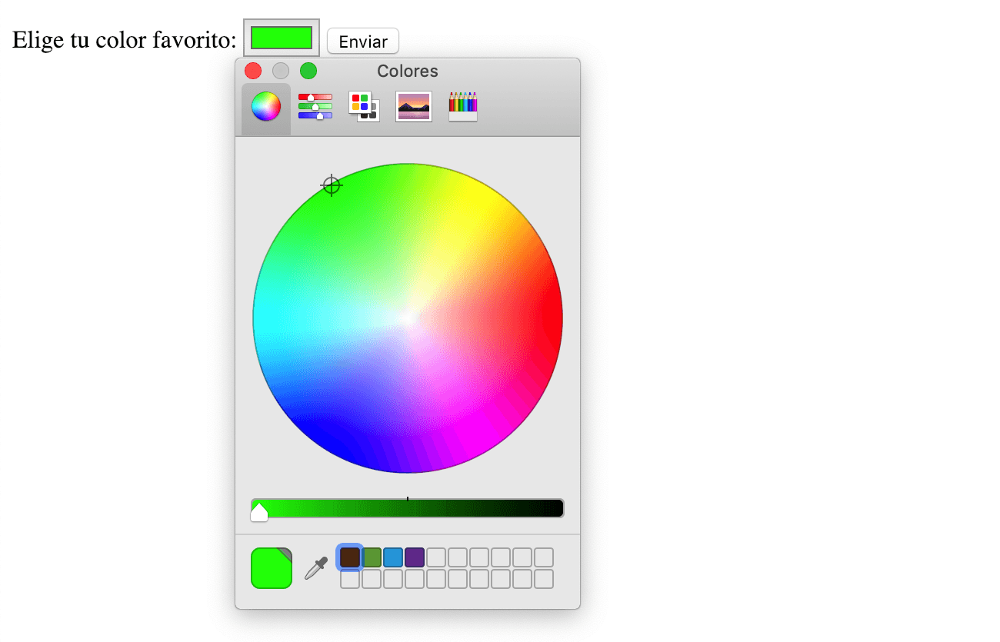

Siguiendo con el repaso a los nuevos tipos de `input` que tenemos dentro de [HTML5](http://www.manualweb.net/html5/) vamos a ver qué capacidades nos ofrece el `input` color en [HTML5](http://www.manualweb.net/html5/). Este tipo de `input` nos va a servir cuando tengamos que ofrecerle al usuario la posibilidad de cambiar el color de algo. De esta manera lo que **el navegador va a mostrar es una paleta de colores para que el usuario elija uno de ellos**.


## Sintaxis básica


Pero vayamos por partes, lo primero será insertar nuestro elemento `input`, para poder tener un `input` color en [HTML5](http://www.manualweb.net/html5/) deberemos de asignarle el tipo `color`.


```html
<input type="color"/>
```


## Asignar un valor por defecto


Los valores que soporta este tipo de campos son los códigos de colores en formato RGB. Si queremos darle un valor por defecto podremos indicar un color RGB en su atributo `value`. Así, si queremos que el color por defecto sea el rojo (#f00) escribiremos lo siguiente:


```html
<input type="color" value="#f00"/>
```


## Interacción con el usuario


Cuando el usuario interactue con nuestro campo input color en [HTML5](http://www.manualweb.net/html5/) vera dos cosas, la primera es que la entrada no es un campo de texto dónde pueda escribir un color, si no que se suele representar con un elemento con el color elegido y segundo que se le ofrecerá una paleta de colores dónde podrá elegir el color que más le guste.


Gráficamente se representaría algo similar a:





Cuando elija el nuevo color, este pasará a ser el que se represente en la muestra del campo de entrada.


Como hemos visto, el elemento `input` color en [HTML5](http://www.manualweb.net/html5/) nos proporciona una forma muy sencilla e intuitiva para que el usuario pueda elegir un color de una paleta.

