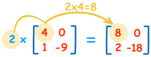

Multiplicar una matriz por un escalar en Java consiste en multiplicar el contenido de una matriz por un número real. Para ello se multiplicará el valor de cada uno de los elementos de la matriz por el valor del número real.





## Crear la matriz


Para llevar a cabo nuestra codificación lo primero que haremos será crear nuestra matriz.


```java
int[][] matriz = { {1,2}, {3,4} };
```


## Definir el escalar


Y luego nuestro escalar o número entero.


```java
int escalar = 3;
```


## Matriz de resultados


Además, aunque no sería necesario, vamos a crear una matriz para almacenar el resultado.


```java
int[][] resultado = new int[matriz.length][matriz[0].length];
```


Vemos que evaluamos el tamaño del array bidimensional anterior para crear la matriz de resultados.


## Recorrer la matriz


Para poder realizar el código de multiplicar una matriz por un escalar en Java lo que tenemos que hacer es ir recorriendo la matriz mediante un par de bucles anidados:


```java
for (int x=0; x < matriz.length; x++) {
  for (int y=0; y < matriz[x].length; y++) {
    // Código de multiplicación
  }
}
```


Así el resultado de cada una de las posiciones x,y será multiplicar el contenido que haya en la matriz dentro de la posición x,y por el número escalar. Quedándonos el siguiente código:


```java
for (int x=0; x < matriz.length; x++) {
  for (int y=0; y < matriz[x].length; y++) {
    resultado[x][y] = matriz[x][y] * escalar;
  }
}
```


Como podemos ver es muy sencillo realizar un código que nos permita multiplicar una matriz por un escalar en Java.

