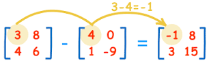

En este ejemplo vamos a ver como podemos manipular un para de matrices para poder realizar la operación de restar matrices en [Java](https://www.manualweb.net/java/). Lo primero que tenemos que saber es cómo se representa una matriz en [Java](https://www.manualweb.net/java/). Una matriz en [Java](https://www.manualweb.net/java/) no deja de ser más que un array bidimensional. Es decir un array que contiene arrays en cada una de sus posiciones. De esta forma podemos crear una matriz en [Java](https://www.manualweb.net/java/) mediante el siguiente código:


```java
int[][] matriz = {{1,2,3},{4,5,6}};
```


En este caso hemos creado una matriz de enteros. Vemos que en cada posición de la matriz hay un nuevo array de enteros. De ahí la definición int[][]. De igual manera puedes inicializar la matriz en [Java](https://www.manualweb.net/java/) mediante el acceso a sus elementos.


```java
int[][] matriz = new int[3][2];
matriz[0][0] = 1;
matriz[0][1] = 2;
...
```


Puedes utilizar la forma que más te guste aunque creo que la primera es mucho más rápida y sencilla. Ahora veamos un poco de teoría de resta de matrices. La resta de matrices A-B hace que se reste al elemento de la matriz A el elemento de la matriz B. Siempre atendiendo a la posición que ocupan. Veámoslo gráficamente: 





Pasemos ahora al código y veamos como podemos restar matrices en [Java](https://www.manualweb.net/java/). Lo primero será definir las matrices:


```java
int[][] matriz1 = {{1,2,3},{4,5,6}};
int[][] matriz2 = {{6,5,4},{3,2,1}};
```


Lo siguiente será definir la matriz en la que dejamos el resultado. Esta matriz será del mismo tamaño que la matriz1.


```java
int[][] resultado = new int[matriz1.length][matriz1[0].length];
```


Vemos que en la inicialización hemos utilizado el tamaño de las filas y de las filas del primer elemento del array para inicializar la matriz de resultado. Para realizar la resta lo que vamos a hacer es recorrer todas las filas.


```java
for (int x=0; x < resultado.length; x++) {...}
```


Y por cada fila todas las columnas:


```java
for (int x=0; x < resultado.length; x++) {
  for (int y=0; y < resultado[x].length; y++) {...}
}
```


De esta forma iremos posicionándonos en los elementos 0,0 0,1 0,2 1,0 1,1 ... Estas posiciones están definidas mediante las variables x,y del bucle. Así que ahora solo tenemos que ejecutar la resta.


```java
for (int x=0; x < resultado.length; x++) {
  for (int y=0; y < resultado[x].length; y++) {
    resultado [x][y] = matriz1[x][y] - matriz2[x][y];
  }
}
```


Vemos como hemos resultado el contenido de la posición x,y de la matriz1 y matriz2 dejando el resultado en la matriz resultado. De esta forma tan sencilla y recorriendo las matrices [Java](https://www.manualweb.net/java/) mediante bucles for hemos conseguido realizar una resta de matrices en [Java](https://www.manualweb.net/java/).

