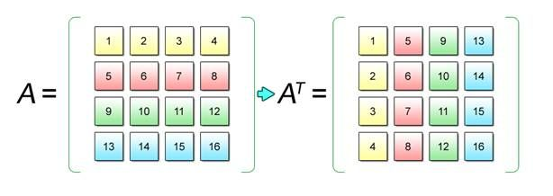

En este ejemplo vamos a transponer una matriz en [Java](https://www.manualweb.net/java/). A la hora de transponer una matriz lo que estamos haciendo es convertir todas sus filas en columnas:





## Definir la matriz original


Lo primero para poder transponer una matriz en [Java](https://www.manualweb.net/java/) será definir la matriz mediante un array bidimensional. En nuestro caso vamos a utilizar una matriz de números enteros:


```java
int[][] matriz = {{1,2,3},{4,5,6}};
```


## Crear la matriz transpuesta


Lo siguiente será crear la nueva matriz. Hay que tener en cuenta que el valor de la dimensión de filas de la matriz transpuesta será el de las columnas de la matriz y el valor de las columnas de la matriz transpuesta será el de las filas de la matriz original.


```java
int[][] matrizTranspuesta = new int[matriz[0].length][matriz.length];
```


Como se puede ver nos apoyamos en el atributo `.length` para saber el tamaño de las filas y columnas de la matriz.


## Recorrer la matriz


Ahora nos apoyamos en bucles para poder recorrer la matriz e ir haciendo la transposición. Como en otros casos utilizamos dos bucles anidados que representen las coordenadas x,y:


```java
for (int x=0; x < matriz.length; x++) {
  for (int y=0; y < matriz[x].length; y++) {
    // código de transposición
  }
}
```


## Realizar la transposición


Ahora pasamos a la asignación. A la hora de pasar las filas a columnas vemos que el orden es el siguiente:


```java
matriz[0][0] -> matrizTranspuesta[0][0]
matriz[0][1] -> matrizTranspuesta[1][0]
matriz[0][2] -> matrizTranspuesta[2][0]
matriz[1][0] -> matrizTranspuesta[0][1]
matriz[1][1] -> matrizTranspuesta[1][1]
matriz[1][2] -> matrizTranspuesta[2][1]
```


Es decir que estamos cambiando las coordenadas x,y de la matriz original en las coordenadas y,x de la segunda. Por lo tanto la asignación será, si estamos recorriendo la matriz original:


```java
matrizTranspuesta[y][x] = matriz[x][y];
```


Quedando el código del bucle completo:


```java
for (int x=0; x < matriz.length; x++) {
  for (int y=0; y < matriz[x].length; y++) {
    matrizTranspuesta[y][x] = matriz[x][y];
  }
}
```


Como vemos es muy sencillo transponer una matriz en [Java](https://www.manualweb.net/java/).

