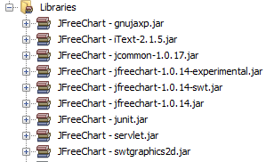

Mientras tanto hago el análisis de mi proyecto de título me he visto en la **necesidad de buscar algunas librerías gráficas** para que me faciliten el trabajo en [Java](https://www.manualweb.net/java/), es así que he llegado a [JFreeChart](http://www.jfree.org/jfreechart/), librería para estadísticas gráficas. Hoy por hoy les explicaré lo sencillo que resulta crear un gráfico con JFreeChart. **Lo primero que tenemos que hacer es agregar la librerías de JFreeChart**, si no las tenemos, podemos [acceder a ellas desde la página de sus programadores](http://sourceforge.net/projects/jfreechart/files/).


> Principalmente trabajaremos con dos librerías que son jcommon-1.0.16.jar y jfreechart-1.0.13.jar


Las librerías quedarán así en tu proyecto:





Una vez que hayamos agregado las librerías de JFreeChart creamos un proyecto nuevo y agregamos un [JFrame](https://www.w3api.com/Java/JFrame/setLayout/). Este [JFrame](https://www.w3api.com/Java/JFrame/setLayout/) puede servir directamente como un gráfico, pero en éste ejemplo lo he usado para agregar un botón que hará la llamada del gráfico en un nuevo [JFrame](https://www.w3api.com/Java/JFrame/setLayout/). Nos vamos a el [JFrame](https://www.w3api.com/Java/JFrame/setLayout/) que ya agregamos, y añadimos sobre él un botón, el cual llamará al gráfico. Visualmente debería quedar algo así:


Lo primero será declarar un atributo [JFrame](https://www.w3api.com/Java/JFrame/setLayout/) dentro de nuestra clase, la cual hemos llamado GraficosJFreeChart:


```java
JFrame frame = new JFrame("Probando JFreeChart");
```


El constructor de JFreeChart inicializaremos el [JFrame](https://www.w3api.com/Java/JFrame/setLayout/), cambiaremos su tamaño y posición en la pantalla:


```java
frame.setSize(500, 270);
frame.setLocationRelativeTo(getRootPane());
this.setLocationRelativeTo(getRootPane());
```


> Cabe destacar que cuando hacemos referencia a "this" estamos haciendo referencia a la ventana de la clase principal en éste caso la primera que agregamos.


La acción de click sobre el botón será la que lance toda la ejecución y carga de los gráficos JFreeChart.


```java
private void jButton1ActionPerformed(java.awt.event.ActionEvent evt) {...} 
```


**Lo primero que haremos con los gráficos JFreeChart es crear un DataSet**, que es dónde vamos a meter los datos que representaremos gráficamente. Para ello utilizamos un DefaultCategoryDataset y añadimos los valores mediante el **método .addValue()**.


```java
DefaultCategoryDataset dataset = new DefaultCategoryDataset();
dataset.addValue(1.0, "Row 1", "Column 1");
dataset.addValue(5.0, "Row 1", "Column 2");
dataset.addValue(3.0, "Row 1", "Column 3");
dataset.addValue(2.0, "Row 2", "Column 1");
dataset.addValue(3.0, "Row 2", "Column 2");
dataset.addValue(2.0, "Row 2", "Column 3");
dataset.addValue(10.0,"Row 3", "Column 4");
dataset.addValue(10.0,"Row 3", "Column 4");
```


Destaquemos que las llamadas al **método addValue() se agregan un valor, un fila y una columna determinada**. ¿Estas pensando en una base de datos? Sí, fácilmente podrían salir los datos de una base de datos. Quizás mas adelante lo expliquemos. Una vez que tenemos el DataSet relleno nos dedicaremos a generar el gráfico. **Los gráficos en JFreeChart se generan mediante la factoría CharFactory**. En este caso, como queremos crear un gráfico de barras utilizamos el método .createBarChart().


```java
JFreeChart chart = ChartFactory.createBarChart(
  "Ejemplo básico para Linea de Codigo",
  "Categorías",
  "Valores",
  dataset,
  PlotOrientation.VERTICAL,
  true,
  true,
  true
);
```


En la creación del gráfico al método createBarChart le pasamos el título, los valores de los textos de los ejes, si queremos que haya leyenda,... y lo más importante el DataSet con los datos. El gráfico creado hay que mostrarlo. **Para mostrar un gráfico en JFreeChart hay que ponerlo en un Panel**. Así que creamos un panel con la clase ChartPanel al cual le pasamos como parámetro el gráfico que acabamos de crear. Después mostramos el panel en el [JFrame](https://www.w3api.com/Java/JFrame/setLayout/).


```java
ChartPanel chartPanel = new ChartPanel(chart, false);
frame.setContentPane(chartPanel);
frame.setVisible(true);
```


Ya tenemos nuestro primer gráfico con [Java](https://www.manualweb.net/java/) y JFreeChart.

