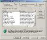
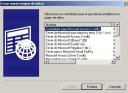
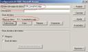

No es que MS Access sea una base de datos que sirva para grandes volúmenes de datos, ni que se la pueda pedir una gran concurrencia de peticiones. Si bien, su gran baza, es el ser una base de datos con la que empezar a aprender, además de dar funcionalidad a usuarios domésticos. Algunos de los límites de MS Access son los siguientes: - Número de caracteres en un campo tipo texto: 255
- Número de usuarios concurrente: 255
- Tamaño máximo de la base de datos: 2Gb
- Número de caracteres de una sentencia: 64.000
- …


MS Access puede ser también un buen inicio para empezar a aprender a conectar bases de datos mediante [JDBC](http://lineadecodigo.com/tag/java-jdbc/). Los pasos que tendremos que seguir para conseguir esto son los siguientes. Primero deberemos de crear una conexión ODBC. Una conexión ODBC permite crear una forma unificada de accesos entre una base de datos, sea cual sea su tipo (MS Access, FoxPro, MySQL,…) y el sistema Windows, y por ende los programas que corren sobre el. Para crear una conexión ODBC deberemos de ir al Panel de Control >> Herramientas Administrativas >> Orígenes de Datos (ODBC). Si bien, esto puede cambiar dependiendo de la versión del sistema operativo y del lenguaje del sistema instalado. Al final nos aparecerá una imagen como la que sigue: Lo siguiente que deberemos de hacer es crear un DSN del sistema. Esto lo que va a hacer es dar un nombre representativo a la base de datos que elijamos. Para ello deberemos de ir a la pestaña DSN de Sistema y pulsar sobre el botón de “Agregar…”. Saliendonos la siguiente ventana: El tipo de base de datos que añadiremos será el MS Access. (*.mdb). Ahora deberemos de indicar el nombre del DSN y la ubicación de nuestra base de datos. La ventana será la que sigue: Una vez que tenemos creado el DSN del sistema pasaremos a nuestro programa Java. Hay que recordar que para establecer una conexión [JDBC](http://lineadecodigo.com/tag/java-jdbc/) necesitaremos dos cosas: el nombre del driver que realizará la conexión y la URL destino donde está la base de datos. En el caso de las conexiones ODBC existe un driver estándar que se llama sun.jdbc.odbc.JdbcOdbcDriver. Veamos como sería la línea de conexión de dicho driver.











```java
Class.forName("sun.jdbc.odbc.JdbcOdbcDriver");
```


Por lo que se refiere a la URL de destino, en el caso de ODBC se sigue la siguiente nomenclatura:


```java
"jdbc:<subprotocol>:<subname>"
```


Donde el subprotocol sería odbc y el subname el nombre de DSN de sistema que hayamos asignado a nuestra base de datos. Quedandonos la URL de conexión de la siguiente forma:


```java
String url = "jdbc:odbc:DSN_LineaDeCodigo";
```


Solo nos quedará el realizar la conexión. Veamos como sería esa [línea de código](http://lineadecodigo.com/):


```java
Connection db =  DriverManager.getConnection (url, "usuario","password");
```


En usuario y password deberemos de poner el nombre del usuario y password que tenga de acceso la base de datos. Si es que los tiene. En caso negativo se deberán dejar vacíos.

