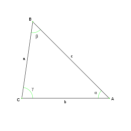

La verdad es que el número de comentarios que nos dejáis en la web son muy numerosos y no somos capaces de poder responder a todos. Pero de vez en cuando vamos viendo alguna petición interesante sobre algún código que no tenemos. Este es el caso de [calcular el área de un triángulo escaleno con los lados en Java](http://lineadecodigo.com/java/area-de-un-triangulo-con-java/#comment-114236). Lo primero será saber [qué es un triángulo escaleno](https://es.wikipedia.org/wiki/Tri%C3%A1ngulo_escaleno) y cómo se calcula su área. Pues bien, **un triángulo escaleno es aquel que tiene todos sus lados con longitudes diferentes**. Por lo tanto no hay dos ángulos que tengan la misma medida. De esta forma si queremos calcular el área de un triángulo escaleno a partir de sus lados ([ya vimos lo sencillo que es hacerlo en Java si sabemos su base y su altura](http://lineadecodigo.com/java/area-de-un-triangulo-con-java/)) deberemos de aplicar la siguiente formula. Por un lado deberemos de calcular el semiperímetro con la suma de todos sus lados dividida por 2: Y con el semiperímetro calculamos el área del triángulo escaleno como la raíz cuadrada del semiperímetro multiplicado por la resta de cada uno de los lados al semiperímetro: Una vez que tenemos estos conocimientos sobre cómo calcular el área de un triángulo escaleno, vamos a ver cómo hacerlo en [Java](http://www.manualweb.net/java). Lo primero será obtener las información de sus lados:





```java
// Longitud de los lados
double lado1 = 3;
double lado2 = 2;
double lado3 = 4;
```


Lo siguiente calcular el semiperímetro:


```java
double semiperimetro = (lado1+lado2+lado3)/2;
System.out.println("El semiperímetro es de " + semiperimetro);
```


Y con el semiperímetro ya calcular el área:


```java
double area = Math.sqrt(semiperimetro*(semiperimetro-lado1)*(semiperimetro-lado2)*(semiperimetro-lado3));
System.out.println ("El área del triángulo escaleno es " + area);
```


En este caso hemos utilizado la [clase ](https://www.w3api.com/Java/Math/)[`Math`](https://www.w3api.com/Java/Math/) y en concreto el [método ](https://www.w3api.com/Java/Math/.sqrt())[`.sqrt()`](https://www.w3api.com/Java/Math/.sqrt()) que nos permite calcular una raíz cuadrada de un valor. Así que conociendo la fórmula y mediante estos tres sencillos pasos hemos podido calcular el área de un triángulo escaleno con los lados mediante [Java](http://www.manualweb.net/java).

