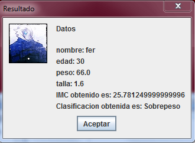

### ¿Qué es el índice de masa corporal?


En este ejemplo vamos a calcular el [índice de masa corporal](http://es.wikipedia.org/wiki/%C3%8Dndice_de_masa_corporal) con [Java](https://www.manualweb.net/java/) mediante la fórmula:


```text
 imc= p/(t*t)
```


Donde:

- p= peso
- t= talla o estatura
- imc = el índice de masa corporal

### Cómo calculo el índice de masa corporal con Java


Vamos a definir una clase [Java](https://www.manualweb.net/java/) llamada **CalculoIMC.java** y su método **main** e importamos la librería [`javax.swing`](https://www.w3api.com/Java/tag/javax.swing/). Abajo de esta clase definimos otra más y la llamaremos `Persona` con cuatro atributos: nombre, edad, peso y estatura.


```java
import javax.swing.JOptionPane;

class CalculoIMC{
  public static void main(String[] args) {
    //... falta más código por escribir
  }
}

//aqui esta la clase Persona
class Persona{
//atributos de la clase
  public String nombre;
  public int edad;
  public double peso,talla;
  //...
}
```


Ahora vamos a definir un método [Java](https://www.manualweb.net/java/) para asignar los atributos:


```java
Persona asignar(String n,int e,double p,double t){
  nombre=n;
  edad=e;
  peso=p;
  talla=t;
  return this;
}
```


El operador `this` nos sirve para hacer referencia a los propios atributos de la clase [Java](https://www.manualweb.net/java/). No es necesario declarar un tipo de dato.


Una vez hecho, ya podemos escribir el método que calcula el [índice de masa corporal](http://es.wikipedia.org/wiki/%C3%8Dndice_de_masa_corporal) con [Java](https://www.manualweb.net/java/)


```java
public double imc(){
  return peso/(talla*talla);
}
```


Cuando se obtiene el resultado se puede hacer una comparativa de acuerdo a una clasificación:


```java
String cad="";
if(imc()&lt;16.00){
  cad="Infrapeso: Delgadez Severa";
}else if(imc()<=16.00 || imc()<=16.99){
  cad="Infrapeso: Delgadez moderada";
}else if(imc()<=17.00 ||imc()<=18.49){
  cad="Infrapeso: Delgadez aceptable";
}else if(imc()<=18.50 || imc()<=24.99){
  cad="Peso Normal";
}else if(imc()<=25.00 || imc()<=29.99){
  cad="Sobrepeso";
}else if(imc()<=30.00 || imc()<=34.99){
  cad="Obeso: Tipo I";
}else if(imc()<=35.00 || imc()=40.00){
  cad="Obeso: Tipo III";
}else{
  cad="no existe clasificacion";
}
  return cad;
```


Y para mostrar esos resultados usamos la clase [Java](https://www.manualweb.net/java/) [`JOptionPane`](https://www.w3api.com/Java/JOptionPane/) con el método [`showMessageDialog()`](https://www.w3api.com/Java/JOptionPane/showMessageDialog/) en un método llamado **verDatos()**


```java
Persona verDatos(){
  String res="Datos\n";
  res+="\nnombre: "+nombre;
  res+="\nedad: "+edad;
  res+="\npeso: "+peso;
  res+="\ntalla: "+talla;
  res+="\nIMC obtenido es: "+imc();
  res+="\nClasificacion obtenida es: "+clasificacion();
  JOptionPane.showMessageDialog(null, res,"Resultado",JOptionPane.PLAIN_MESSAGE,new ImageIcon("ferd.jpg"));
  return this;
}
//nota: todo esto dentro de la clase Persona.java
```


Volvemos a la clase [Java](http://www.manualweb.net/tutorial-java/) principal **CalculoIMC**:


```java
public static void main(String[] args) {
  //instanciar clase
  Persona persona= new Persona();

  //asignamos los datos de los atributos, para eso usamos JOptionPane.showInputDialog()
  persona.nombre=JOptionPane.showInputDialog("nombre: ");
  persona.edad=Integer.parseInt(JOptionPane.showInputDialog("edad: "));
  persona.peso=Double.parseDouble(JOptionPane.showInputDialog("peso: "));
  persona.talla=Double.parseDouble(JOptionPane.showInputDialog("talla: "));

  // y al final concatenamos los métodos
  persona.asignar(persona.nombre,persona.edad,persona.peso,persona.talla).verDatos();
```


Al final se visualiza nuestro ejemplo [Java](https://www.manualweb.net/java/) todo en una ventana:




