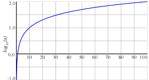

Ya vimos en [el artículo dígitos de un número](http://lineadecodigo.com/java/digitos-de-un-numero/) cómo podemos saber cuántos dígitos contiene un número. Para ello utilizábamos un bucle y una división sobre el número. En este caso vamos a utilizar el logaritmo en base 10 para poder realizar lo mismo y así poder calcular los dígitos de un número con logaritmos.


Lo que tenemos que saber es que el logaritmo en base 10 nos indica el exponente al que hay que elevar 10 para que se pueda obtener el número. Así:

- **Log (10) es 1**: Si elevas 10<sup>1</sup> será igual a 10
- **Log (100) es 2**: Si elevas 10<sup>2</sup> será igual a 100
- **Log (1000) es 3**: Si elevas 10<sup>3</sup> será igual a 1000




## Cálculo de dígitos con logaritmos


De esta manera podemos ver que el valor del resultado de un logaritmo en base 10 sobre un número corresponde a los dígitos del número menos 1. Así que deberemos aplicar el logaritmo en base 10 para un número y sumarle 1.


En el caso de que el número nos ofrezca decimales, nos quedaremos con la parte entera:

- **Log(20) es 1,3**: Nos quedamos con la parte entera, es decir, 1
- **Log(300) es 2,47**: Nos quedamos con la parte entera, es decir, 2

## Implementación en Java


Si pasamos a codificar nuestro cálculo de dígitos de un número con logaritmos en [Java](http://www.manualweb.net/java) tenemos que saber varias cosas:

- Para calcular un logaritmo en base 10 utilizaremos el método `Math.log10()`
- Haremos un **cast** sobre el número decimal mediante la sentencia `(int)`

De esta forma nos quedará una simple línea de código:


```java
int digitos = (int) Math.log10(numero) + 1;
```


Vemos que al número devuelto por el logaritmo en base 10 le aplicamos el cast para quedarnos con la parte entera y le sumamos una unidad.


## Código completo


El código completo nos quedaría de la siguiente forma:


```java
public class NumeroDigitosLogaritmo {
    public static void main(String[] args) {
        int numero = 12345;
        int digitos = (int) Math.log10(numero) + 1;
        System.out.println("El número " + numero + " tiene " + digitos + " dígitos");
    }
}
```


Ya hemos visto lo sencillo que es realizar nuestro cálculo de dígitos de un número con logaritmos en [Java](http://www.manualweb.net/java).

