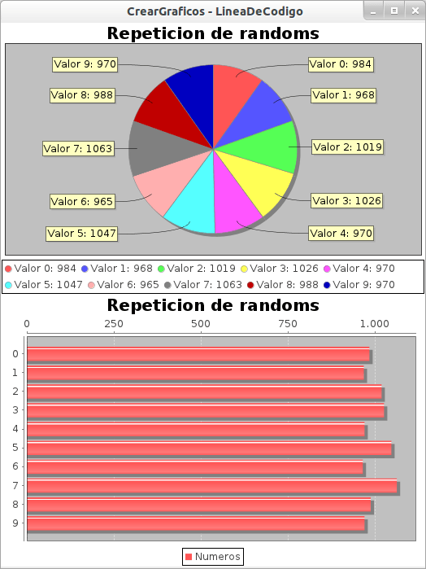

El otro día veíamos como [crear, de una forma sencilla, un gráfico con JFreeChart](http://lineadecodigo.com/java/graficos-en-java-con-jfreechart/). Hoy les presento una forma muy fácil para crear y mostrar un gráfico de torta y uno de barras en [Java](https://www.manualweb.net/java/) con JFreeChart. Recordar que lo primero es [descargarse las librerías de JFreeChart](http://sourceforge.net/projects/jfreechart/files/). Vamos a necesitar las siguientes librerías [JFreeChart](http://www.jfree.org/jfreechart/) y [JCommon](http://www.jfree.org/jcommon/).


Una vez que estén importados los respectivos .jar podremos comenzar a ver el código. Una forma fácil que se me ocurrió para mostrarles el funcionamiento de esta librería fue crear unos 10000 números aleatorios entre 0 y 9 y llevar un registro de cuantas veces apareció cada número. Para esto tenemos el siguiente código:


```java
Random rnd = new Random(System.currentTimeMillis());
// Establece una semilla para el random
int[] array = new int[10];
for (int i = 0; i < 10000; i++)
  array[rnd.nextInt(10)]++;
```


Cada vez que el random da un numero, se aumenta en uno la cantidad de veces que fue dado. Una vez finalizado el algoritmo tenemos un arreglo donde en cada índice se indica cuantas veces surgió ese índice del random. Luego, **procederemos a crear el gráfico de torta en base a nuestro arreglo** con JFreeChart. Lo tendremos todo en el método crearGraficoTorta.


```java
private static JPanel crearGraficoTorta(int[] array) {...} 
```


Lo primero será crear un dataset donde vamos a almacenar las distintas 'porciones' de la torta. Es por ello que utilizamos una **clase DefaultPieDataSet** de JFreeChart.


```java
DefaultPieDataset dataset = new DefaultPieDataset();
for (int i = 0; i < array.length; i++)
  dataset.setValue("Valor " + i + ": " + array[i], array[i]);
```


Utilizamos un bucle for para agregar las 'porciones' a nuestro grafico de torta. El ultimo parametro indica el valor de la torta que ocupa cada porcion. Luego, en base a este dataset, creamos nuestro gráfico. **Utilizamos la factoría de creación de gráficos de JFreeChart, la ChartFactory**.


```java
JFreeChart chart = ChartFactory.createPieChart("Repeticion de randoms",
  dataset, true, true, true);
```


Podemos hacer algunas mejoras sobre el propio gráfico con JFreeChart como añadirle un fondo o quitar la leyenda:


```java
chart.setBackgroundPaint(Color.white);
chart.removeLegend();
```


Finalmente, **retornamos un panel que contenga a esa torta**. Ahora, procederemos a crear el gráfico de barras en base a nuestro arreglo.


```text
private static JPanel crearGraficoBarras(int[] array) {...}
```


Volvemos a crear **un dataset donde vamos a almacenar las distintas 'barras'**. En este caso es un **DefaultCategoryDataSet**.


```java
String serie = "Numeros";

for (int i = 0; i < array.length; i++)
	dataset.addValue(array[i], serie, "" + i);
```


Una vez completado el dataset, se crea el grafico de barras en base a el.


```java
JFreeChart chart = ChartFactory.createBarChart("Repeticion de randoms", null, null, dataset, PlotOrientation.HORIZONTAL, true, true, false);
```


Para terminar **debemos agregar los gráficos a un frame para poder verlos**:


```java
JFrame frame = new JFrame("CrearGraficos - LineaDeCodigo");
frame.setDefaultCloseOperation(JFrame.EXIT_ON_CLOSE);
frame.setLayout(new GridLayout(2, 1));

frame.add(crearGraficoTorta(array));
frame.add(crearGraficoBarras(array));

frame.pack(); 
frame.setLocationRelativeTo(null); 
frame.setVisible(true);
```


En este código hemos añadido los gráficos mediante el método .add() del JFrame. Adicionalmente hemos **redimensionado el tamaño del frame, al minimo posible con el método .pack() y centrado el frame con .setLocationRelativeTo(null)**.


Nuestro resultado final para crear gráficos de torta y barras con JFreeChart nos quedará de la siguiente forma:





Una vez que saben como hacer uno de estos gráficos con JFreeChart, el resto (Líneas de Tiempo, Gráficos XY, etc.) son básicamente el mismo procedimiento con algunos detalles con respecto al dataset de cada tipo.

