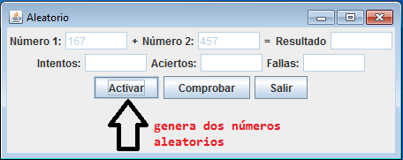
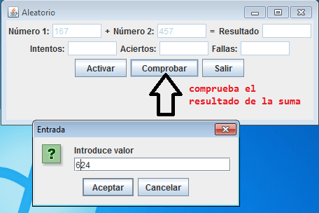

Vamos a realizar un programa de escritorio usando **Java Swing**. Consiste en hacer un **juego de adivinar la suma de dos números generados aleatoriamente**. 


Necesitamos los siguientes controles: 

- 6 `JTextField`
- 6 `JLabel`
- 3 `JButton`

Un botón se encargará de generar y mostrar los dos números aleatorios, el siguiente botón activa una ventanita para introducir la suma de esos dos y comprobar si es correcta (acierto) o no (fallo) y mostrará el número de intentos realizados. Y por último un botón para quitar la aplicación. 


Como se trata de una aplicación gráfica es necesario importar las librerías `javax.swing.*` y `java.awt.*`:


```java
import javax.swing.*;
import java.awt.*;
```


## Definir los controles


Los controles a usar utilizarán las clases `JTextField` y `JButton`:


```java
JTextField t1, t2, t3, t4, t5, t6;
JButton b1, b2, b3;
```


También necesitamos definir las variables que controlarán los valores aleatorios y su suma, así como los aciertos, fallos e intentos:


```java
int numero1, numero2, suma, aciertos, fallos, intentos;
```


## Generar números aleatorios


Para generar los números aleatorios creamos una función:


```java
public int aleatorio(int min, int max) {
    return (int)(Math.random() * (max - min + 1) + min);
}
```


Puedes leer más información sobre cómo crear un número aleatorio con Java. 


Ahora pasamos a codificar los botones Activar, Comprobar y Salir.


## Botón Activar


Este botón inicia el juego, para ello lo que hacemos es crear dos números aleatorios, con la clase creada anteriormente, y los ponemos dentro de los campos de texto sus valores.





Su código:


```java
b1.addActionListener(new ActionListener() {
    public void actionPerformed(ActionEvent e) {
        numero1 = aleatorio(1, 100);
        numero2 = aleatorio(1, 100);
        suma = numero1 + numero2;
        
        t1.setText(String.valueOf(numero1));
        t2.setText(String.valueOf(numero2));
    }
});
```


## Botón Comprobar


Es el botón que lanza el juego, lo que hace es crear un diálogo, mediante una clase `JOptionPane`. Cogemos el valor insertado por el usuario y comprobamos si coincide con la suma de los números aleatorios. Si es así incrementamos los aciertos, si no coincide, incrementamos los fallos.





Su código:


```java
b2.addActionListener(new ActionListener() {
    public void actionPerformed(ActionEvent e) {
        String resultado = JOptionPane.showInputDialog("Introduce la suma:");
        int respuesta = Integer.parseInt(resultado);
        
        if (respuesta == suma) {
            aciertos++;
            JOptionPane.showMessageDialog(null, "¡Correcto!");
        } else {
            fallos++;
            JOptionPane.showMessageDialog(null, "Incorrecto. La respuesta era: " + suma);
        }
        
        intentos++;
        t4.setText(String.valueOf(aciertos));
        t5.setText(String.valueOf(fallos));
        t6.setText(String.valueOf(intentos));
    }
});
```


## Botón Salir


En este caso, lo que hacemos es salir de la aplicación mediante el método `System.exit`:


```java
b3.addActionListener(new ActionListener() {
    public void actionPerformed(ActionEvent e) {
        System.exit(0);
    }
});
```

