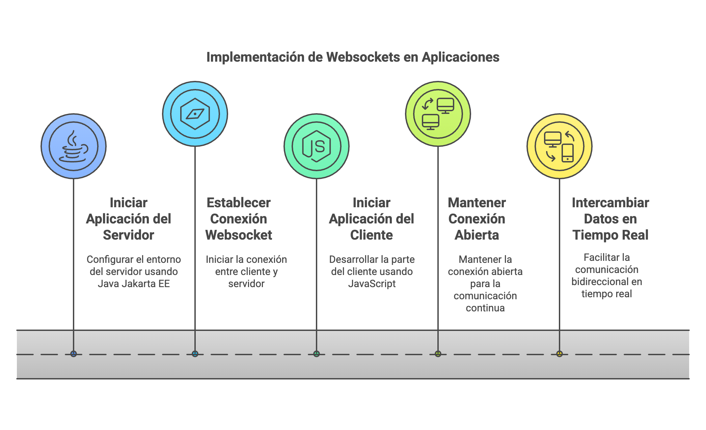
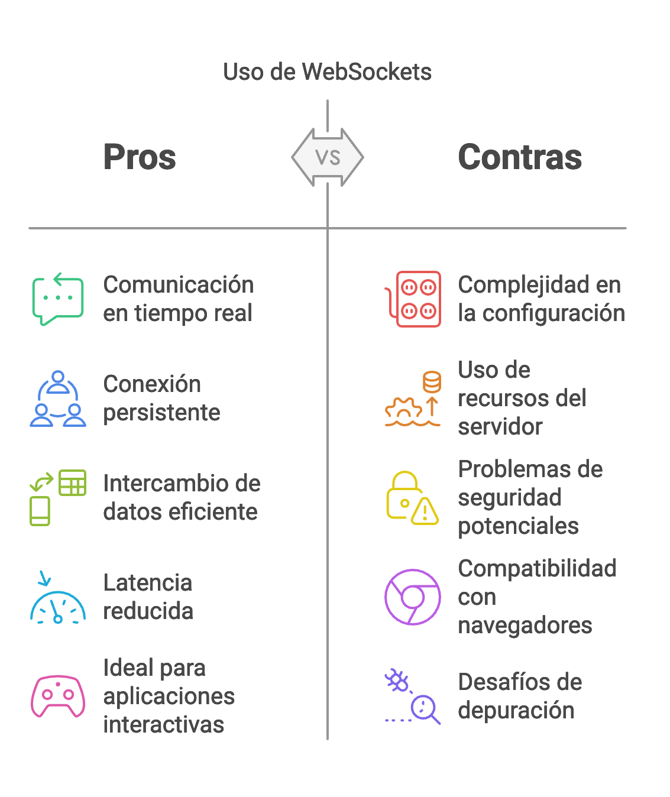

En el ejemplo de hoy vamos a ver cómo podemos crear un websocket echo en [Java EE](https://www.manualweb.net/javaee/). Es decir, vamos a **crear un websocket** que cuando le preguntemos algo nos realice una función de echo y devuelva el mismo texto que le hayamos pasado. Este ejemplo es perfecto para empezar a conocer cómo crear un websocket en [Java EE](https://www.manualweb.net/javaee/) o lo que es lo mismo con su versión opensource [Jakarta EE](https://arquitectoit.com/java/que-es-jakarta-ee/).


## ¿Qué es un websocket?


Un websocket es un **protocolo de comunicación bidireccional** que permite establecer una **conexión persistente entre un cliente y un servidor**. A diferencia del protocolo HTTP tradicional, los websockets **mantienen la conexión abierta**, lo que permite el intercambio de datos en tiempo real sin necesidad de realizar múltiples peticiones.


Esta tecnología es especialmente útil para **aplicaciones que requieren actualizaciones en tiempo real**, como chats, juegos en línea, información de bolsa en tiempo real o aplicaciones de monitorización.


Para poder crear una aplicación que utilice websockets y así crear tu websocket echo en [Java EE](https://www.manualweb.net/javaee/) deberemos de crear por un lado la parte del sevidor, que en este caso la haremos mediante [Java Jakarta EE](https://arquitectoit.com/java/que-es-jakarta-ee/) y por otra parte el cliente que lo construiremos en [Javascript](https://www.manualweb.net/javascript/).





## Pros y contras del uso de websocket


Antes de conocer cómo crear tu websocket echo en [Java EE](https://www.manualweb.net/javaee/) vamos a revisar los pros y contras de los websockets. Los pros del uso de websocket son múltiples y significativos:

- **Comunicación en tiempo real** que permite una interacción instantánea entre cliente y servidor
- **Conexión persistente** que elimina la necesidad de establecer múltiples conexiones nuevas
- **Intercambio de datos eficiente** con una sobrecarga mínima en la transmisión de información
- **Latencia reducida** gracias a la eliminación de handshakes repetitivos
- Ideal para **aplicaciones interactivas** que requieren actualizaciones frecuentes de datos

Por otro lado, los contras del uso del websocket que debemos considerar son:

- **Complejidad de la configuración inicial** y mantenimiento de las conexiones websocket
- **Uso intensivo de recursos del servidor** debido a las conexiones persistentes
- **Problemas de seguridad potenciales** relacionados con la autenticación y autorización continua
- **Compatibilidad variable con los navegadores antiguos** y necesidad de implementar fallbacks
- **Desafíos de depuración** debido a la naturaleza asíncrona de las comunicaciones




## Crear un Websocket Echo en Java EE


Lo primero para poder crear un websocket echo en [Java EE](https://www.manualweb.net/javaee/) es crear el código [Java](https://www.manualweb.net/java/) del servidor. Para ello tenemos que saber que dentro de [Jakarta EE](https://arquitectoit.com/java/que-es-jakarta-ee/) disponemos de la librería `jakarta.websocket`, la cual nos proporciona todas las utilidades para la creación del Websocket. Así que lo primero que haremos será importar la librería.


En concreto, la clase principal que utilizaremos mediante una anotación, es `ServerEndPoint` la cual nos permite crear un endpoint para nuestro websocket.


```java
import jakarta.websocket.*;
import jakarta.websocket.server.ServerEndpoint;
```


Pasaremos a definir el endpoint mediante la anotación `@ServerEndPoint`, la cual recibe como parámetro el path del endpoint que queremos crear


```java
@ServerEndpoint("/echo") 
public class EchoWebsocket { ... }
```


De esta manera hemos creado un endpoint cuyo path será el nombre del servidor seguido del endpoint /echo.


Ahora pasamos a definir los diferentes métodos que tiene la clase `EchoWebSocket`. Estos métodos representan los diferentes estados en los que puede estar un websocket:

- **OnOpen** - Este método se ejecuta cuando se establece una nueva conexión con el websocket. Es útil para inicializar recursos o registrar la conexión del cliente
- **OnMessage** - Este método maneja los mensajes entrantes del cliente. En nuestro caso de echo, será el encargado de recibir el mensaje y devolverlo al cliente
- **OnClose** - Este método se invoca cuando se cierra la conexión del websocket, ya sea por parte del cliente o del servidor. Permite realizar tareas de limpieza y liberar recursos

## Apertura de sesión del WebSocket


Para la apertura de conexión vamos a crear un método anotado mediante la clase `@OnOpen`.


```java
@OnOpen
public void onOpen(Session session){ ... }
```


El método de apertura del websocket va a crear una sesión para el intercambio de información. Es por ello, que la clase que se recibe como parámetro es la sesión mediante el objeto `Session`.


De la sesión lo que vamos a hacer es obtener el Id asignado a la sesión para poder trazar la actividad mediante el método `.getId()`. Además vamos a enviar un mensaje al cliente indicando que la sesión se ha inicializado entre el cliente y el servidor. Esto lo conseguimos mediante el método `.getBasicRemote()` que nos da la conexión y el método `.sendText()` sobre la conexión que recibe como parámetro el texto que queremos enviar al cliente.


```java
@OnOpen
public void onOpen(Session session){
    System.out.println("Sesión " + session.getId() + " abierta"); 
    try {
        session.getBasicRemote().sendText("Conexión Establecida");
    } catch (IOException ex) {
        ex.printStackTrace();
    }
}
```


## Recepción de un mensaje en el Websocket


Ahora pasamos a codificar el método de recepción de mensajes que lo conseguimos mediante la anotación `@OnMessage`.


```java
@OnMessage
public void onMessage(String message, Session session){ ... }
```


El método `onMessage()` recibe dos parámetros, el primero es el mensaje que nos ha enviado el cliente y el segundo la sesión que hemos establecido en la apertura.


El [código fuente en Java](https://linedecodigo.com/categoria/java/) que vamos a codificar dejará un mensaje en el log para ver lo que ha llegado, y para implenentar la lógica del websocket echo en [Java EE](https://www.manualweb.net/javaee/) lo que hacemos es devolver al cliente el mismo mensaje.


Nuevamente utilizamos el método `.getBasicRemote()` que nos da la conexión y el método `.sendText()` para enviar el texto.


Quedándonos el código del método `onMessage()` de la siguiente manera:


```java
@OnMessage
public void onMessage(String message, Session session){
    System.out.println("Mensaje de " + session.getId() + ": " + message);
    try {
        session.getBasicRemote().sendText(message);
    } catch (IOException ex) {
        ex.printStackTrace();
    }
}
```


## Cierre del websocket


Lo último que codificamos dentro del código para crear tu websocket echo en [Java EE](https://www.manualweb.net/javaee/) es el cierre del websocket. Para ello vamos a crear un método con la anotación `@OnClose`, el cual recibe la sesión que abrimos al inicio.


```java
@OnClose
public void onClose(Session session){ ... }
```


En este método vamos a volcar en la traza el ID de la sesión que se ha finalizado.


```java
@OnClose
public void onClose(Session session){
    System.out.println("Sesión " +session.getId()+" finalizada");
}
```


Con esto ya tendremos a nuestro websocket echo en [Java EE](https://www.manualweb.net/javaee/) desarrollado y solo tendremos que desplegar sobre un servidor que soporte [Jakarta EE](https://arquitectoit.com/java/que-es-jakarta-ee/) cómo Payara 5, Tomcat 10, Jetty 11 o Wildfly 22.


## Desplegar Websocket Echo en Java EE en un Servidor


Una vez con todo el código desarrollado para poder crear tu websocket echo en [Java EE](https://www.manualweb.net/javaee/) pasaremos a configurar nuestra aplicación [Java EE](https://www.manualweb.net/javaee/) para poder desplegar el war que contiene nuestro código del websocket echo en [Java EE](https://www.manualweb.net/javaee/).


Para ello en el fichero pom.xml vamos a crear una entrada que nos indique dónde se genera el código para el servidor, en este caso para un [servidor Payara 5](https://www.payara.fish/). 


```xml
  <properties>
    <project.build.sourceEncoding>UTF-8</project.build.sourceEncoding>
    <maven.compiler.source>1.8</maven.compiler.source>
    <maven.compiler.target>1.8</maven.compiler.target>
    <output.directory>/lineadecodigo/payara5/glassfish/domains/domain1/autodeploy</output.directory>
  </properties>
```


Podéis leer más sobre cómo [descargar y arrancar un servidor Payara 5](https://blog.payara.fish/how-to-deploy-an-application-on-payara-server-5).


Ahora, al arrancar el servidor tendremos el endpoint con nuestro websocket,


```shell
ws://localhost:8080/lineadecodigo_jakartaee/echo
```


Hay que tener en cuenta que el protocolo es websocket, no es http. Por lo cual vemos que [la URI](https://www.ayudaenlaweb.com/internet-basico/que-es-la-url/) tiene el protocolo ws.


## Cliente Javascript que conecta al Websocket Echo


Ahora que tenemos el servidor levantado con nuestro código de servidor con el websocket vamos a codificar el cliente que se conecte a nuestro websocket echo en [Java EE](https://www.manualweb.net/javaee/).


Para poder codificar el cliente que se conecte con el websocket vamos a utilizar el objeto Javascript [`WebSocket`](https://w3api.com/WebAPI/WebSocket/). El constructor del [`WebSocket`](https://w3api.com/WebAPI/WebSocket/WebSocket/) recibe como parámetro la URL del websocket.


```javascript
var mysocket = new WebSocket("ws://localhost:8080/lineadecodigo_jakartaee/echo");
```


Una vez que hemos establecido conexión con el websocket podemos enviarle un mensaje mediante el método [`.send()`](https://w3api.com/WebAPI/WebSocket/send/). El método [`.send()`](https://w3api.com/WebAPI/WebSocket/send/) recibe como parámetro el texto que queremos enviar al websocket.


```javascript
mysocket.send("Texto a enviar al Websocket");
```


## Gestionar interacciones con el servidor desde el cliente


Para poder gestionar las interacciones con el servidor, el objeto `Websocket` del cliente tiene los mismos eventos que en la parte de servidor, es decir, [`onopen`](https://www.w3api.com/WebAPI/Websocket/open/), [`onmessage`](https://www.w3api.com/WebAPI/Websocket/message/) y [`onclose`](https://www.w3api.com/WebAPI/Websocket/close_evento/). Por lo cual podemos codificar qué hacer en el cliente cuando se abre la conexión, cuando se recibe un mensaje desde el servidor y cuándo se cierra la conexión.


```javascript
mysocket.onopen = function (evt){
   console.log("Websocket abierto");    
};

mysocket.onmessage = function (evt){
   console.log("RECIBIDO: " + evt.data);    
};

mysocket.onclose = function (evt){
   console.log("Websocket cerrado");
};

mysocket.onerror = function (evt) {
   console.log("ERROR: " + evt.data);
}
```


En este código lo que hacemos es volcar el contenido a la consola de lo que está enviando el servidor.


## Cierre del Websocket Echo


Lo último que haremos con el [código cliente en Javascript](https://lineadecodigo.com/categoria/javascript/) será cerrar la conexión contra el websocket. Para ello solo tenemos que invocar el método [`.close()`](https://www.w3api.com/WebAPI/WebSocket/close/).


```javascript
mysocket.close();
```


Con esto ya tendremos codificado tanto el cliente como el servidor de nuestro websocket en [Java EE](https://www.manualweb.net/javaee/)


## Interface de usuario para el Websocket Echo


Lo último que haremos será crear un interface para poder hablar con el websocket echo. Para ello lo primero será crear todo el código del websocket, dentro del cual añadimos un método `escribir()` que nos permite volcar el contenido de un mensaje a un elemento [`textarea`](https://w3api.com/HTML/textarea/) en [HTML](https://www.manualweb.net/html/)., así como un método `enviar()` para enviar el mensaje al websocket y un método desconectar para realizar el cierre del websocket.


```javascript
function escribir(texto){
    valor = document.getElementById("caja").value;
    document.getElementById("caja").value = valor + texto + "\n";
}	

var mysocket = new WebSocket("ws://localhost:8080/lineadecodigo_jakartaee/echo");

mysocket.onopen = function (evt){
 escribir("Websocket abierto");     
};

mysocket.onmessage = function (evt){
  escribir("RECIBIDO: " + evt.data);
};

mysocket.onclose = function (evt){
 escribir("Websocket cerrado");
};

mysocket.onerror = function (evt) {
  escribir("ERROR: " + evt.data);
}

function enviar(texto) {
  mysocket.send(texto);
  escribir("ENVIADO: " + texto);
}

function desconectar(){		
	mysocket.close();
}       
```


Y añadiremos los [elementos HTML que nos permiten crear un formulario](https://manualweb.net/html/formularios-html/):


```html
<textarea id="caja" cols="100" rows="20"></textarea><br/>
<input id="mensaje" type="text" size="105"></input>
<button onClick="enviar(document.getElementById('mensaje').value);">Enviar</button>
<button onClick="desconectar()">Desconectar</button>
```


Ahora ya sí tenemos todo lo necesario para que puedas crear tu websocket echo en [Java EE](https://www.manualweb.net/javaee/).

