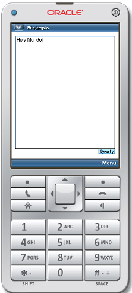

En un anterior ejemplo vimos [como con Java ME podíamos crear una aplicación Hola Mundo](http://lineadecodigo.com/java/hola-mundo-con-java-me/). En ese caso utilizamos un Canvas sobre el que volcábamos una cadena de texto con el "Hola Mundo".


En este segundo ejemplo vamos a ver como podemos crear un primer ejemplo de Hola Mundo con [Java ME](http://www.manualweb.net/javame/), pero en este caso gestionaremos la salida mediante un TextBox.


## Definiendo Display y TextBox


Lo primero será definir nuestra clase Display que es la que, al fin y al cabo, representa la pantalla del dispositivo móvil. De igual manera definiremos la clase TextBox que será la caja de texto en la que insertaremos nuestro Hola Mundo.


```java
private Display display;
TextBox textbox = new TextBox("Mi ejemplo","Hola Mundo",20,0);
```


Ya vemos que cuando creamos el TextBox estamos indicando su título "Mi ejemplo" y su contenido. Así como su tamaño y restricciones.


## Métodos del MIDlet


Lo siguiente será recordar los tres métodos de los que se compone un MIDLet: startApp, pauseApp y destroyApp.


```java
protected void destroyApp(boolean unconditional)
  throws MIDletStateChangeException { }
protected void pauseApp() { }
protected void startApp() throws MIDletStateChangeException { }
```


## Inicializando la aplicación


Será el método de inicialización o startApp() en el que instanciemos nuestro display. Para instanciar el Display utilizamos la propia factoría Display y su método `.getDisplay()`


```java
display = Display.getDisplay(this);
```


Ya solo nos quedará añadir el TextBox a nuestro display. Para ello utilizamos el método .setCurrent() sobre el Display, pasándole la caja de texto o TextBox.


```java
display.setCurrent(textbox);
```


El método startApp() nos quedará de la siguiente forma:


```java
protected void startApp() throws MIDletStateChangeException {
  display = Display.getDisplay(this);
  display.setCurrent(textbox);
}
```


Con estos sencillos pasos tenemos creados nuestro Hola Mundo con [Java ME](http://www.manualweb.net/javame/) y un TextBox. Y nuestro resultado:




