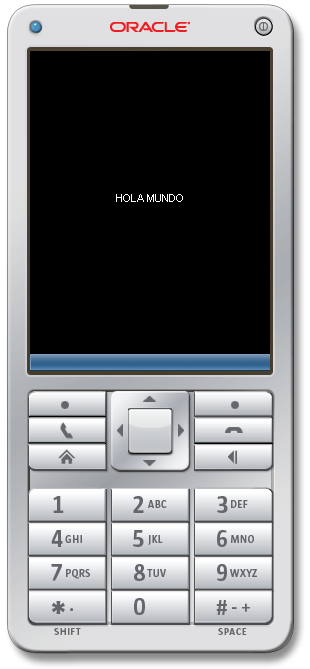

**Java ME (Java Micro Edition)** es una tecnología que está enfocada no solo a teléfonos móviles sino a todo dispositivo que funcione con [Java](https://www.manualweb.net/java/). En ese grupo podemos encontrar decodificadores de TV, lectores de tarjeta y demás.


En este primer artículo vamos a realizar un código sencillo que nos muestre un Hola Mundo con [Java ME](http://www.manualweb.net/javame/)


Mediante este código lo podrás probar más fácilmente en un IDE el cual sea de tu preferencia ya sea Netbeans o Eclipse. Este código está enfocado a teléfonos móviles los cuales tienen una cierta **configuración y perfil**.


Cuando hablamos de **configuración** nos referimos a que debido a las diferentes capacidades de procesamiento de los teléfonos móviles, el API de [Java](https://www.manualweb.net/java/), se reduce dejando solo las funcionalidades básicas de dicho dispositivo.


En cuanto al **perfil** nos referimos a que diferentes móviles pueden tener diferentes características, las cuales podrían ser una cámara integrada o una pantalla táctil es en esto en las características extra o específicas de los móviles.


Este código de Hola Mundo con [Java ME](http://www.manualweb.net/javame/) vamos a realizarlo con un Perfil MIDP 2.0 y una configuración CLDC 1.0, el cual solo nos imprimirá en la pantalla de nuestro móvil el mensaje HOLA MUNDO.


## Descargando Java ME


Lo primero que tienes que hacer antes de empezar a desarrollar el código Hola Mundo con [Java ME](http://www.manualweb.net/javame/) es el descargarte la librería [Java ME](http://www.manualweb.net/javame/).


Así que lo primero que tenemos que hacer es [descargarnos el Kit de Desarrollo de Java ME desde la página de Oracle](http://www.oracle.com/technetwork/java/javame/javamobile/download/overview/index.html).


En este Kit encontraremos, entre otras cosas, las definiciones de los dispositivos y los perfiles y configuraciones a los que hemos hecho mención anteriormente.


## Empezando a codificar el Hola Mundo con Java ME


Lo primero que tenemos que saber es que las clases que construyamos para [Java ME](http://www.manualweb.net/javame/) extenderán de la clase MIDlet. Esta clase MIDlet es la que nos proporcionará los métodos para el ciclo de vida de la aplicación:


```java
public class HolaMundo extends MIDlet {...}
```


Como la clase MIDlet es abstracta necesitamos sobreescribir sus métodos. Las librerías que necesitaremos de [Java ME](http://www.manualweb.net/javame/) serán:


```java
import javax.microedition.lcdui.Canvas;
import javax.microedition.lcdui.Display;
import javax.microedition.lcdui.Graphics;
import javax.microedition.midlet.*;
```


Por lo cual tendremos que importarlas antes de nuestro código. Definiremos dos variables que nos servirán para mostrar en pantalla mi mensaje. Por un lado Display es sencillamente mi pantalla en el móvil, la variable mycanvas es en la que nosotros dibujamos nuestro mensaje.


```java
private Display display;
private MyCanvas mycanvas;
```


## El inicio de la aplicación: startApp()


En el inicio de la aplicación lo que haremos será, en primer lugar obtener acceso a la pantalla, es decir, al Display.


```java
this.display = Display.getDisplay(this);
```


Instanciamos nuestro Canvas. Ahora veremos que tiene el Canvas y como inserta el texto.


```java
this.mycanvas = new MyCanvas();
```


Y por último añadimos el Canvas a la pantalla mediante el método .setCurrent()


```java
display.setCurrent(mycanvas);
```


El código completo de startApp() quedará de la siguiente forma:


```java
protected void startApp() throws MIDletStateChangeException {        
  display = Display.getDisplay(this);
  this.mycanvas = new MyCanvas();		
  display.setCurrent(mycanvas);
}
```


## El Canvas y la cadena Hola Mundo


Como hemos visto antes, la gestión de insertar la cadena se la hemos dejado a nuestra clase MyCanvas. La clase MyCanvas extiende de Canvas la cual es abstracta, debemos implementar su metodo paint(Graphics).


En el método paint tenemos un objeto Graphics el cual servirá para escribir nuestro "Hola Mundo", una característica de esta clase es que cuando se hace una instancia de ella, se llama al método paint para que dibuje lo que nosotros pusimos dentro del método.


```java
class MyCanvas extends Canvas {
  protected void paint(Graphics g) {
    g.setColor(255,255,255);
    g.drawString("HOLA MUNDO", this.getWidth()/2, this.getHeight()/2,
                   Graphics.BASELINE|Graphics.HCENTER);
  }
}
```


También hemos añadido el método .setColor, el cual indica que el texto a insertar es blanco. Esto lo necesitamos ya que el fondo del Canvas es negro y no se verían las letras.


## Probando la aplicación en emulador


Si probáis la aplicación en el emulador que viene con el Kit de desarrollo de Java ME de Oracle obtendréis un resultado como el que se muestra a continuación:





Pues con este código tenemos nuestra primera aplicación Hola Mundo con [Java ME](http://www.manualweb.net/javame/). Espero que os haya gustado.

