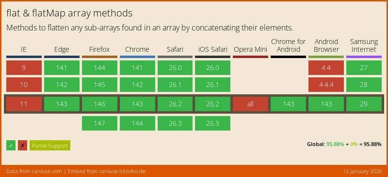

Cuando estamos manejando arrays que sean matrices o que tengan múltiples dimensiones nos puede ser muy útil el saber cómo aplanar array en [Javascript](http://www.manualweb.net/javascript). Es decir, conseguir mover todos los elementos a una única dimensión. Esto nos simplifica cosas como recorrer los elementos o poder volcarlos en algún sistema.


Hasta la **versión ES10 (o ES2019)** era un procedimiento que teníamos que hacer a mano, pero desde esta versión del estándar [Javascript](http://www.manualweb.net/javascript) ya disponemos de un método del objeto [`Array`](http://www.w3api.com/Javascript/Array/) que es `.flat()` y que nos ayuda a aplanar arrays en [Javascript](http://www.manualweb.net/javascript).


## Crear un array multidimensional


Lo primero será crear nuestro array multi-dimensional, que podría ser algo así:


```javascript
let miArray = [[1,2],[3,[4,5],6],[7],[8,9,10]];
```


Como vemos tenemos varias profundidades de arrays anidados. En el caso de tenerlo que aplanarlo a mano deberemos de tener muy en cuenta esa profundidad.


## Utilizar el método .flat()


Lo siguiente será llamar al método `.flat()`:


```javascript
let arrayAplanado = miArray.flat();
```


Hay que tener en cuenta que si no pasamos ninguna información al método `.flat()` este solo aplanará el primer nivel. Es por ello que [si recorremos el array con Javascript](http://lineadecodigo.com/javascript/recorrer-un-array-en-javascript/):


```javascript
arrayAplanado.forEach(elemento => console.log(elemento));
```


La salida por consola será la siguiente:


```shell
1
2
3
[4,5]
6
7
8
9
10
```


Donde podemos ver que no ha aplanado el cuarto elemento que vuelve a ser un array.


## Aplanar con profundidad


Es por ello que al método `.flat()` deberemos de pasarle por parámetro el nivel de profundidad sobre el que queremos aplanar. En este caso le vamos a pasar un nivel 2:


```javascript
let arrayAplanado = miArray.flat(2);
```


En este caso la salida por consola ya sería:


```javascript
1
2
3
4
5
6
7
8
9
10
11
12
```


## Compatibilidad del método .flat()


Aunque el método `.flat()` ya está implementado en la mayoría de los navegadores principales puede ser un problema si tienes que mantener alguna compatibilidad de navegadores. En este caso es importante que le eches un ojo a la compatibilidad del método `.flat()` en [Can I Use](https://caniuse.com/array-flat).





## Implementar un polyfill


Y si no, siempre te quedará implementar un polyfill como el siguiente:


```javascript
if (!Array.prototype.flat) {
  Array.prototype.flat = function(depth) {
    var flattend = [];
    (function flat(array, depth) {
      for (let el of array) {
        if (Array.isArray(el) && depth > 0) {
          flat(el, depth - 1); 
        } else {
          flattend.push(el);
        }
      }
    })(this, Math.floor(depth) || 1);
    return flattend;
  };
}
```


Espero que os sea útil el uso del método `.flat()` para aplanar arrays en [Javascript](http://www.manualweb.net/javascript). ¿En qué casos creéis que os sería útil?

