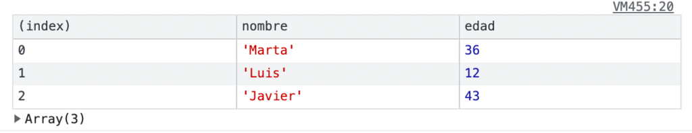
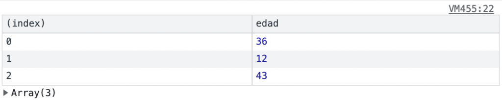

Si estás programando en [Javascript](https://www.manualweb.net/javascript) seguro que más de una vez [has volcado contenido a la consola para ver qué está sucediendo en tu programa](https://lineadecodigo.com/javascript/volcar-datos-a-consola-con-javascript-console-log/). Y para ello te habrás apoyado en el método [`console.log()`](https://lineadecodigo.com/javascript/volcar-datos-a-consola-con-javascript-console-log/). 


Si bien, sabías que, además de texto, puedes mostrar tablas por consola en [Javascript](https://www.manualweb.net/javascript). Es decir, puedes volcar el contenido de tus objetos como si fuesen líneas de una tabla. Para poder mostrar tablas por consola en Javascript deberás de utilizar el método `console.table()`. 


Pero, ¿qué recibe el método `console.table()`? Pues dicho método recibe un array de elementos. Así su sintaxis será la siguiente:


```javascript
console.table(data);
```


## Crear objetos Persona


De esta forma, lo que vamos a hacer es crear un array de objetos en [Javascript](https://www.manualweb.net/javascript). Para ello definimos un sencillo objeto `Persona` que tiene 2 atributos que son nombre y edad. El código nos quedará de la siguiente forma:


```javascript
function Persona(nombre, edad) {
  this.nombre = nombre;
  this.edad = edad;
}
```


Y creamos varios objetos de tipo persona, cada uno con unos valores diferentes:


```javascript
var persona1 = new Persona("Luis", 41);
var persona2 = new Persona("Esther", 39);
var persona3 = new Persona("Sara", 9);
var persona4 = new Persona("Lucia", 2);
```


## Mostrar tabla con console.table()


De esta forma lo que vamos a pasar al método `console.table()` será un array de estos objetos. Creamos el array directamente en el parámetro del método.


```javascript
console.table([persona1, persona2, persona3, persona4]);
```


Así podremos ver que se nos muestra por consola lo siguiente:





## Filtrar propiedades en console.table()


También podemos generar la tabla de solo una de las propiedades de los objetos del array. La sintaxis será la siguiente:


```javascript
console.table(data, [propiedades]);
```


Vemos que las propiedades a mostrar pueden ser varias, por eso es un array de propiedades. De esta forma si de nuestros objetos solo queremos sacar una propiedad, como por ejemplo, la edad, lo codificaremos de la siguiente forma:


```javascript
console.table([persona1, persona2, persona3, persona4], ["edad"]);
```


En este caso la salida por consola de la tabla se verá de la siguiente forma:





Así ya hemos visto la potencia que tiene `console.table()` para Mostrar tablas por consola en [Javascript](https://www.manualweb.net/javascript). Seguro que si no la has utilizado ahora empezarás a utilizarla.

