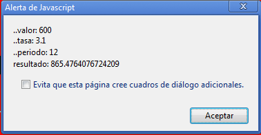

Javascript es un lenguaje de programación que permite ampliar las posibilidades de las páginas HTML. El navegador se encarga por completo de interpretar el código escrito y no hay necesidad de compilación.


## Incluir Javascript en HTML


Para incluir código Javascript en páginas HTML es necesario hacer uso de la etiqueta `<script>`. De esta forma insertaremos código Javascript de la siguiente forma:


```javascript
<script language="javascript" type="text/javascript">
// Código Javascript
</script>
```


También se pueden usar scripts externos:


```html
<script language="javascript" src="/js/miScript.js" type="text/javascript"></script>
```


## Programación Orientada a Objetos con Javascript


Vamos a realizar un ejemplo para obtener el valor futuro de una inversión (su valor) dado una tasa de interés y periodo o plazo final. Tenemos entonces tres datos:

- valor presente
- tasa de interés
- periodo final

## Fórmula para calcular el valor futuro


```javascript
valor_futuro = valor * Math.pow(1 + tasa/100, periodo)
```


## Constructor de la clase Economica


Vamos a definir una función que sirva como "constructor" de la clase Economica:


```javascript
console.log("Creo el Constructor");
function Economica(valor, tasa, periodo) {
  this.valor = valor;
  this.tasa = tasa;
  this.periodo = periodo;
  // Este es un método que nos mostrará el resultado de la operación
  this.desplegarResultado = desplegarResultado;
}
```


## Función para visualizar los datos


Ahora creamos una función para visualizar los datos:


```javascript
function ver(string) {
  alert(string);
}
```


## Método desplegarResultado


Definimos el método "desplegarResultado":


```javascript
function desplegarResultado() {
  var valorFuturo = parseFloat(this.valor) * Math.pow(1 + parseFloat(this.tasa)/100, parseInt(this.periodo));
  console.log("valor futuro: " + valorFuturo);
  var result = "\n..valor: " + this.valor + " \n..tasa: " + this.tasa + " \n..periodo: " + this.periodo;
  result += " \nresultado: " + valorFuturo.toString();
  ver(result);
}
```


## Método para solicitar datos al usuario


También es necesario crear un método que solicite los datos al usuario:


```javascript
function datos() {
  var valor = prompt("Valor:", "");
  var tasa = prompt("Tasa:", "");
  var periodo = prompt("Periodo:", "");
  
  //creamos una instancia de la "clase" Economica y le pasamos los parámetros
  obj1 = new Economica(parseFloat(valor), parseFloat(tasa), parseInt(periodo));

  //invocamos al método "desplegarResultado" para ver el resultado
  obj1.desplegarResultado();
}
```


## Activar el método con un botón


Por último creamos un botón que active el método "datos":


```html
<button onclick="javascript:datos()">Ver resultado</button>
```


El resultado que obtendremos por pantalla una vez que hayamos introducido el valor de la inversión, la tasa de interés y periodo o plazo de pago mostrará todos los datos ingresados junto con el valor futuro calculado.




