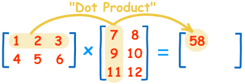

## ¿Por qué multiplicar matrices en Javascript?


Quizás pueda resultar raro el que queramos saber cómo hay que multiplicar matrices en [Javascript](http://www.manualweb.net/javascript). Pero veremos algún ejemplo dónde es de utilidad el saber cómo se realiza esta operación y lo útil que es a la hora de manejar coordenadas como matrices, que lo veremos en un siguiente artículo. 


## Crear una matriz en Javascript


Pero vamos paso a paso y lo primero será crear una matriz en [Javascript](http://www.manualweb.net/javascript). Tenemos que saber que una matriz no deja de ser un array donde cada una de las posiciones es a su vez un array de elementos, por ejemplo de números. 


De esta forma podemos inicializar una matriz en [Javascript](http://www.manualweb.net/javascript) de la siguiente manera:


```javascript
let matriz1 = [[1,2,3],[4,5,6]];
let matriz2 = [[7,8],[9,10],[11,12]];
```


De cara a entender lo que serían las columnas y las filas de la matriz atenderemos a que los elementos del array principal son las filas y cada uno de los elementos del array interno serán las columnas. 


De esta forma las dos matrices que hemos instanciado en estas líneas de código corresponderían a las matrices:


```javascript
1 2 3       7  8
4 5 6       9  10
            11 12
```


## Obtener el tamaño de la matriz


Si queremos saber cuantas filas y columnas tiene la matriz podemos calcularlo de la siguiente forma:


```javascript
let filas1 = matriz1.length;
let columnas1 = matriz1[0].length;
```


Vemos que las filas las obtenemos mediante la propiedad `.length` del array y las columnas preguntando al primer elemento de la matriz, nuevamente con la propiedad `.length` del array. 


## Validar que se puede multiplicar


Y es que esto es muy importante ya que **para poder multiplicar matrices se tiene que dar que las columnas de la primera matriz sean las mismas columnas de la matriz dos**. 


Esta comprobación la haremos de la siguiente forma:


```javascript
if (columnas1 !== matriz2.length) {
    console.log("No se pueden multiplicar las matrices");
}
```


## Crear la matriz resultado


Lo siguiente será crear la matriz con el resultado. La matriz tendrá un tamaño equivalente a tantas filas como la matriz 1 como columnas de la matriz 2. 


Así que creamos la matriz para el resultado de la multiplicación de la siguiente manera:


```javascript
let columnas2 = matriz2[0].length;
let multiplicacion = new Array(filas1).fill(0).map(() => new Array(columnas2).fill(0));
```


Vemos que primero creamos un array y luego por cada elemento del array un nuevo elemento. Nos apoyamos en el método [`.fill()`](http://www.w3api.com/Javascript/Array/fill) que nos permite rellenar el array con un número. En este caso lo vamos a inicializar a 0. 


## Realizar la multiplicación de matrices


Lo siguiente será realizar la multiplicación. Para ello vamos recorriendo la matriz resultado y en cada posición x,y le asignamos el resultado de multiplicar cada elemento de la fila de la primera matriz con cada una de las columnas de la segunda matriz. 


El esquema sería el siguiente:





Y el código que lo implementa sería:


```javascript
for (let i = 0; i < filas1; i++) {
    for (let j = 0; j < columnas2; j++) {
        for (let k = 0; k < columnas1; k++) {
            multiplicacion[i][j] += matriz1[i][k] * matriz2[k][j];
        }
    }
}
```


De esta forma ya habremos conseguido realizar la multiplicación y el resultado quedará almacenado en la matriz multiplicación. 


## Conclusión


Así habremos conseguido multiplicar matrices en [Javascript](http://www.manualweb.net/javascript). 


Por cierto, sabías que [también hemos explicado cómo multiplicar matrices en Java](http://lineadecodigo.com/java/multiplicar-matrices-en-java/). Ves que es muy parecido. Te atreves a explicarlo para otros lenguajes de programación. Ponlo en los comentarios y lo iremos incorporando a [Línea de Código](http://lineadecodigo.com/).

